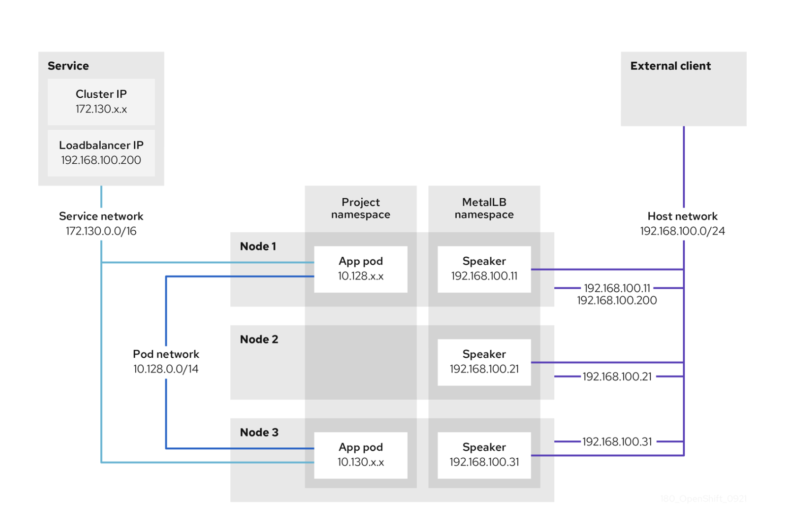
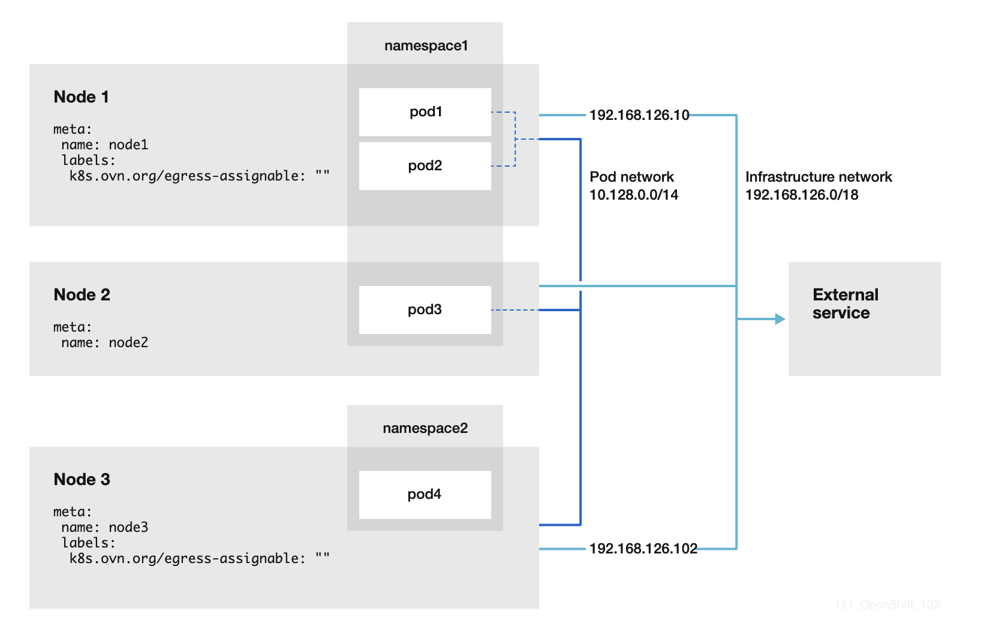

# Creating Routes on NCP (Egress and Backward Routes)

> This guide explains how to configure routes for **egress** and **ingress** requirements using **NNCP**.


-----------------------------------------------------------------------

## Before Implementation

- Changes involving MetalLB, IPAddressPool, backward routes, default egress routes, EgressIP configuration, and MetalLB loopback route modifications must be reviewed and agreed upon collaboratively by the solution architect, network architect, and cloud architect.

- On the Nokia side, design documents such as IPCIQ, IPLLD, or DNP must be updated by their respective owners.

- Based on the updated Nokia documents, the cloud architect should update the Cloud NCP LLD to reflect all new changes.

- Once the above steps are complete, the MACD engineer can accept the ticket and review the LLD to fully understand the requirements.

- Validate in the system whether the change has already been implemented to avoid duplicate route creation.

- After all validations are completed, proceed with the implementation.

- Most important point here is all change need to created via manifest file and updated respective PGT. push everything on git and sync argocd. at last push this config via CGU. (done via ZTP only). 

------------------------------------------------------------------------

## Route Creation Overview

All static routes are created on the **gateway (GW) nodes** to handle
both:

- **Ingress (backward routes):** for incoming traffic

- **Egress (default egress routes):** for outgoing traffic

------------------------------------------------------------------------

## Ingress

Ingress traffic is managed through **MetalLB**. Applications expose services with a **LoadBalancer IP**, which must be part of the MetalLB
configuration (`IPAddressPool`).

-   MetalLB configuration is located at:

        CWL-Cluster/site-policies/sites/hub/source-crs/metallb

### Ingress Explanation

1) MetalLB speaker pods advertise the **application LoadBalancer IP** to BGP peers.

2)  BGP peers (on the switches) receive traffic destined for that IP.

3)  The traffic is routed to the MetalLB speaker pod.

4)  From there, Kubernetes iptables forwards it to the internal service cluster IP.

5)  Finally, traffic is directed to the appropriate application pod endpoint.

Since speaker pods run on **GW nodes**, the GW nodes must have routes to external client systems via the **MetalLB VLAN interface** (BGP subnet).

In OCP, these ingress routes are called **backward routes** and are
defined under:

    CWL-Cluster/site-policies/sites/hub/source-crs/nmstate


### Ingress Diagram





### Ingress Config Example


#### Ingress IPAddresspool Config


```
apiVersion: metallb.io/v1beta1
kind: IPAddressPool
metadata:
  name: ncp-metallb-oam-pa-pa-addresspool
  namespace: metallb-system
spec:
  addresses:
  - 10.89.101.128/27
  - 10.89.97.208/28
  - 10.89.99.192/27
  autoAssign: false
  avoidBuggyIPs: false
```
#### Ingress backward's route config


```
apiVersion: nmstate.io/v1
kind: NodeNetworkConfigurationPolicy
metadata:
  name: backward-route-for-oam-pa-pa-metallb-vlan104
spec:
  desiredState:
    routes:
      config:
      - destination: 10.89.100.66/32
        metric: 150
        next-hop-address: 10.89.97.161
        next-hop-interface: vlan104
        table-id: 254
      - destination: 10.89.136.0/24
        metric: 150
        next-hop-address: 10.89.97.161
        next-hop-interface: vlan104
        table-id: 254
      - destination: 100.64.10.3/32
        metric: 150
        next-hop-address: 10.89.97.162
        next-hop-interface: vlan104
        table-id: 254
      - destination: 100.64.10.4/32
        metric: 150
        next-hop-address: 10.89.97.163
        next-hop-interface: vlan104
        table-id: 254
  nodeSelector:
    node-role.kubernetes.io/gateway: ""
```
------------------------------------------------------------------------

## Egress

Egress is needed when application pods communicate with external systems
(e.g., **NetAct**, **SFTP servers**, or **log servers**).

Egress configuration has two components:

1)  **EgressIP configuration** for the application namespace:

        CWL-Cluster/site-policies/sites/hub/source-crs/egressip/egressip.yaml

2)  **Default egress route configuration** (created via NNCP):

        CWL-Cluster/site-policies/sites/hub/source-crs/egressip/default_route_for_egress.yaml


### Egress Explanation

1) Application pods send traffic destined for external systems (e.g., NetAct, SFTP).

2) Kubernetes routes this traffic through the EgressIP assigned to the namespace.

3) The egress traffic exits via the GW node where the EgressIP is active.

4) On the GW node, the default egress route (NNCP) ensures that traffic is forwarded to the correct external next-hop. but this default route will be with metric as 999.  which is low priorty for worste case.  so you need to create additional site specific route with metric as 150. 

5) From there, the external network routes the traffic to the target system (e.g., NetAct/SFTP server).

6) Return traffic comes back via the same GW node using the EgressIP, maintaining session consistency.

This ensures controlled, predictable outbound traffic from applications to external systems.


### Egress Diagram


> it's just an example:  in our infra, host should be a gateway node and network should be application external network which is metallb bgp network.




### Egress Config Example


#### Egress default route 

```
apiVersion: nmstate.io/v1
kind: NodeNetworkConfigurationPolicy
metadata:
  name: egress-default-route
spec:
  desiredState:
    routes:
      config:
      - destination: 0.0.0.0/0
        metric: 999
        next-hop-address: 10.89.97.161
        next-hop-interface: vlan104
        table-id: 254
      - destination: 10.89.27.4/32
        metric: 150
        next-hop-address: 10.89.97.161
        next-hop-interface: vlan104
        table-id: 254
  nodeSelector:
    node-role.kubernetes.io/gateway: ""

```

#### Egress IP configuration

```
apiVersion: k8s.ovn.org/v1
kind: EgressIP
metadata:
  name: egress-ncd01pan-oam-snat
spec:
  egressIPs:
  - 10.89.97.172
  namespaceSelector:
    matchLabels:
      kubernetes.io/metadata.name: paclypancd01
```
------------------------------------------------------------------------

> With these configurations, ingress (backward routes) and egress routes are consistently managed across OCP deployments.
