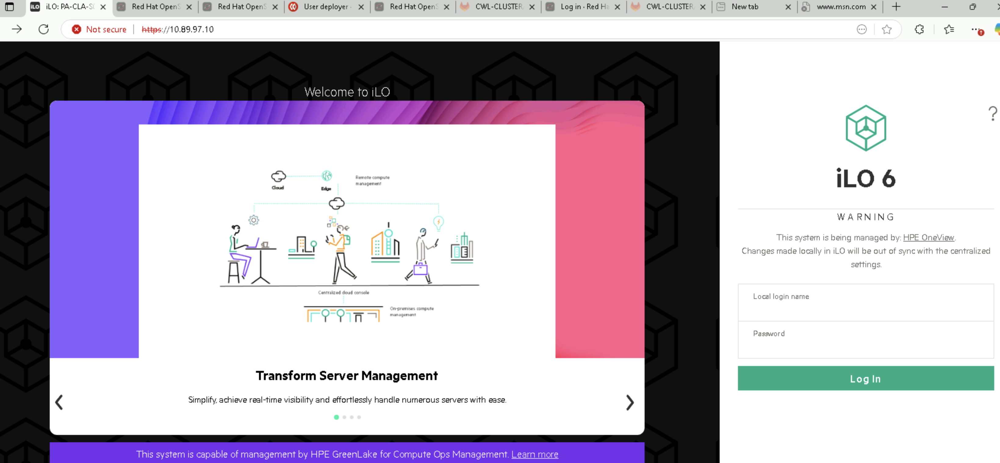
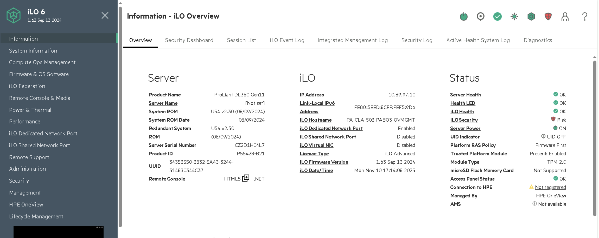
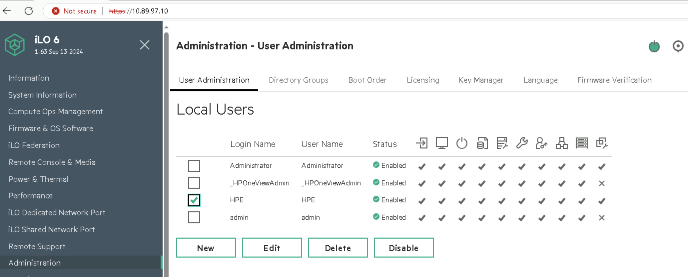
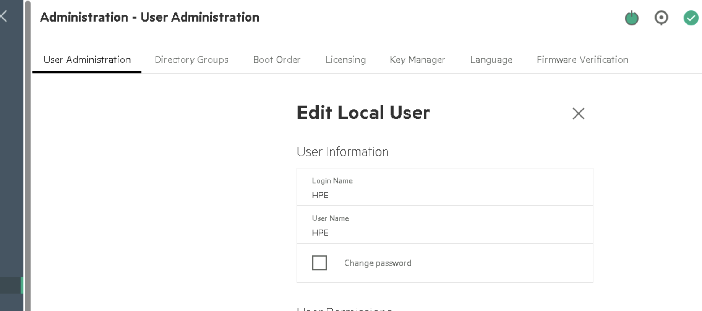
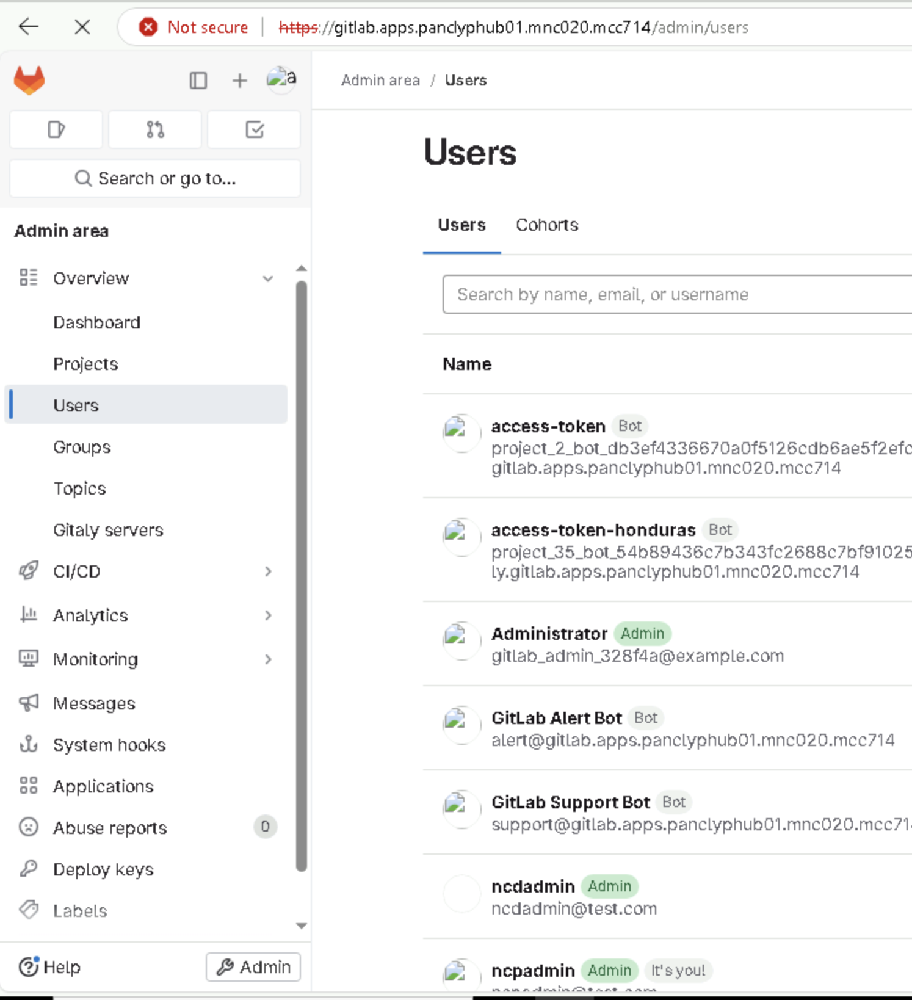

# OpenShift (OCP) Password Rotation Guide  
**Environment:** Hub and Spoke Clusters (Bare Metal HP and DELL )  
**Includes:** infra quay,  OCP UI using OAuth for hub and cwl, Quay for hub and cwl,  Argo CD, GIT, Cluster monitoring and baremetal console management services too. 


---

## Overview
This guide outlines all the key places where passwords or credentials need to be updated in a multi-cluster OpenShift environment that uses **Argo CD, GIT, Quay passwd, OCP UI (only OAuth), Bare Metal Nodes**

---

## 1. OCP Cluster (OCP UI based passwd - common for hub and cwl)

### OAuth Users with htpasswd


#### Updating HTPasswd User Passwords 

Procedure to `update` the password of an existing users common for hub and cwl. 


1) Retrieve the htpasswd file from the htpass-secret Secret object and save the file to your file system:

```
[root@dom14npv101-infra-manager ~ hub]# oc get secret htpass-secret -ojsonpath={.data.htpasswd} -n openshift-config | base64 --decode > users.htpasswd
[root@dom14npv101-infra-manager ~ hub]# cat users.htpasswd
ncpadmin:$2y$05$DYlpXiwFzfyRioO4hRNq1.ZdFLO3yMz3Pl3gs7.yUpEUKeOGoHX9K
nokia:$2y$05$SLpgZb3AE.fE7WQEGIMOXesoZdY9pV9OHVpXb5CuITdZO5RVId8Ye
[root@dom14npv101-infra-manager ~ hub]# 
```

2) update the users password from the users.htpasswd file.

```
[root@dom14npv101-infra-manager ~ hub]# htpasswd -bB users.htpasswd nokia nokia@1234
Updating password for user nokia
[root@dom14npv101-infra-manager ~ hub]# 
```

3) Replace the htpass-secret Secret object with the updated users in the users.htpasswd file:

```
[root@dom14npv101-infra-manager ~ hub]# oc create secret generic htpass-secret --from-file=htpasswd=users.htpasswd --dry-run=client -o yaml -n openshift-config | oc replace -f -
secret/htpass-secret replaced
[root@dom14npv101-infra-manager ~ hub]# 
```

4) Wait for all these pods to be restarted 

```
[root@dom14npv101-infra-manager ~ hub]# oc get pods -n openshift-authentication -o wide -w
NAME                             READY   STATUS    RESTARTS   AGE     IP             NODE                                                       NOMINATED NODE   READINESS GATES
oauth-openshift-f446bd5b-58cps   1/1     Running   0          6m48s   172.20.2.190   ncpvnpvhub-hubmaster-101.ncpvnpvhub.pnwlab.nsn-rdnet.net   <none>           <none>
oauth-openshift-f446bd5b-k8dqx   1/1     Running   0          5m53s   172.21.0.241   ncpvnpvhub-hubmaster-103.ncpvnpvhub.pnwlab.nsn-rdnet.net   <none>           <none>
oauth-openshift-f446bd5b-v4n6m   1/1     Running   0          6m21s   172.20.0.134   ncpvnpvhub-hubmaster-102.ncpvnpvhub.pnwlab.nsn-rdnet.net   <none>           <none>
oauth-openshift-f446bd5b-v4n6m   1/1     Terminating   0          6m24s   172.20.0.134   ncpvnpvhub-hubmaster-102.ncpvnpvhub.pnwlab.nsn-rdnet.net   <none>           <none>
oauth-openshift-6497ccb4f5-d5wxd   0/1     Pending       0          0s      <none>         <none>                                                     <none>           <none>
oauth-openshift-6497ccb4f5-d5wxd   0/1     Pending       0          0s      <none>         <none>                                                     <none>           <none>

```

5) Validate the login now. 

```
[root@dom14npv101-infra-manager ~ hub]# oc login -u nokia -p nokia@123
WARNING: Using insecure TLS client config. Setting this option is not supported!

Login failed (401 Unauthorized)
Verify you have provided the correct credentials.
[root@dom14npv101-infra-manager ~ hub]# oc login -u nokia -p nokia@1234
WARNING: Using insecure TLS client config. Setting this option is not supported!

Login successful.

You don't have any projects. You can try to create a new project, by running

    oc new-project <projectname>

[root@dom14npv101-infra-manager ~ hub]# 

```


#### Removing the kubeadmin user 


1. After you define an identity provider and create a new cluster-admin user, you can remove the kubeadmin to improve cluster security.

##### Warning
`If you follow this procedure before another user is a cluster-admin, then OpenShift Container Platform must be reinstalled. It is not possible to undo this command.`


##### Prerequisites

* You must have configured at least one identity provider.
* You must have added the cluster-admin role to a user.
* You must be logged in as an administrator.


##### Procedure


1. Remove the kubeadmin secrets:


```
oc delete secrets kubeadmin -n kube-system
```


---

## 2. Argo CD | Change ArgoCD Admin Password via Kubernetes Secret (OpenShift GitOps)

Update ArgoCD Admin Password via Kubernetes Secret (OpenShift GitOps)

This guide explains how to securely update the **ArgoCD admin password**
by modifying the Kubernetes Secret used by OpenShift GitOps.

------------------------------------------------------------------------

#### Example Existing Secret

Your current secret looks like this:

``` yaml
apiVersion: v1
data:
  admin.password: dEtvalliZFAySXhTOEpIQ3VwRTN5NE1WRnNPWjFya2g=
kind: Secret
metadata:
  name: openshift-gitops-cluster
  namespace: openshift-gitops
type: Opaque
```

------------------------------------------------------------------------

#### Steps to Update the Password

##### Generate a new bcrypt hash for your new password

Run the following command to create a bcrypt hash of your new password:

``` bash
htpasswd -bnBC 10 "" <new_password> | tr -d ':\n'
```

**Example output:**

    $2a$10$8f0uPpTx6M0DKB.0HLDiuOfwVQ7MSnZCfvRWtKn6dmCkzW9Qe2Sa2

------------------------------------------------------------------------

##### Base64 encode the hash

Because your Secret uses the `data:` field (not `stringData:`), you must
Base64 encode the hash before applying it.

``` bash
echo -n '$2a$10$8f0uPpTx6M0DKB.0HLDiuOfwVQ7MSnZCfvRWtKn6dmCkzW9Qe2Sa2' | base64
```

**Example encoded output:**

    JDIhJDEwJDhmMHVQcFR4Nk0wREtCLjBITERpdU9md1ZRN01TblozQ2Z2Uld0S242ZG1DazpXOVFlMlNhMg==

------------------------------------------------------------------------

##### Edit the Secret in OpenShift

Run the following command to edit the secret:

``` bash
oc edit secret -n openshift-gitops openshift-gitops-cluster
```

Replace the existing value under `data.admin.password:` with your **new
Base64-encoded hash**:

``` yaml
data:
  admin.password: JDIhJDEwJDhmMHVQcFR4Nk0wREtCLjBITERpdU9md1ZRN01TblozQ2Z2Uld0S242ZG1DazpXOVFlMlNhMg==
```

Save and exit the editor (`:wq` in vi).


##### Restart ArgoCD Server Pods

Restart the ArgoCD server pods to apply the new password:

``` bash
oc delete pod -n openshift-gitops -l app.kubernetes.io/name=argocd-server
```

This ensures the new password takes effect immediately.


##### Log in with the new password 

Once the pods are back online, log in again using your new password:

Access via ArgoUI. 


## 3. Bare Metal Node 'core user' Passwords (Common for hub and cwl)

Each node (hub and spokes) may have:
- `core` user (for RHCOS)


### Purpose

This file ensures that all **master and worker nodes** in the cluster have a consistent, predefined password for the `core` user, derived from
a **hashed password value** rather than a plain-text string.
This approach aligns with best security practices by preventing password exposure in configuration files.


### Procedure

#### 1. Update the core user password

1.  Update the existing MachineConfig files named:

    -   `98-worker-core-pass`
    -   `98-master-core-pass`

2.  Generate a new password hash using the command:

    ``` bash
    mkpasswd -m SHA-512 <your_password>
    ```

3.  Copy the generated hash and update the corresponding `core-pass`
    files with the new hash.

4.  **Note:** First update the **master**, then the **worker**.

To edit the MachineConfig file:

``` bash
oc edit machineconfig 98-master-core-pass
```

------------------------------------------------------------------------

#### \[Example\]

``` yaml
apiVersion: machineconfiguration.openshift.io/v1
kind: MachineConfig
metadata:
  annotations:
    ran.openshift.io/ztp-gitops-generated: '{}'
  labels:
    machineconfiguration.openshift.io/role: worker
  name: 98-master-core-pass
spec:
  config:
    ignition:
      version: 3.4.0
    passwd:
      users:
      - name: core
        passwordHash: <your_hash>
```

------------------------------------------------------------------------

**NOTE:**
The nodes do not reboot and should become available within a few moments. 

------------------------------------------------------------------------

#### 1.1 track the process using `oc get mcp`

1.  run the following command
    ```
    oc get mcp
    ```

#### 2. Verification

1.  Start a debug session on a node:

    ``` bash
    oc debug node/<node_name>
    ```

2.  Enter the chroot environment:

    ``` bash
    chroot /host
    ```

3.  Verify the password hash:

    ``` bash
    cat /etc/shadow
    ```
You should see an entry similar to:

```
        systemd-journal-remote:!!::::::
        core:<your_hash>:20263:0:99999:7:::
```

---

## 4. Quay Registries 

### Updating hub quay passwd 

#### Updating hub quay passwd  (part-1)

1) login to hub quay on the web browser 
> https://quay-registry.apps.panclyphub01.mnc020.mcc714/ 
> deployer/deployer -> this user was used for cwl cluster installation.  


2) once logined in navigate to account setting 


3) then click on change password under the user setting 


4) A windo popup and put your username and passwd to change 


#### Updating the hub quay passwd on hub pull secret (part-2)

1) login to hub using oc login 

2) oc edit scret on the cwl cluster namespace. ("ncpcwltri04nac-ns name" then name "ncpcwltri04nac-disconnected-registry-pull-secret")

#### Update this hub quay password on CWL pull secret on git side (part-3)

1) navigate to site-config dir on the infra-node even you can using ui to update it on the git structure. 

2) edit file (site-config->pre-reqs->pull-secret-clustername.yaml)  update and save it. 

3) push to git (git add. '  git commit -m "update", git push)

#### Update this hub quay passwd on the cwl quay gobal pull secret as well. (part-4)

1) login to cwl using oc login 

2) oc edit scret on the openshif-config namespace. ("gobal-pull-secret) update and save it. 

```bash
oc extract secret/pull-secret -n openshift-config --to=-
oc set data secret/pull-secret -n openshift-config   --from-file=.dockerconfigjson=/path/to/updated.json
```

Then verify:
```bash
oc get secret pull-secret -n openshift-config -o yaml
```

### Updating CWL quay passwd 

#### Updating CWL quay passwd  (part-1)

1) login to CWL quay on the web browser 
> https://quay-registry.apps.panclypCWL01.mnc020.mcc714/ 
> deployer/deployer -> this user was used for CWL proxy-cache ITMS.  


2) once logined in navigate to account setting 


3) then click on change password under the user setting 


4) A windo popup and put your username and passwd to change 


#### Update this passwd on the cwl pull secret as well used for ITMS. (Part-2)


## 5. Hardware management console passwd change

### HPE based ILO passwd reset - Part-1

1) login to ILO ip on that server (if your cluster has built using 30 servers) you need to do this steps for all 30 servers. 

Note:  on NCP deployment hardware management service is fully handled by Nokia hardware team.  so you have to simply ask them to change password. 



2) use the current passwd to login to dashboard



3) Click on administration menu from the left side 


4) Click on user-administration followed by select an user.  



5) Then this will enable edit option for this user id. 



6) next you will find an option to change passwd as combo box. 


7) followed by enter your new passwd and then click on save. 

#### Update this hp new password on CWL pull secret on git side (part-2)

1) navigate to site-config dir on the infra-node even you can using ui to update it on the git structure. 

2) edit file (site-config->pre-reqs->bmc-credentials-clustername.yaml)  update and save it. 

> passwd and username should be base64 encrypted. 

3) push to git (git add. '  git commit -m "update", git push)


## 6. Cluster Monitoring 


## 7. Git server password management 

1) Login to git server UI. 


2) Once logined in, click on admin under the left side page. 


3) Select users on the left side 



4) Now select your user id here and left as edit 


5) Then select save button here. 

> Dont change the root id passwd for second backup login. 


---


## 🧾 References
- [Red Hat OpenShift Docs – User Management](https://docs.openshift.com/container-platform/latest/authentication/understanding-authentication.html)  
- [Machine Config Operator](https://docs.openshift.com/container-platform/latest/post_installation_configuration/machine-configuration-tasks.html)

---

**Author:** Internal Ops Guide  
**Version:** 1.0  
**Last Updated:** 2025-11-07
