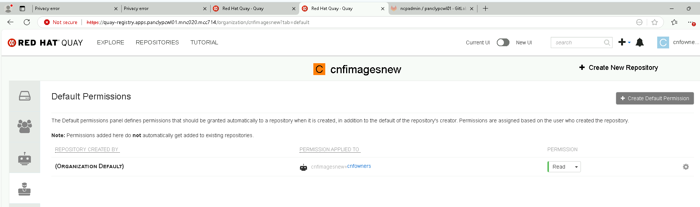

# Proxy-cache quay based pod creation

## proxy-cache TLS issue. 

0) Login in to CWL cluster and make sure mcp and nodes are looks good at this point, if any issue, need to be resolved first. 

```
[root@ncputility ~ pancwl_rc]$ oc get nodes
NAME                                     STATUS   ROLES                              AGE   VERSION
appworker0.panclypcwl01.mnc020.mcc714    Ready    appworker,appworker-mcp-a,worker   38d   v1.29.6+aba1e8d
appworker1.panclypcwl01.mnc020.mcc714    Ready    appworker,appworker-mcp-a,worker   38d   v1.29.6+aba1e8d
appworker10.panclypcwl01.mnc020.mcc714   Ready    appworker,appworker-mcp-b,worker   37d   v1.29.6+aba1e8d
appworker11.panclypcwl01.mnc020.mcc714   Ready    appworker,appworker-mcp-b,worker   37d   v1.29.6+aba1e8d
appworker12.panclypcwl01.mnc020.mcc714   Ready    appworker,appworker-mcp-b,worker   37d   v1.29.6+aba1e8d
appworker13.panclypcwl01.mnc020.mcc714   Ready    appworker,appworker-mcp-b,worker   37d   v1.29.6+aba1e8d
appworker14.panclypcwl01.mnc020.mcc714   Ready    appworker,appworker-mcp-b,worker   37d   v1.29.6+aba1e8d
appworker15.panclypcwl01.mnc020.mcc714   Ready    appworker,appworker-mcp-b,worker   37d   v1.29.6+aba1e8d
appworker16.panclypcwl01.mnc020.mcc714   Ready    appworker,appworker-mcp-b,worker   37d   v1.29.6+aba1e8d
appworker17.panclypcwl01.mnc020.mcc714   Ready    appworker,appworker-mcp-b,worker   37d   v1.29.6+aba1e8d
appworker19.panclypcwl01.mnc020.mcc714   Ready    appworker,appworker-mcp-c,worker   37d   v1.29.6+aba1e8d
appworker2.panclypcwl01.mnc020.mcc714    Ready    appworker,appworker-mcp-a,worker   30d   v1.29.6+aba1e8d
appworker20.panclypcwl01.mnc020.mcc714   Ready    appworker,appworker-mcp-c,worker   37d   v1.29.6+aba1e8d
appworker21.panclypcwl01.mnc020.mcc714   Ready    appworker,appworker-mcp-c,worker   37d   v1.29.6+aba1e8d
appworker22.panclypcwl01.mnc020.mcc714   Ready    appworker,appworker-mcp-c,worker   37d   v1.29.6+aba1e8d
appworker23.panclypcwl01.mnc020.mcc714   Ready    appworker,appworker-mcp-c,worker   37d   v1.29.6+aba1e8d
appworker24.panclypcwl01.mnc020.mcc714   Ready    appworker,appworker-mcp-c,worker   37d   v1.29.6+aba1e8d
appworker25.panclypcwl01.mnc020.mcc714   Ready    appworker,appworker-mcp-c,worker   37d   v1.29.6+aba1e8d
appworker26.panclypcwl01.mnc020.mcc714   Ready    appworker,appworker-mcp-c,worker   37d   v1.29.6+aba1e8d
appworker27.panclypcwl01.mnc020.mcc714   Ready    appworker,appworker-mcp-d,worker   37d   v1.29.6+aba1e8d
appworker28.panclypcwl01.mnc020.mcc714   Ready    appworker,appworker-mcp-d,worker   37d   v1.29.6+aba1e8d
appworker29.panclypcwl01.mnc020.mcc714   Ready    appworker,appworker-mcp-d,worker   37d   v1.29.6+aba1e8d
appworker3.panclypcwl01.mnc020.mcc714    Ready    appworker,appworker-mcp-a,worker   38d   v1.29.6+aba1e8d
appworker30.panclypcwl01.mnc020.mcc714   Ready    appworker,appworker-mcp-d,worker   37d   v1.29.6+aba1e8d
appworker31.panclypcwl01.mnc020.mcc714   Ready    appworker,appworker-mcp-d,worker   37d   v1.29.6+aba1e8d
appworker32.panclypcwl01.mnc020.mcc714   Ready    appworker,appworker-mcp-d,worker   37d   v1.29.6+aba1e8d
appworker33.panclypcwl01.mnc020.mcc714   Ready    appworker,appworker-mcp-d,worker   37d   v1.29.6+aba1e8d
appworker34.panclypcwl01.mnc020.mcc714   Ready    appworker,appworker-mcp-d,worker   37d   v1.29.6+aba1e8d
appworker4.panclypcwl01.mnc020.mcc714    Ready    appworker,appworker-mcp-a,worker   38d   v1.29.6+aba1e8d
appworker5.panclypcwl01.mnc020.mcc714    Ready    appworker,appworker-mcp-a,worker   38d   v1.29.6+aba1e8d
appworker6.panclypcwl01.mnc020.mcc714    Ready    appworker,appworker-mcp-a,worker   38d   v1.29.6+aba1e8d
appworker7.panclypcwl01.mnc020.mcc714    Ready    appworker,appworker-mcp-a,worker   37d   v1.29.6+aba1e8d
appworker9.panclypcwl01.mnc020.mcc714    Ready    appworker,appworker-mcp-b,worker   37d   v1.29.6+aba1e8d
gateway1.panclypcwl01.mnc020.mcc714      Ready    gateway,gateway-mcp-a,worker       38d   v1.29.6+aba1e8d
gateway2.panclypcwl01.mnc020.mcc714      Ready    gateway,gateway-mcp-a,worker       38d   v1.29.6+aba1e8d
gateway3.panclypcwl01.mnc020.mcc714      Ready    gateway,gateway-mcp-b,worker       38d   v1.29.6+aba1e8d
gateway4.panclypcwl01.mnc020.mcc714      Ready    gateway,gateway-mcp-b,worker       38d   v1.29.6+aba1e8d
master0.panclypcwl01.mnc020.mcc714       Ready    control-plane,master,monitor       38d   v1.29.6+aba1e8d
master1.panclypcwl01.mnc020.mcc714       Ready    control-plane,master,monitor       38d   v1.29.6+aba1e8d
master2.panclypcwl01.mnc020.mcc714       Ready    control-plane,master,monitor       38d   v1.29.6+aba1e8d
storage0.panclypcwl01.mnc020.mcc714      Ready    storage,worker                     38d   v1.29.6+aba1e8d
storage1.panclypcwl01.mnc020.mcc714      Ready    storage,worker                     38d   v1.29.6+aba1e8d
storage2.panclypcwl01.mnc020.mcc714      Ready    storage,worker                     38d   v1.29.6+aba1e8d
storage3.panclypcwl01.mnc020.mcc714      Ready    storage,worker                     38d   v1.29.6+aba1e8d
storage4.panclypcwl01.mnc020.mcc714      Ready    storage,worker                     38d   v1.29.6+aba1e8d
[root@ncputility ~ pancwl_rc]$ oc get mcp
NAME              CONFIG                                                      UPDATED   UPDATING   DEGRADED   MACHINECOUNT   READYMACHINECOUNT   UPDATEDMACHINECOUNT   DEGRADEDMACHINECOUNT   AGE
appworker-mcp-a   rendered-appworker-mcp-a-0e9dd6df593dcd5016bbe7d601119bf4   True      False      False      8              8                   8                     0                      37d
appworker-mcp-b   rendered-appworker-mcp-b-0e9dd6df593dcd5016bbe7d601119bf4   True      False      False      9              9                   9                     0                      37d
appworker-mcp-c   rendered-appworker-mcp-c-5afb864664d3b10530b54b3153a1a61e   True      False      False      8              8                   8                     0                      29h
appworker-mcp-d   rendered-appworker-mcp-d-5afb864664d3b10530b54b3153a1a61e   True      False      False      8              8                   8                     0                      29h
gateway-mcp-a     rendered-gateway-mcp-a-c81254a16575de9053ae543c4f1ba3fb     True      False      False      2              2                   2                     0                      37d
gateway-mcp-b     rendered-gateway-mcp-b-3be41ecbbe09004c35ca04a4309cabf0     True      False      False      2              2                   2                     0                      29h
master            rendered-master-114f60e6be691323222ea11e72de0bcf            True      False      False      3              3                   3                     0                      38d
storage           rendered-storage-dc2d8a34080bce1400e11bb1fb098693           True      False      False      5              5                   5                     0                      37d
worker            rendered-worker-68cb1df39185f7ad80fda7915e4c5a42            True      False      False      0              0                   0                     0                      38d
[root@ncputility ~ pancwl_rc]$

```

1) login to hub cluster and run this command 
```
[root@ncputility ~ pancwl_rc]$ source /root/panhubrc
WARNING: Using insecure TLS client config. Setting this option is not supported!

Login successful.

You have access to 105 projects, the list has been suppressed. You can list all projects with 'oc projects'

Using project "default".
[root@ncputility ~ panhub_rc]$ oc get secret -n openshift-ingress-operator router-ca -o "jsonpath={.data['tls\.crt']}" | base64 -d
-----BEGIN CERTIFICATE-----
MIIDDDCCAfSgAwIBAgIBATANBgkqhkiG9w0BAQsFADAmMSQwIgYDVQQDDBtpbmdy
ZXNzLW9wZXJhdG9yQDE3NDAwNzQ1NDQwHhcNMjUwMjIwMTgwMjIzWhcNMjcwMjIw
MTgwMjI0WjAmMSQwIgYDVQQDDBtpbmdyZXNzLW9wZXJhdG9yQDE3NDAwNzQ1NDQw
ggEiMA0GCSqGSIb3DQEBAQUAA4IBDwAwggEKAoIBAQDjXWFSVPshwihivZhaTrB7
0boUOw2j3Ut/J6eSm+JA+xVl05L4XD8+C8VSst+f32Pe42Lso2hrovY1dT7IBX3g
6S9Nnd2iRc9vC/qHcQkGQ6krIYSQ48aCH7UuahCpTqxEp+MwmhCTQngN2maTJBe3
0E6K2IL4zXSi0Iuj08BOnH/w4pJxeWhyngXDf2SeA88EmU3juHLshHrAND84uou2
/sOStIAhFwU+o887dSgx7iERy+6nczSDB9Qvq11cUSS4RPC82bNnxcc+BrynDwZ/
eggs0OEaj/1cHu/svKZHX9gUKrqz80wF8YGZLLgI2oPAf2VJorvtkJAErzgttroF
AgMBAAGjRTBDMA4GA1UdDwEB/wQEAwICpDASBgNVHRMBAf8ECDAGAQH/AgEAMB0G
A1UdDgQWBBTZS/SzkBfiHQ5/Gy+b4g1XJOHkojANBgkqhkiG9w0BAQsFAAOCAQEA
UwPhAbzTWZIlBsMHAL+8jvxM8qxc6HDhayAD4gbCE65vHYgSizost02vRfpOPQq1
D6HM8JjifS3KHd6E6chdTbrHI0W8pMJJPon5akCJf/uGeGDl+2wKfmVC6UoV7hC3
pcUzm3JKwsNJbjS5rxL8f5a8bNdIFfLQKuyRpnVX2CsNHvh+WJzynQ+PUJ6zCa7y
x5AJxca2PTnBKRoVTAyumT1suluI9f4GRYnxTE/qIKRZRs+uT3kIl/N9VX+GbjGb
pPszJ+p6N6Arl1BqJP1DdLin2IFGZL39pTyifm5GP+Vou2aHPuHZDVoCdxsFKup+
gUY2KeKz0UManwubPQNnKA==
-----END CERTIFICATE-----
[root@ncputility ~ panhub_rc]$

```

2) login to workload cluster and run this command 
```
[root@ncputility ~ pancwl_rc]$ source /root/pancwlrc
WARNING: Using insecure TLS client config. Setting this option is not supported!

Login successful.

You have access to 115 projects, the list has been suppressed. You can list all projects with 'oc projects'

Using project "nokia".
[root@ncputility ~ pancwl_rc]$ oc get cm -n openshift-config user-ca-bundle -o yaml
apiVersion: v1
data:
  ca-bundle.crt: |
    -----BEGIN CERTIFICATE-----
    MIIDDDCCAfSgAwIBAgIBATANBgkqhkiG9w0BAQsFADAmMSQwIgYDVQQDDBtpbmdy
    ZXNzLW9wZXJhdG9yQDE3NDAwNzQ1NDQwHhcNMjUwMjIwMTgwMjIzWhcNMjcwMjIw
    MTgwMjI0WjAmMSQwIgYDVQQDDBtpbmdyZXNzLW9wZXJhdG9yQDE3NDAwNzQ1NDQw
    ggEiMA0GCSqGSIb3DQEBAQUAA4IBDwAwggEKAoIBAQDjXWFSVPshwihivZhaTrB7
    0boUOw2j3Ut/J6eSm+JA+xVl05L4XD8+C8VSst+f32Pe42Lso2hrovY1dT7IBX3g
    6S9Nnd2iRc9vC/qHcQkGQ6krIYSQ48aCH7UuahCpTqxEp+MwmhCTQngN2maTJBe3
    0E6K2IL4zXSi0Iuj08BOnH/w4pJxeWhyngXDf2SeA88EmU3juHLshHrAND84uou2
    /sOStIAhFwU+o887dSgx7iERy+6nczSDB9Qvq11cUSS4RPC82bNnxcc+BrynDwZ/
    eggs0OEaj/1cHu/svKZHX9gUKrqz80wF8YGZLLgI2oPAf2VJorvtkJAErzgttroF
    AgMBAAGjRTBDMA4GA1UdDwEB/wQEAwICpDASBgNVHRMBAf8ECDAGAQH/AgEAMB0G
    A1UdDgQWBBTZS/SzkBfiHQ5/Gy+b4g1XJOHkojANBgkqhkiG9w0BAQsFAAOCAQEA
    UwPhAbzTWZIlBsMHAL+8jvxM8qxc6HDhayAD4gbCE65vHYgSizost02vRfpOPQq1
    D6HM8JjifS3KHd6E6chdTbrHI0W8pMJJPon5akCJf/uGeGDl+2wKfmVC6UoV7hC3
    pcUzm3JKwsNJbjS5rxL8f5a8bNdIFfLQKuyRpnVX2CsNHvh+WJzynQ+PUJ6zCa7y
    x5AJxca2PTnBKRoVTAyumT1suluI9f4GRYnxTE/qIKRZRs+uT3kIl/N9VX+GbjGb
    pPszJ+p6N6Arl1BqJP1DdLin2IFGZL39pTyifm5GP+Vou2aHPuHZDVoCdxsFKup+
    gUY2KeKz0UManwubPQNnKA==
    -----END CERTIFICATE-----
kind: ConfigMap
metadata:
  annotations:
    openshift.io/owning-component: End User
  creationTimestamp: "2025-03-03T08:56:26Z"
  name: user-ca-bundle
  namespace: openshift-config
  resourceVersion: "43318895"
  uid: 6624e5ad-93b5-418e-8c1e-7a91c724a760
[root@ncputility ~ pancwl_rc]$ oc get proxy cluster -o yaml
apiVersion: config.openshift.io/v1
kind: Proxy
metadata:
  creationTimestamp: "2025-03-03T08:54:59Z"
  generation: 2
  name: cluster
  resourceVersion: "48312416"
  uid: ceaebe02-9bd3-4361-847e-1b880ebb85de
spec:
  trustedCA:
    name: user-ca-bundle   <---------------------------- this should be patched. if missing. 
status: {}
[root@ncputility ~ pancwl_rc]$
```

3) login to workload cluster add tls of hub to cwl. 
```
[root@ncputility ~ pancwl_rc]$ oc patch proxy cluster --patch '{"spec":{"trustedCA":{"name":"user-ca-bundle"}}}' --type=merge
[root@ncputility ~ pancwl_rc]$ oc get proxy cluster -o yaml
apiVersion: config.openshift.io/v1
kind: Proxy
metadata:
  creationTimestamp: "2025-03-03T08:54:59Z"
  generation: 2
  name: cluster
  resourceVersion: "48312416"
  uid: ceaebe02-9bd3-4361-847e-1b880ebb85de
spec:
  trustedCA:
    name: user-ca-bundle
status: {}
[root@ncputility ~ pancwl_rc]$

```
## Configure the proxy cache on the registry level. 

### hub quay configiration

1) Open up the hub quay url 

### CWL quay configuration 

1) Open CWL quay login via super account and created an user called cnfowners also fix the passwd.


2) Create an org as same as hub quay. 


3) Set the proxy cache configuration for the organization


4) create robot account and default permission



5) Create a new team for image pull user


6) Set default permission for the pull user (optional)

<Organization> → Default Permissions → + Create Default Permission

7) Extend the global image pull secret

> During the Managed cluster installation, the global pull secret is configured. If the 2nd Hub Quay account and the cache account are not prepared in advance, these accounts need to be added. In case of mirrored registries, only the global pull secret can be used. It is not possible to add project specific pull secrets. For more information, see chapter Image configuration resources in document Images, available in OpenShift Container Platform Product documentation.

## Testing pod creation using `proxy-cache` quay. 

1) Login the namespace with cluster admin access to grand rights for an scc. 
```
[root@ncputility ~ pancwl_rc]$ source  /root/pancwlrc
WARNING: Using insecure TLS client config. Setting this option is not supported!

Login successful.

You have access to 116 projects, the list has been suppressed. You can list all projects with 'oc projects'

Using project "default".
[root@ncputility ~ pancwl_rc]$ 
```
2) Grand admin rights to project. if missed during project creation phase. 
```
[root@ncputility ~ pancwl_rc]$ oc policy add-role-to-user admin  nokia  -n nokia
clusterrole.rbac.authorization.k8s.io/admin added: "nokia"
[root@ncputility ~ pancwl_rc]$ 
```
3) Also grand scc role to default service account via anyuid. 
```
[root@ncputility ~ pancwl_rc]$ oc adm policy add-scc-to-user anyuid -z default -n nokia
clusterrole.rbac.authorization.k8s.io/system:openshift:scc:anyuid added: "default"
[root@ncputility ~ pancwl_rc]$ 
```
4) login to cnf tenant here .
```
[root@ncputility ~ pancwl_rc]$ oc login -u nokia -p nokia@123
WARNING: Using insecure TLS client config. Setting this option is not supported!

Login successful.

You have one project on this server: "nokia"

Using project "nokia".
[root@ncputility ~ pancwl_rc]$ 
```
5) run an pod using proxy-cache url 
```
[root@ncputility ~ pancwl_rc]$  oc run podpingtest3 --image=ephemeral.url/cnfimages/testimage01:latest --restart=Never  -- tail -f /dev/null
pod/podpingtest3 created
[root@ncputility ~ pancwl_rc]$ oc get pods
NAME           READY   STATUS              RESTARTS   AGE
podpingtest3   0/1     ContainerCreating   0          4s
[root@ncputility ~ pancwl_rc]$ oc get pods
NAME           READY   STATUS              RESTARTS   AGE
podpingtest3   0/1     ContainerCreating   0          6s
[root@ncputility ~ pancwl_rc]$ oc get pods
NAME           READY   STATUS              RESTARTS   AGE
podpingtest3   0/1     ContainerCreating   0          8s
[root@ncputility ~ pancwl_rc]$ oc get pods
NAME           READY   STATUS              RESTARTS   AGE
podpingtest3   0/1     ContainerCreating   0          9s
[root@ncputility ~ pancwl_rc]$ oc get pods
NAME           READY   STATUS              RESTARTS   AGE
podpingtest3   0/1     ContainerCreating   0          11s
[root@ncputility ~ pancwl_rc]$ oc get pods
NAME           READY   STATUS              RESTARTS   AGE
podpingtest3   0/1     ContainerCreating   0          13s
[root@ncputility ~ pancwl_rc]$ 
```
6) validate the pod status and make sure it's getting the image via proxy-cache. 
```
[root@ncputility ~ pancwl_rc]$ oc get pods
NAME           READY   STATUS    RESTARTS   AGE
podpingtest3   1/1     Running   0          5m1s
[root@ncputility ~ pancwl_rc]$


[root@ncputility ~ pancwl_rc]$ oc describe pod podpingtest3
Name:             podpingtest3
Namespace:        nokia
Priority:         0
Service Account:  default
Node:             appworker9.panclypcwl01.mnc020.mcc714/10.89.96.35
Start Time:       Fri, 04 Apr 2025 08:04:47 -0500
Labels:           run=podpingtest3
Annotations:      k8s.ovn.org/pod-networks:
                    {"default":{"ip_addresses":["172.19.21.252/23"],"mac_address":"0a:58:ac:13:15:fc","gateway_ips":["172.19.20.1"],"routes":[{"dest":"172.16....
                  k8s.v1.cni.cncf.io/network-status:
                    [{
                        "name": "ovn-kubernetes",
                        "interface": "eth0",
                        "ips": [
                            "172.19.21.252"
                        ],
                        "mac": "0a:58:ac:13:15:fc",
                        "default": true,
                        "dns": {}
                    }]
                  openshift.io/scc: anyuid
Status:           Running
IP:               172.19.21.252
IPs:
  IP:  172.19.21.252
Containers:
  podpingtest3:
    Container ID:  cri-o://749055ef608c6f30be42248c63889fd85377928389dae2e29eed50919cc2ee79
    Image:         ephemeral.url/cnfimages/testimage01:latest
    Image ID:      ephemeral.url/cnfimages/testimage01@sha256:32666e0234f88377a91de56bb78f2d4f8df45b4f99c1c2dc9ee1d134c84f4753
    Port:          <none>
    Host Port:     <none>
    Args:
      tail
      -f
      /dev/null
    State:          Running
      Started:      Fri, 04 Apr 2025 08:05:05 -0500
    Ready:          True
    Restart Count:  0
    Environment:    <none>
    Mounts:
      /var/run/secrets/kubernetes.io/serviceaccount from kube-api-access-mp46w (ro)
Conditions:
  Type                        Status
  PodReadyToStartContainers   True
  Initialized                 True
  Ready                       True
  ContainersReady             True
  PodScheduled                True
Volumes:
  kube-api-access-mp46w:
    Type:                    Projected (a volume that contains injected data from multiple sources)
    TokenExpirationSeconds:  3607
    ConfigMapName:           kube-root-ca.crt
    ConfigMapOptional:       <nil>
    DownwardAPI:             true
    ConfigMapName:           openshift-service-ca.crt
    ConfigMapOptional:       <nil>
QoS Class:                   BestEffort
Node-Selectors:              <none>
Tolerations:                 node.kubernetes.io/not-ready:NoExecute op=Exists for 60s
                             node.kubernetes.io/unreachable:NoExecute op=Exists for 60s
Events:
  Type    Reason          Age    From               Message
  ----    ------          ----   ----               -------
  Normal  Scheduled       6m5s   default-scheduler  Successfully assigned nokia/podpingtest3 to appworker9.panclypcwl01.mnc020.mcc714
  Normal  AddedInterface  6m4s   multus             Add eth0 [172.19.21.252/23] from ovn-kubernetes
  Normal  Pulling         6m4s   kubelet            Pulling image "ephemeral.url/cnfimages/testimage01:latest"
  Normal  Pulled          5m47s  kubelet            Successfully pulled image "ephemeral.url/cnfimages/testimage01:latest" in 17.521s (17.521s including waiting)
  Normal  Created         5m47s  kubelet            Created container podpingtest3
  Normal  Started         5m47s  kubelet            Started container podpingtest3
[root@ncputility ~ pancwl_rc]$

```


## CNF image upload using pod command 

1) login to hub quay using cnfowners and org as cnfimages. 

```
[root@ncputility ~ pancwl_rc]$ podman login quay-registry.apps.panclyphub01.mnc020.mcc714 -u cnfowners -p cnfowners
Login Succeeded!
[root@ncputility ~ pancwl_rc]$

```

2) load the container images to log registry 
```
[root@ncputility ~ pancwl_rc]$ podman load -i <filename>.tar^C
[root@ncputility ~ pancwl_rc]$
```

3) tag the image to your registry here 

```
[root@ncputility ~ pancwl_rc]$ podman tag quay-registry.apps.panclyphub01.mnc020.mcc714/cnfimages/testimage01 quay-registry.apps.panclyphub01.mnc020.mcc714/cnfimagesnew/testimage01:latest
[root@ncputility ~ pancwl_rc]$
```

4) push the image to remore registry using podman push command here .
```
[root@ncputility ~ pancwl_rc]$ podman push quay-registry.apps.panclyphub01.mnc020.mcc714/cnfimagesnew/testimage01:latest
Getting image source signatures
Copying blob 1af69dabfc93 done   |
Copying blob 53f86715cdba done   |
Copying blob b6361360b38a done   |
Copying config d39b33df22 done   |
Writing manifest to image destination
[root@ncputility ~ pancwl_rc]$
```