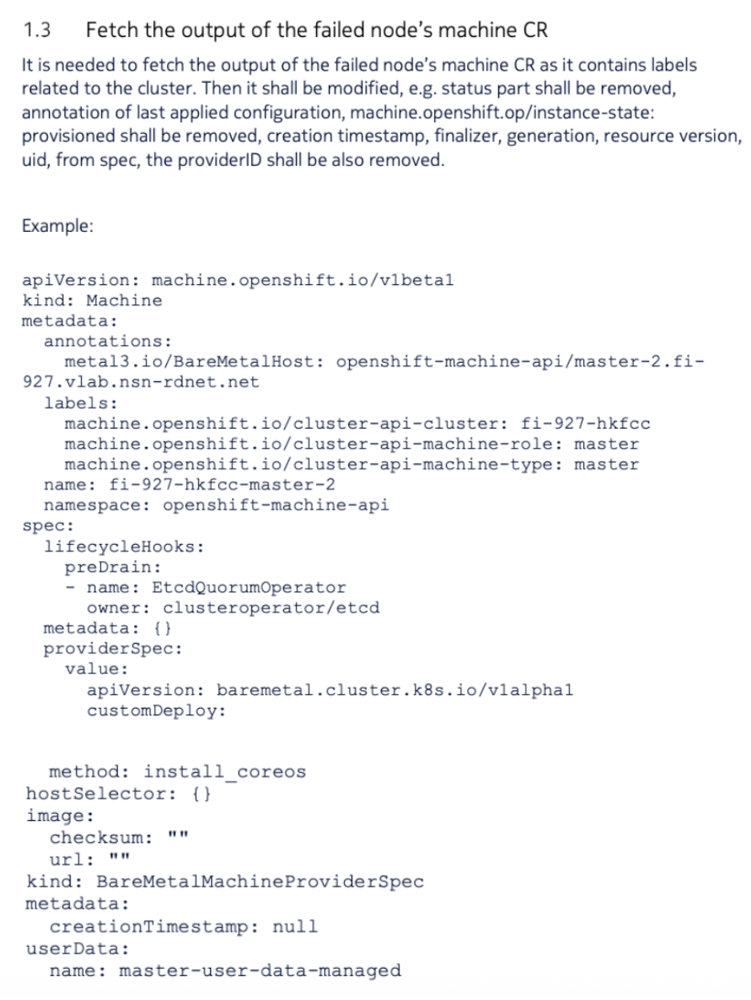

# Hub Cluster - Master Replacement 

> Here is the steps to do the master replacement on the hub cluster.  Dont use this steps for NMC/NWC.  


## Highlevel Steps

* [Removing the failed node from the cluster](#removing-the-failed-node-from-the-cluster)
* [Adding back the node control plane node](#adding-back-the-node-control-plane-node)


## Removing the failed node from the cluster 

### Identifying the failed control plane node

1) First identify which node is the failed one, e.g. which is in NotReady state, using the `oc get nodes` command.

```
[root@dom16hub101-infra-manager ~]# oc get nodes
NAME                                               STATUS   ROLES                                 AGE   VERSION
ncpvblvhub-hubmaster-101.ncpvblvhub.t-mobile.lab   Ready    control-plane,master,monitor,worker   74d   v1.29.10+67d3387
ncpvblvhub-hubmaster-102.ncpvblvhub.t-mobile.lab   Ready    control-plane,master,monitor,worker   74d   v1.29.10+67d3387
ncpvblvhub-hubmaster-103.ncpvblvhub.t-mobile.lab   Ready    control-plane,master,monitor,worker   74d   v1.29.10+67d3387
ncpvblvhub-hubworker-101.ncpvblvhub.t-mobile.lab   Ready    gateway,worker                        74d   v1.29.10+67d3387
ncpvblvhub-hubworker-102.ncpvblvhub.t-mobile.lab   Ready    gateway,worker                        74d   v1.29.10+67d3387
[root@dom16hub101-infra-manager ~]#
```

> Example `ncpvblvhub-hubmaster-102.ncpvblvhub.t-mobile.lab` will use this node for replacement.

```
[root@dom16hub101-infra-manager ~]# oc get nodes
NAME                                               STATUS                     ROLES                                 AGE   VERSION
ncpvblvhub-hubmaster-101.ncpvblvhub.t-mobile.lab   Ready                      control-plane,master,monitor,worker   74d   v1.29.10+67d3387
ncpvblvhub-hubmaster-102.ncpvblvhub.t-mobile.lab   Ready,SchedulingDisabled   control-plane,master,monitor,worker   74d   v1.29.10+67d3387
ncpvblvhub-hubmaster-103.ncpvblvhub.t-mobile.lab   Ready                      control-plane,master,monitor,worker   74d   v1.29.10+67d3387
ncpvblvhub-hubworker-101.ncpvblvhub.t-mobile.lab   Ready                      gateway,worker                        74d   v1.29.10+67d3387
ncpvblvhub-hubworker-102.ncpvblvhub.t-mobile.lab   Ready                      gateway,worker                        74d   v1.29.10+67d3387
[root@dom16hub101-infra-manager ~]# 
```

2) Drain the node, using oc adm drain command. 

```
[root@dom16hub101-infra-manager ~]# oc adm drain ncpvblvhub-hubmaster-102.ncpvblvhub.t-mobile.lab --ignore-daemonsets --delete-emptydir-data --force
node/ncpvblvhub-hubmaster-102.ncpvblvhub.t-mobile.lab already cordoned
Warning: ignoring DaemonSet-managed Pods: open-cluster-management-backup/node-agent-lvlpm, openshift-cluster-node-tuning-operator/tuned-2xqzr, openshift-dns/dns-default-x7x7p, openshift-dns/node-resolver-sd5qh, openshift-image-registry/node-ca-5nkn2, openshift-ingress-canary/ingress-canary-rngvh, openshift-local-storage/diskmaker-discovery-4snb5, openshift-local-storage/diskmaker-manager-vkkxk, openshift-machine-api/ironic-proxy-24kth, openshift-machine-config-operator/machine-config-daemon-9j45d, openshift-machine-config-operator/machine-config-server-ww4tz, openshift-monitoring/node-exporter-9xshs, openshift-multus/multus-additional-cni-plugins-hkcdv, openshift-multus/multus-dt7qt, openshift-multus/network-metrics-daemon-4j5fx, openshift-multus/whereabouts-reconciler-bv24v, openshift-network-diagnostics/network-check-target-btgf8, openshift-network-node-identity/network-node-identity-td874, openshift-network-operator/iptables-alerter-75rfw, openshift-nmstate/nmstate-handler-tngrh, openshift-ovn-kubernetes/ovnkube-node-svz9x, openshift-storage/csi-cephfsplugin-rnkrk, openshift-storage/csi-rbdplugin-zg88h; deleting Pods that declare no controller: openshift-etcd/etcd-guard-ncpvblvhub-hubmaster-102.ncpvblvhub.t-mobile.lab, openshift-kube-apiserver/kube-apiserver-guard-ncpvblvhub-hubmaster-102.ncpvblvhub.t-mobile.lab, openshift-kube-controller-manager/kube-controller-manager-guard-ncpvblvhub-hubmaster-102.ncpvblvhub.t-mobile.lab, openshift-kube-scheduler/openshift-kube-scheduler-guard-ncpvblvhub-hubmaster-102.ncpvblvhub.t-mobile.lab
evicting pod multicluster-engine/clusterclaims-controller-7d56ff6fc9-555pz
evicting pod ncd-git/ncd-git-gitlab-shell-55ccf645ff-ks77d
evicting pod multicluster-engine/assisted-image-service-0
evicting pod multicluster-engine/assisted-service-96cf94d9c-wg9zh
evicting pod ncd-db/ncd-postgresql-postgresql-ha-sentinel-8556d466c6-kd52n
evicting pod openshift-logging/logging-loki-gateway-7687c66f64-fxd4d
evicting pod ncd-db/ncd-postgresql-postgresql-ha-proxy-54c69f6cc-csqbz
evicting pod open-cluster-management-observability/observability-thanos-rule-1
evicting pod openshift-machine-api/cluster-baremetal-operator-75fbb58cc5-lpqds
evicting pod open-cluster-management-hub/cluster-manager-registration-controller-7bcbcd64c5-s5p8l
evicting pod open-cluster-management-observability/observability-grafana-85c6896fd4-7vxzp
evicting pod openshift-machine-api/control-plane-machine-set-operator-65fbf4bd7-j2l2r
** output Omitted **
pod/console-mce-console-57b6b4968-jfl4x evicted
pod/logging-loki-query-frontend-55bc666b5c-87hmh evicted
pod/ncd-postgresql-postgresql-ha-keeper-2 evicted
pod/apiserver-776b5f87d7-6t6vz evicted
node/ncpvblvhub-hubmaster-102.ncpvblvhub.t-mobile.lab drained
[root@dom16hub101-infra-manager ~]#

```
3) Once drain complete, shutdown the node. (power off)
```
[root@dom16hub101-infra-manager ~]# oc get nodes
NAME                                               STATUS                     ROLES                                 AGE   VERSION
ncpvblvhub-hubmaster-101.ncpvblvhub.t-mobile.lab   Ready                      control-plane,master,monitor,worker   74d   v1.29.10+67d3387
ncpvblvhub-hubmaster-102.ncpvblvhub.t-mobile.lab   Ready,SchedulingDisabled   control-plane,master,monitor,worker   74d   v1.29.10+67d3387
ncpvblvhub-hubmaster-103.ncpvblvhub.t-mobile.lab   Ready                      control-plane,master,monitor,worker   74d   v1.29.10+67d3387
ncpvblvhub-hubworker-101.ncpvblvhub.t-mobile.lab   Ready                      gateway,worker                        74d   v1.29.10+67d3387
ncpvblvhub-hubworker-102.ncpvblvhub.t-mobile.lab   Ready                      gateway,worker                        74d   v1.29.10+67d3387
```
4) Post power off, node will become not ready. 
```
[root@dom16hub101-infra-manager ~]# oc get nodes
NAME                                               STATUS                        ROLES                                 AGE   VERSION
ncpvblvhub-hubmaster-101.ncpvblvhub.t-mobile.lab   Ready                         control-plane,master,monitor,worker   74d   v1.29.10+67d3387
ncpvblvhub-hubmaster-102.ncpvblvhub.t-mobile.lab   NotReady,SchedulingDisabled   control-plane,master,monitor,worker   74d   v1.29.10+67d3387
ncpvblvhub-hubmaster-103.ncpvblvhub.t-mobile.lab   Ready                         control-plane,master,monitor,worker   74d   v1.29.10+67d3387
ncpvblvhub-hubworker-101.ncpvblvhub.t-mobile.lab   Ready                         gateway,worker                        74d   v1.29.10+67d3387
ncpvblvhub-hubworker-102.ncpvblvhub.t-mobile.lab   Ready                         gateway,worker                        74d   v1.29.10+67d3387
[root@dom16hub101-infra-manager ~]#

```
### Removing the node from the etcd cluster

1) First fetch the pods from the openshift-etcd namespace which have the label k8s-app=etcd.

```
[root@dom16hub101-infra-manager ~]# oc -n openshift-etcd get pods -l k8s-app=etcd -o wide
NAME                                                    READY   STATUS    RESTARTS   AGE   IP              NODE                                               NOMINATED NODE   READINESS GATES
etcd-ncpvblvhub-hubmaster-101.ncpvblvhub.t-mobile.lab   4/4     Running   12         74d   10.145.151.92   ncpvblvhub-hubmaster-101.ncpvblvhub.t-mobile.lab   <none>           <none>
etcd-ncpvblvhub-hubmaster-102.ncpvblvhub.t-mobile.lab   0/0     not running   12         74d   10.145.151.93   ncpvblvhub-hubmaster-102.ncpvblvhub.t-mobile.lab   <none>           <none>
etcd-ncpvblvhub-hubmaster-103.ncpvblvhub.t-mobile.lab   4/4     Running   8          74d   10.145.151.94   ncpvblvhub-hubmaster-103.ncpvblvhub.t-mobile.lab   <none>           <none>
[root@dom16hub101-infra-manager ~]# 
```

2) Start a remote shall to one of the pods which shall be running, and not scheduled on the failed node.

```
[root@dom16hub101-infra-manager ~]# oc rsh -n openshift-etcd etcd-ncpvblvhub-hubmaster-102.ncpvblvhub.t-mobile.lab
sh-5.1# etcdctl endpoint health
{"level":"warn","ts":"2025-05-27T17:09:44.374886Z","logger":"client","caller":"v3@v3.5.14/retry_interceptor.go:63","msg":"retrying of unary invoker failed","target":"etcd-endpoints://0xc00027a000/10.145.151.93:2379","attempt":0,"error":"rpc error: code = DeadlineExceeded desc = context deadline exceeded"}
https://10.145.151.94:2379 is healthy: successfully committed proposal: took = 7.162307ms
https://10.145.151.92:2379 is healthy: successfully committed proposal: took = 7.213802ms
https://10.145.151.93:2379 is unhealthy: failed to commit proposal: context deadline exceeded
Error: unhealthy cluster
sh-5.1#
```

3) check the status of the etdctl memebers. and removed the scale-in commpute. 

```
sh-5.1# etcdctl member list -w table
+------------------+---------+--------------------------------------------------+----------------------------+----------------------------+------------+
|        ID        | STATUS  |                       NAME                       |         PEER ADDRS         |        CLIENT ADDRS        | IS LEARNER |
+------------------+---------+--------------------------------------------------+----------------------------+----------------------------+------------+
| 44ad9888985e068c | started | ncpvblvhub-hubmaster-101.ncpvblvhub.t-mobile.lab | https://10.145.151.92:2380 | https://10.145.151.92:2379 |      false |
| f26d12a58d17e571 | started | ncpvblvhub-hubmaster-103.ncpvblvhub.t-mobile.lab | https://10.145.151.94:2380 | https://10.145.151.94:2379 |      false |
| fc4de79a3d723a5c | Not running | ncpvblvhub-hubmaster-102.ncpvblvhub.t-mobile.lab | https://10.145.151.93:2380 | https://10.145.151.93:2379 |      false |
+------------------+---------+--------------------------------------------------+----------------------------+----------------------------+------------+
sh-5.1# etcdctl member remove fc4de79a3d723a5c
Member fc4de79a3d723a5c removed from cluster 136d42915c2b0516
sh-5.1# etcdctl member list -w table
+------------------+---------+--------------------------------------------------+----------------------------+----------------------------+------------+
|        ID        | STATUS  |                       NAME                       |         PEER ADDRS         |        CLIENT ADDRS        | IS LEARNER |
+------------------+---------+--------------------------------------------------+----------------------------+----------------------------+------------+
| 44ad9888985e068c | started | ncpvblvhub-hubmaster-101.ncpvblvhub.t-mobile.lab | https://10.145.151.92:2380 | https://10.145.151.92:2379 |      false |
| f26d12a58d17e571 | started | ncpvblvhub-hubmaster-103.ncpvblvhub.t-mobile.lab | https://10.145.151.94:2380 | https://10.145.151.94:2379 |      false |
+------------------+---------+--------------------------------------------------+----------------------------+----------------------------+------------+
sh-5.1#
```

4) check the etcd health now. 
```
sh-5.1#  etcdctl endpoint health
{"level":"warn","ts":"2025-05-27T17:10:43.025287Z","logger":"client","caller":"v3@v3.5.14/retry_interceptor.go:63","msg":"retrying of unary invoker failed","target":"etcd-endpoints://0xc000020000/10.145.151.93:2379","attempt":0,"error":"rpc error: code = DeadlineExceeded desc = context deadline exceeded"}
https://10.145.151.94:2379 is healthy: successfully committed proposal: took = 6.399106ms
https://10.145.151.92:2379 is healthy: successfully committed proposal: took = 6.344247ms
https://10.145.151.93:2379 is unhealthy: failed to commit proposal: context deadline exceeded
Error: unhealthy cluster
sh-5.1#
exit
command terminated with exit code 1
[root@dom16hub101-infra-manager ~]#
```

5) run the following command to Turn off the quorum guard:
```
[root@dom16hub101-infra-manager ~]# oc patch etcd/cluster --type=merge -p '{"spec":{"unsupportedConfigOverrides":{"useUnsupportedUnsafeNonHANonProductionUnstableEtcd": true}}}'
etcd.operator.openshift.io/cluster patched
[root@dom16hub101-infra-manager ~]# 
```

6) Remove the old secrets for the unhealthy etcd member that was removed by running the following commands.

```
[root@dom16hub101-infra-manager ~]# oc get secrets -n openshift-etcd | grep master-102
etcd-peer-ncpvblvhub-hubmaster-102.ncpvblvhub.t-mobile.lab              kubernetes.io/tls   2      74d
etcd-serving-metrics-ncpvblvhub-hubmaster-102.ncpvblvhub.t-mobile.lab   kubernetes.io/tls   2      74d
etcd-serving-ncpvblvhub-hubmaster-102.ncpvblvhub.t-mobile.lab           kubernetes.io/tls   2      74d
[root@dom16hub101-infra-manager ~]# #for i in `oc get secrets -n openshift-etcd | grep master-2 | awk
'{print $1}'`; do oc delete secrets -n openshift-etcd $i; done
[root@dom16hub101-infra-manager ~]# for i in `oc get secrets -n openshift-etcd | grep master-102 | awk '{print $1}'`; do oc delete secrets -n openshift-etcd $i; done
secret "etcd-peer-ncpvblvhub-hubmaster-102.ncpvblvhub.t-mobile.lab" deleted
secret "etcd-serving-metrics-ncpvblvhub-hubmaster-102.ncpvblvhub.t-mobile.lab" deleted
secret "etcd-serving-ncpvblvhub-hubmaster-102.ncpvblvhub.t-mobile.lab" deleted
[root@dom16hub101-infra-manager ~]# oc get secrets -n openshift-etcd | grep master-102                                                                 etcd-peer-ncpvblvhub-hubmaster-102.ncpvblvhub.t-mobile.lab              kubernetes.io/tls   2      3s
etcd-serving-metrics-ncpvblvhub-hubmaster-102.ncpvblvhub.t-mobile.lab   kubernetes.io/tls   2      2s
etcd-serving-ncpvblvhub-hubmaster-102.ncpvblvhub.t-mobile.lab           kubernetes.io/tls   2      3s
[root@dom16hub101-infra-manager ~]#
[root@dom16hub101-infra-manager ~]#

```


### Fetch the output of the failed node’s machine CR

It is needed to fetch the output of the failed node’s machine CR as it contains labels related to the cluster. Then it shall be m odified, e.g. status part shall be removed, annotation of last applied configuration, `machine.openshift.op/instance-state:
provisioned` shall be removed, creation timestamp, finalizer, generation, resource version,
uid, from spec, the providerID shall be also removed.

1) Get the list of node and find the node you want to remove from machines. 


```
[root@dom16hub101-infra-manager ~]# oc get nodes
NAME                                               STATUS                        ROLES                                 AGE   VERSION
ncpvblvhub-hubmaster-101.ncpvblvhub.t-mobile.lab   Ready                         control-plane,master,monitor,worker   74d   v1.29.10+67d3387
ncpvblvhub-hubmaster-102.ncpvblvhub.t-mobile.lab   NotReady,SchedulingDisabled   control-plane,master,monitor,worker   74d   v1.29.10+67d3387
ncpvblvhub-hubmaster-103.ncpvblvhub.t-mobile.lab   Ready                         control-plane,master,monitor,worker   74d   v1.29.10+67d3387
ncpvblvhub-hubworker-101.ncpvblvhub.t-mobile.lab   Ready                         gateway,worker                        74d   v1.29.10+67d3387
ncpvblvhub-hubworker-102.ncpvblvhub.t-mobile.lab   Ready                         gateway,worker                        74d   v1.29.10+67d3387
[root@dom16hub101-infra-manager ~]# 
```

2) using the follow command to ge the node need to removed.  using `-o wide `

```
[root@dom16hub101-infra-manager ~]# oc get machines.machine -A
NAMESPACE               NAME                              PHASE     TYPE   REGION   ZONE   AGE
openshift-machine-api   ncpvblvhub-b6cjs-master-0         Running                          74d
openshift-machine-api   ncpvblvhub-b6cjs-master-1         Running                          74d
openshift-machine-api   ncpvblvhub-b6cjs-master-2         Running                          74d
openshift-machine-api   ncpvblvhub-b6cjs-worker-0-mlq8w   Running                          74d
openshift-machine-api   ncpvblvhub-b6cjs-worker-0-x5dc5   Running                          74d
[root@dom16hub101-infra-manager ~]# oc get machines.machine -n openshift-machine-api
NAME                              PHASE     TYPE   REGION   ZONE   AGE
ncpvblvhub-b6cjs-master-0         Running                          74d
ncpvblvhub-b6cjs-master-1         Running                          74d
ncpvblvhub-b6cjs-master-2         Running                          74d
ncpvblvhub-b6cjs-worker-0-mlq8w   Running                          74d
ncpvblvhub-b6cjs-worker-0-x5dc5   Running                          74d
[root@dom16hub101-infra-manager ~]#

```

3) take a backup of these nodes from file. 
```
[root@dom16hub101-infra-manager ~]# oc get machines.machine.openshift.io -n openshift-machine-api -o yaml `oc get machines.machine.openshift.io -n openshift-machine-api -o wide |grep ncpvblvhub-hubmaster-102.ncpvblvhub.t-mobile.lab|awk {'print $1'}` > backup_machinemaster-102.yaml
```

4) just collecting all those outputs here. 

> just refer to productline guide for reference sample tempalte



```
[root@dom16hub101-infra-manager ~]# cat backup_machinemaster-102.yaml
apiVersion: machine.openshift.io/v1beta1
kind: Machine
metadata:
  annotations:
    machine.openshift.io/instance-state: unmanaged
    metal3.io/BareMetalHost: openshift-machine-api/ncpvblvhub-hubmaster-102.ncpvblvhub.t-mobile.lab
  creationTimestamp: "2025-03-13T23:51:45Z"
  finalizers:
  - machine.machine.openshift.io
  generation: 3
  labels:
    machine.openshift.io/cluster-api-cluster: ncpvblvhub-b6cjs
    machine.openshift.io/cluster-api-machine-role: master
    machine.openshift.io/cluster-api-machine-type: master
  name: ncpvblvhub-b6cjs-master-1
  namespace: openshift-machine-api
  resourceVersion: "140998860"
  uid: a53b879c-a886-4381-a1bb-9322333fa76e
spec:
  lifecycleHooks:
    preDrain:
    - name: EtcdQuorumOperator
      owner: clusteroperator/etcd
  metadata: {}
  providerID: baremetalhost:///openshift-machine-api/ncpvblvhub-hubmaster-102.ncpvblvhub.t-mobile.lab/346b01e0-6bb8-40bd-8db3-d3eabf4d44f1
  providerSpec:
    value:
      apiVersion: baremetal.cluster.k8s.io/v1alpha1
      customDeploy:
        method: install_coreos
      hostSelector: {}
      image:
        checksum: ""
        url: ""
      kind: BareMetalMachineProviderSpec
      metadata:
        creationTimestamp: null
      userData:
        name: master-user-data-managed
status:
  addresses:
  - address: fde1:53ba:e9a0:de11:912f:2112:633a:4b75
    type: InternalIP
  - address: ""
    type: InternalIP
  - address: ""
    type: InternalIP
  - address: ""
    type: InternalIP
  - address: ""
    type: InternalIP
  - address: ""
    type: InternalIP
  - address: ""
    type: InternalIP
  - address: ""
    type: InternalIP
  - address: ""
    type: InternalIP
  - address: 10.145.151.93
    type: InternalIP
  - address: ""
    type: InternalIP
  conditions:
  - lastTransitionTime: "2025-03-14T00:04:57Z"
    message: 'Drain operation currently blocked by: [{Name:EtcdQuorumOperator Owner:clusteroperator/etcd}]'
    reason: HookPresent
    severity: Warning
    status: "False"
    type: Drainable
  - lastTransitionTime: "2025-03-14T00:03:59Z"
    status: "True"
    type: InstanceExists
  - lastTransitionTime: "2025-03-13T23:58:56Z"
    status: "True"
    type: Terminable
  lastUpdated: "2025-05-27T17:08:29Z"
  nodeRef:
    kind: Node
    name: ncpvblvhub-hubmaster-102.ncpvblvhub.t-mobile.lab
    uid: cdc0d098-638f-4c2d-b4ba-4c2c1ebc1c10
  phase: Running
[root@dom16hub101-infra-manager ~]# cat backup_machinemaster-102_editted.yaml
apiVersion: machine.openshift.io/v1beta1
kind: Machine
metadata:
  annotations:
    machine.openshift.io/instance-state: unmanaged
    metal3.io/BareMetalHost: openshift-machine-api/ncpvblvhub-hubmaster-102.ncpvblvhub.t-mobile.lab
  finalizers:
  - machine.machine.openshift.io
  generation: 3
  labels:
    machine.openshift.io/cluster-api-cluster: ncpvblvhub-b6cjs
    machine.openshift.io/cluster-api-machine-role: master
    machine.openshift.io/cluster-api-machine-type: master
  name: ncpvblvhub-b6cjs-master-1
  namespace: openshift-machine-api
spec:
  lifecycleHooks:
    preDrain:
    - name: EtcdQuorumOperator
      owner: clusteroperator/etcd
  metadata: {}
  providerID: baremetalhost:///openshift-machine-api/ncpvblvhub-hubmaster-102.ncpvblvhub.t-mobile.lab/346b01e0-6bb8-40bd-8db3-d3eabf4d44f1
  providerSpec:
    value:
      apiVersion: baremetal.cluster.k8s.io/v1alpha1
      customDeploy:
        method: install_coreos
      hostSelector: {}
      image:
        checksum: ""
        url: ""
      kind: BareMetalMachineProviderSpec
      metadata:
        creationTimestamp: null
      userData:
        name: master-user-data-managed

[root@dom16hub101-infra-manager ~]# oc get nodes
NAME                                               STATUS                        ROLES                                 AGE   VERSION
ncpvblvhub-hubmaster-101.ncpvblvhub.t-mobile.lab   Ready                         control-plane,master,monitor,worker   74d   v1.29.10+67d3387
ncpvblvhub-hubmaster-102.ncpvblvhub.t-mobile.lab   NotReady,SchedulingDisabled   control-plane,master,monitor,worker   74d   v1.29.10+67d3387
ncpvblvhub-hubmaster-103.ncpvblvhub.t-mobile.lab   Ready                         control-plane,master,monitor,worker   74d   v1.29.10+67d3387
ncpvblvhub-hubworker-101.ncpvblvhub.t-mobile.lab   Ready                         gateway,worker                        74d   v1.29.10+67d3387
ncpvblvhub-hubworker-102.ncpvblvhub.t-mobile.lab   Ready                         gateway,worker                        74d   v1.29.10+67d3387


```


### Removing failed node’s OSDs from ODF

1) Get the list of pods from `openshift-storage` namespace here. 
``` 
[root@dom16hub101-infra-manager ~]# oc get pods -n openshift-storage -o wide | grep -i ncpvblvhub-hubmaster-102.ncpvblvhub.t-mobile.lab
csi-cephfsplugin-rnkrk                                            2/2     Running   6              71d   10.145.151.93    ncpvblvhub-hubmaster-102.ncpvblvhub.t-mobile.lab   <none>           <none>
csi-rbdplugin-provisioner-646d95bdd9-496ng                        6/6     Running   0              15d   172.21.1.43      ncpvblvhub-hubmaster-102.ncpvblvhub.t-mobile.lab   <none>           <none>
csi-rbdplugin-zg88h                                               3/3     Running   9              71d   10.145.151.93    ncpvblvhub-hubmaster-102.ncpvblvhub.t-mobile.lab   <none>           <none>
rook-ceph-crashcollector-11cef195e99cf42211bc5b21918ec486-b8jpz   1/1     Running   0              26d   172.21.0.19      ncpvblvhub-hubmaster-102.ncpvblvhub.t-mobile.lab   <none>           <none>
rook-ceph-exporter-11cef195e99cf42211bc5b21918ec486-6f8c85r84bf   1/1     Running   0              26d   172.21.0.20      ncpvblvhub-hubmaster-102.ncpvblvhub.t-mobile.lab   <none>           <none>
rook-ceph-mon-a-66bcddd94-wbfs4                                   2/2     Running   0              26d   172.21.0.9       ncpvblvhub-hubmaster-102.ncpvblvhub.t-mobile.lab   <none>           <none>
rook-ceph-osd-0-54d5b7dd6b-vjf4f                                  2/2     Running   0              27d   172.21.0.11      ncpvblvhub-hubmaster-102.ncpvblvhub.t-mobile.lab   <none>           <none>
rook-ceph-osd-5-79fb5f7965-wpgpq                                  2/2     Running   0              27d   172.21.0.17      ncpvblvhub-hubmaster-102.ncpvblvhub.t-mobile.lab   <none>           <none>
[root@dom16hub101-infra-manager ~]# 
```

2) remove the mon and osd pods running on the master2 nodes. then check the status of the pod's to make sure, it's terminated. 

```
[root@dom16hub101-infra-manager ~]# oc scale deployment rook-ceph-mon-a --replicas=0 -n openshift-storage
deployment.apps/rook-ceph-mon-a scaled
[root@dom16hub101-infra-manager ~]# oc scale deployment rook-ceph-osd-0 --replicas=0 -n openshift-storage
deployment.apps/rook-ceph-osd-0 scaled
[root@dom16hub101-infra-manager ~]#
[root@dom16hub101-infra-manager ~]# oc scale deployment rook-ceph-osd-5 --replicas=0 -n openshift-storage
deployment.apps/rook-ceph-osd-5 scaled
[root@dom16hub101-infra-manager ~]# oc get pods -n openshift-storage -o wide | grep -i ncpvblvhub-hubmaster-102.ncpvblvhub.t-mobile.lab
csi-cephfsplugin-rnkrk                                            2/2     Running       6              71d   10.145.151.93    ncpvblvhub-hubmaster-102.ncpvblvhub.t-mobile.lab   <none>           <none>
csi-rbdplugin-provisioner-646d95bdd9-496ng                        6/6     Running       0              15d   172.21.1.43      ncpvblvhub-hubmaster-102.ncpvblvhub.t-mobile.lab   <none>           <none>
csi-rbdplugin-zg88h                                               3/3     Running       9              71d   10.145.151.93    ncpvblvhub-hubmaster-102.ncpvblvhub.t-mobile.lab   <none>           <none>
rook-ceph-exporter-11cef195e99cf42211bc5b21918ec486-6f8c85r84bf   0/1     Terminating   0              26d   172.21.0.20      ncpvblvhub-hubmaster-102.ncpvblvhub.t-mobile.lab   <none>           <none>
[root@dom16hub101-infra-manager ~]# oc scale deployment --selector=app=rook-ceph-crashcollector,node_name=ncpvblvhub-hubmaster-102.ncpvblvhub.t-mobile.lab  --replicas=0 -n openshift-storage
error: no objects passed to scale
[root@dom16hub101-infra-manager ~]# oc get pods -n openshift-storage -o wide | grep -i ncpvblvhub-hubmaster-102.ncpvblvhub.t-mobile.lab                csi-cephfsplugin-rnkrk                                            2/2     Running   6              71d   10.145.151.93    ncpvblvhub-hubmaster-102.ncpvblvhub.t-mobile.lab   <none>           <none>
csi-rbdplugin-provisioner-646d95bdd9-496ng                        6/6     Running   0              15d   172.21.1.43      ncpvblvhub-hubmaster-102.ncpvblvhub.t-mobile.lab   <none>           <none>
csi-rbdplugin-zg88h                                               3/3     Running   9              71d   10.145.151.93    ncpvblvhub-hubmaster-102.ncpvblvhub.t-mobile.lab   <none>           <none>
[root@dom16hub101-infra-manager ~]#

```

2.1) remove the label from the node. 

```
[root@dom16hub101-infra-manager ~]# oc label node ncpvblvhub-hubmaster-102.ncpvblvhub.t-mobile.lab cluster.ocs.openshift.io/openshift-storage-
node/ncpvblvhub-hubmaster-102.ncpvblvhub.t-mobile.lab unlabeled
[root@dom16hub101-infra-manager ~]#
```

3) Now run the OSD removal script to delete the OSD completely from the cluster.

```
[root@dom16hub101-infra-manager ~]# oc process -n openshift-storage ocs-osd-removal -p FAILED_OSD_IDS=0,5 FORCE_OSD_REMOVAL=true | oc create -n openshift-storage -f -
Error from server (AlreadyExists): error when creating "STDIN": jobs.batch "ocs-osd-removal-job" already exists
[root@dom16hub101-infra-manager ~]# oc get jobs -n openshift-storage | gre removal
bash: gre: command not found...
[root@dom16hub101-infra-manager ~]# oc get jobs -n openshift-storage | grep removal
ocs-osd-removal-job                                      1/1           14m        33d
[root@dom16hub101-infra-manager ~]# oc delete jobs -n openshift-storage ocs-osd-removal-job
job.batch "ocs-osd-removal-job" deleted
[root@dom16hub101-infra-manager ~]# oc process -n openshift-storage ocs-osd-removal -p FAILED_OSD_IDS=0,5 FORCE_OSD_REMOVAL=true | oc create -n openshift-storage -f -
job.batch/ocs-osd-removal-job created
[root@dom16hub101-infra-manager ~]# oc get jobs -n openshift-storage | grep removal                                                                    ocs-osd-removal-job                                      0/1           5s         5s
[root@dom16hub101-infra-manager ~]# oc get jobs -n openshift-storage | grep removal
ocs-osd-removal-job                                      1/1           13s        14s
[root@dom16hub101-infra-manager ~]# oc delete jobs -n openshift-storage ocs-osd-removal-job                                                            job.batch "ocs-osd-removal-job" deleted
[root@dom16hub101-infra-manager ~]#
```

4) At last remove the pv as well. post check that ceph cluster.

```
[root@dom16hub101-infra-manager ~]#oc get pv | grep local | grep -i released
local-pv-4fcd3797                          3576Gi     RWO            Delete           Released    openshift-storage/ocs-deviceset-localblockstorage-0-data-0ll69z                      localblockstorage     <unset>                          71d
local-pv-cb7421c8                          3576Gi     RWO            Delete           Released    openshift-storage/ocs-deviceset-localblockstorage-2-data-1w8q46                      localblockstorage     <unset>                          33d
[root@dom16hub101-infra-manager ~]# oc delete pv local-pv-4fcd3797 local-pv-cb7421c8
persistentvolume "local-pv-4fcd3797" deleted
persistentvolume "local-pv-cb7421c8" deleted
[root@dom16hub101-infra-manager ~]#

[root@dom16hub101-infra-manager ~]# oc get clusteroperator baremetal
NAME        VERSION   AVAILABLE   PROGRESSING   DEGRADED   SINCE   MESSAGE
baremetal   4.16.24   True        False         False      74d

```

### Removing the node from the cluster


1) Get the node status of `master-102`. from `bmh`, `machine` etc. 

```
[root@dom16hub101-infra-manager ~]# oc get bmh -n openshift-machine-api
NAME                                               STATE       CONSUMER                          ONLINE   ERROR   AGE
ncpvblvhub-hubmaster-101.ncpvblvhub.t-mobile.lab   unmanaged   ncpvblvhub-b6cjs-master-0         true             74d
ncpvblvhub-hubmaster-102.ncpvblvhub.t-mobile.lab   unmanaged   ncpvblvhub-b6cjs-master-1         true             74d
ncpvblvhub-hubmaster-103.ncpvblvhub.t-mobile.lab   unmanaged   ncpvblvhub-b6cjs-master-2         true             74d
ncpvblvhub-hubworker-101.ncpvblvhub.t-mobile.lab   unmanaged   ncpvblvhub-b6cjs-worker-0-mlq8w   true             74d
ncpvblvhub-hubworker-102.ncpvblvhub.t-mobile.lab   unmanaged   ncpvblvhub-b6cjs-worker-0-x5dc5   true             74d
[root@dom16hub101-infra-manager ~]# oc delete bmh -n openshift-machine-api ncpvblvhub-hubmaster-102.ncpvblvhub.t-mobile.lab
baremetalhost.metal3.io "ncpvblvhub-hubmaster-102.ncpvblvhub.t-mobile.lab" deleted

[root@dom16hub101-infra-manager ~]# oc get bmh -n openshift-machine-api
NAME                                               STATE       CONSUMER                          ONLINE   ERROR   AGE
ncpvblvhub-hubmaster-101.ncpvblvhub.t-mobile.lab   unmanaged   ncpvblvhub-b6cjs-master-0         true             74d
ncpvblvhub-hubmaster-103.ncpvblvhub.t-mobile.lab   unmanaged   ncpvblvhub-b6cjs-master-2         true             74d
ncpvblvhub-hubworker-101.ncpvblvhub.t-mobile.lab   unmanaged   ncpvblvhub-b6cjs-worker-0-mlq8w   true             74d
ncpvblvhub-hubworker-102.ncpvblvhub.t-mobile.lab   unmanaged   ncpvblvhub-b6cjs-worker-0-x5dc5   true             74d
[root@dom16hub101-infra-manager ~]# 
```

2) Check the `machines.machine` api and delete it. 
```
[root@dom16hub101-infra-manager ~]# oc get machines.machine.openshift.io -n openshift-machine-api
NAME                              PHASE     TYPE   REGION   ZONE   AGE
ncpvblvhub-b6cjs-master-0         Running                          74d
ncpvblvhub-b6cjs-master-1         Failed                           74d
ncpvblvhub-b6cjs-master-2         Running                          74d
ncpvblvhub-b6cjs-worker-0-mlq8w   Running                          74d
ncpvblvhub-b6cjs-worker-0-x5dc5   Running                          74d
[root@dom16hub101-infra-manager ~]# #oc delete machines.machine.openshift.io -n openshift-machine-api ncpvblvhub-b6cjs-master-1
[root@dom16hub101-infra-manager ~]# oc describe machines.machine.openshift.io -n openshift-machine-api ncpvblvhub-b6cjs-master-1 | grep -i master-102
              metal3.io/BareMetalHost: openshift-machine-api/ncpvblvhub-hubmaster-102.ncpvblvhub.t-mobile.lab
  Provider ID:  baremetalhost:///openshift-machine-api/ncpvblvhub-hubmaster-102.ncpvblvhub.t-mobile.lab/346b01e0-6bb8-40bd-8db3-d3eabf4d44f1
    Name:  ncpvblvhub-hubmaster-102.ncpvblvhub.t-mobile.lab
[root@dom16hub101-infra-manager ~]#
[root@dom16hub101-infra-manager ~]# oc delete machines.machine.openshift.io -n openshift-machine-api ncpvblvhub-b6cjs-master-1
machine.machine.openshift.io "ncpvblvhub-b6cjs-master-1" deleted
[root@dom16hub101-infra-manager ~]# oc get machines.machine.openshift.io -n openshift-machine-api
NAME                              PHASE     TYPE   REGION   ZONE   AGE
ncpvblvhub-b6cjs-master-0         Running                          74d
ncpvblvhub-b6cjs-master-2         Running                          74d
ncpvblvhub-b6cjs-worker-0-mlq8w   Running                          74d
ncpvblvhub-b6cjs-worker-0-x5dc5   Running                          74d
[root@dom16hub101-infra-manager ~]#

[root@dom16hub101-infra-manager ~]# oc get machines.machine.openshift.io -n openshift-machine-api
NAME                              PHASE     TYPE   REGION   ZONE   AGE
ncpvblvhub-b6cjs-master-0         Running                          74d
ncpvblvhub-b6cjs-master-2         Running                          74d
ncpvblvhub-b6cjs-worker-0-mlq8w   Running                          74d
ncpvblvhub-b6cjs-worker-0-x5dc5   Running                          74d
[root@dom16hub101-infra-manager ~]# 
```

3) Now check the status of `bmh`, `machines` and `nodes`, to make sure `master-2` is completly removed. 
```
[root@dom16hub101-infra-manager ~]#oc get bmh -n openshift-machine-api
NAME                                               STATE       CONSUMER                          ONLINE   ERROR   AGE
ncpvblvhub-hubmaster-101.ncpvblvhub.t-mobile.lab   unmanaged   ncpvblvhub-b6cjs-master-0         true             74d
ncpvblvhub-hubmaster-103.ncpvblvhub.t-mobile.lab   unmanaged   ncpvblvhub-b6cjs-master-2         true             74d
ncpvblvhub-hubworker-101.ncpvblvhub.t-mobile.lab   unmanaged   ncpvblvhub-b6cjs-worker-0-mlq8w   true             74d
ncpvblvhub-hubworker-102.ncpvblvhub.t-mobile.lab   unmanaged   ncpvblvhub-b6cjs-worker-0-x5dc5   true             74d
[root@dom16hub101-infra-manager ~]# oc get machines.machine.openshift.io -n openshift-machine-api
NAME                              PHASE     TYPE   REGION   ZONE   AGE
ncpvblvhub-b6cjs-master-0         Running                          74d
ncpvblvhub-b6cjs-master-2         Running                          74d
ncpvblvhub-b6cjs-worker-0-mlq8w   Running                          74d
ncpvblvhub-b6cjs-worker-0-x5dc5   Running                          74d
[root@dom16hub101-infra-manager ~]# oc get nodes
NAME                                               STATUS   ROLES                                 AGE   VERSION
ncpvblvhub-hubmaster-101.ncpvblvhub.t-mobile.lab   Ready    control-plane,master,monitor,worker   74d   v1.29.10+67d3387
ncpvblvhub-hubmaster-103.ncpvblvhub.t-mobile.lab   Ready    control-plane,master,monitor,worker   74d   v1.29.10+67d3387
ncpvblvhub-hubworker-101.ncpvblvhub.t-mobile.lab   Ready    gateway,worker                        74d   v1.29.10+67d3387
ncpvblvhub-hubworker-102.ncpvblvhub.t-mobile.lab   Ready    gateway,worker                        74d   v1.29.10+67d3387
[root@dom16hub101-infra-manager ~]#
```

> After this step, the node or failed parts of it can be safely replaced.

## Adding back the node control plane node

### Create BMH and Machine CRs


1) Check the list of nodes in cluster now. 
```
[root@dom16hub101-infra-manager ~]# oc get nodes
NAME                                               STATUS   ROLES                                 AGE   VERSION
ncpvblvhub-hubmaster-101.ncpvblvhub.t-mobile.lab   Ready    control-plane,master,monitor,worker   74d   v1.29.10+67d3387
ncpvblvhub-hubmaster-103.ncpvblvhub.t-mobile.lab   Ready    control-plane,master,monitor,worker   74d   v1.29.10+67d3387
ncpvblvhub-hubworker-101.ncpvblvhub.t-mobile.lab   Ready    gateway,worker                        74d   v1.29.10+67d3387
ncpvblvhub-hubworker-102.ncpvblvhub.t-mobile.lab   Ready    gateway,worker                        74d   v1.29.10+67d3387
[root@dom16hub101-infra-manager ~]#
```
2) In the openshift-machine-api namespace two secrets shall be created. One is for the BMC access and the other one stores the networking configuration.

2.0) The data of secret for BMC access is simply base64 encoded.

```
[root@dom16hub101-infra-manager ~]# cat bmc-credential-hub.yaml
---
apiVersion: v1
kind: Secret
metadata:
  name: control-plane-3-bmc-secret
  namespace: openshift-machine-api
data:
  username: "cm9vdA=="
  password: "Y2Fsdmlu"
type: opaque
[root@dom16hub101-infra-manager ~]#
```


2.1) Then the networking configuration shall be created as a secret. It is needed as the default setting is DHCP for the nodes. These information can be simply copied from the agent-config.yaml which was used for the deployment of the HUB cluster. If node replacement was done (including NIC) make sure to update the MAC addresses!


```
[root@dom16hub101-infra-manager ~]# cat master-102_network_config.yaml
apiVersion: v1
kind: Secret
metadata:
  name: openshift-master-102-network-config-secret
  namespace: openshift-machine-api
type: Opaque
stringData:
  nmstate: |
    interfaces:
      - name: infra-1
        type: ethernet
        state: up
        identifier: mac-address
        mtu: 9126
        mac-address: C4:70:BD:F9:7F:48
      - name: infra-2
        type: ethernet
        state: up
        identifier: mac-address
        mtu: 9126
        mac-address: C4:70:BD:F9:7F:49
      - name: tenant-1-1
        type: ethernet
        state: up
        identifier: mac-address
        mtu: 9126
        mac-address: C4:70:BD:4A:90:8A
      - name: tenant-1-2
        type: ethernet
        state: up
        identifier: mac-address
        mtu: 9126
        mac-address: C4:70:BD:4A:90:8B
      - name: tenant-2-1
        type: ethernet
        state: up
        identifier: mac-address
        mtu: 9126
        mac-address: C4:70:BD:4A:90:8E
      - name: tenant-2-2
        type: ethernet
        state: up
        identifier: mac-address
        mtu: 9126
        mac-address: C4:70:BD:4A:90:8F
      - name: infra-bond
        type: bond
        state: up
        link-aggregation:
          mode: active-backup
          options:
            miimon: "100"
          port:
          - infra-1
          - infra-2
        mtu: 9126
      - name: tenant-bond-1
        link-aggregation:
          mode: active-backup
          options:
            miimon: "100"
          port:
          - tenant-1-1
          - tenant-1-2
        mtu: 9126
        state: up
        type: bond
      - name: tenant-bond-2
        link-aggregation:
          mode: active-backup
          options:
            miimon: "100"
          port:
          - tenant-2-1
          - tenant-2-2
        mtu: 9126
        state: up
        type: bond
      - name: infra-bond.200
        type: vlan
        state: up
        mtu: 9126
        ipv4:
          enabled: true
          dhcp: false
          address:
            - ip: 10.145.151.93
              prefix-length: 26
        ipv6:
          enabled: false
          dhcp: false
        vlan:
          base-iface: infra-bond
          id: 200
    routes:
      config:
        - destination: 0.0.0.0/0
          next-hop-address: 10.145.151.65
          next-hop-interface: infra-bond.200
          table-id: 254
    dns-resolver:
      config:
        search:
        - t-mobile.lab
        server:
        - 5.232.32.63
        - 10.169.69.10

[root@dom16hub101-infra-manager ~]#
```


3) create the BMH resource using `baremetalhost` file.

```
[root@dom16hub101-infra-manager ~]# cat master-102_bmh_wih_secret.yaml
apiVersion: metal3.io/v1alpha1
kind: BareMetalHost
metadata:
  name: ncpvblvhub-hubmaster-102.ncpvblvhub.t-mobile.lab
  namespace: openshift-machine-api
spec:
  automatedCleaningMode: disabled
  bmc:
    address: idrac-virtualmedia://10.145.151.15/redfish/v1/Systems/System.Embedded.1    #this is for dell server , for HP or other vendor check virtual media path
    credentialsName: control-plane-3-bmc-secret
    disableCertificateVerification: True
  bootMACAddress: c4:70:bd:f9:7f:48
  bootMode: UEFISecureBoot
  externallyProvisioned: false
  hardwareProfile: unknown
  online: true
  rootDeviceHints:
    deviceName: /dev/disk/by-path/pci-0000:4a:00.0-scsi-0:2:0:0
  userData:
    name: master-user-data-managed
    namespace: openshift-machine-api
  preprovisioningNetworkDataName: openshift-master-102-network-config-secret
[root@dom16hub101-infra-manager ~]#

```

3.1) After creating this resource, the node will be inspected, and after a few minutes it shall be
in available state.

```
[root@dom16hub101-infra-manager ~]# oc apply -f master_102_bmh.yaml
Warning: metadata.finalizers: "baremetalhost.metal3.io": prefer a domain-qualified finalizer name to avoid accidental conflicts with other finalizer writers
baremetalhost.metal3.io/ncpvblvhub-hubmaster-102.ncpvblvhub.t-mobile.lab created

```

3.2) the node status should change from registering -> inspecting -> available. 

```
[root@dom16hub101-infra-manager ~]# oc get bmh -n openshift-machine-api ncpvblvhub-hubmaster-102.ncpvblvhub.t-mobile.lab
NAME                                               STATE          CONSUMER                    ONLINE   ERROR   AGE
ncpvblvhub-hubmaster-102.ncpvblvhub.t-mobile.lab   available   ncpvblvhub-b6cjs-master-1   true             31m
[root@dom16hub101-infra-manager ~]#

```

> Once the BMH is in available state, the machine CR can be created. The same shall be created which was done in chapter 1.3.

6) create and apply the machines.yaml 
```
[root@dom16hub101-infra-manager ~]# cat backup_machinemaster-102_editted.yaml
apiVersion: machine.openshift.io/v1beta1
kind: Machine
metadata:
  labels:
    machine.openshift.io/cluster-api-cluster: ncpvblvhub-b6cjs
    machine.openshift.io/cluster-api-machine-role: master
    machine.openshift.io/cluster-api-machine-type: master
  name: ncpvblvhub-b6cjs-master-1
  namespace: openshift-machine-api
spec:
  lifecycleHooks:
    preDrain:
    - name: EtcdQuorumOperator
      owner: clusteroperator/etcd
  metadata: {}
  providerSpec:
    value:
      apiVersion: baremetal.cluster.k8s.io/v1alpha1
      customDeploy:
        method: install_coreos
      hostSelector: {}
      image:
        checksum: ""
        url: ""
      kind: BareMetalMachineProviderSpec
      metadata:
        creationTimestamp: null
      userData:
        name: master-user-data-managed
[root@dom16hub101-infra-manager ~]#

[root@dom16hub101-infra-manager ~]# oc apply -f backup_machinemaster-102_editted.yaml
Warning: metadata.finalizers: "machine.machine.openshift.io": prefer a domain-qualified finalizer name to avoid accidental conflicts with other finalizer writers
machine.machine.openshift.io/ncpvblvhub-b6cjs-master-1 created
[root@dom16hub101-infra-manager ~]#

[root@dom16hub101-infra-manager ~]# oc get machines.machine.openshift.io -n openshift-machine-api
NAME                              PHASE          TYPE   REGION   ZONE   AGE
ncpvblvhub-b6cjs-master-0         Running                               74d
ncpvblvhub-b6cjs-master-1         Provisioning                          4m17s
ncpvblvhub-b6cjs-master-2         Running                               74d
ncpvblvhub-b6cjs-worker-0-mlq8w   Running                               74d
ncpvblvhub-b6cjs-worker-0-x5dc5   Running                               74d
[root@dom16hub101-infra-manager ~]#
```
7) Monitor the status of bmh, will change to provisioning
```
[root@dom16hub101-infra-manager ~]# oc get bmh -n openshift-machine-api
NAME                                               STATE          CONSUMER                          ONLINE   ERROR   AGE
ncpvblvhub-hubmaster-101.ncpvblvhub.t-mobile.lab   unmanaged      ncpvblvhub-b6cjs-master-0         true             74d
ncpvblvhub-hubmaster-102.ncpvblvhub.t-mobile.lab   provisioning   ncpvblvhub-b6cjs-master-1         true             31m
ncpvblvhub-hubmaster-103.ncpvblvhub.t-mobile.lab   unmanaged      ncpvblvhub-b6cjs-master-2         true             74d
ncpvblvhub-hubworker-101.ncpvblvhub.t-mobile.lab   unmanaged      ncpvblvhub-b6cjs-worker-0-mlq8w   true             74d
ncpvblvhub-hubworker-102.ncpvblvhub.t-mobile.lab   unmanaged      ncpvblvhub-b6cjs-worker-0-x5dc5   true             74d
[root@dom16hub101-infra-manager ~]#

#nodes will be added to the cluster 

[root@dom16hub101-infra-manager ~]# oc get nodes
NAME                                               STATUS   ROLES                                 AGE   VERSION
ncpvblvhub-hubmaster-101.ncpvblvhub.t-mobile.lab   Ready    control-plane,master,monitor,worker   74d   v1.29.10+67d3387
ncpvblvhub-hubmaster-102.ncpvblvhub.t-mobile.lab   Ready    control-plane,master,worker           80s   v1.29.10+67d3387
ncpvblvhub-hubmaster-103.ncpvblvhub.t-mobile.lab   Ready    control-plane,master,monitor,worker   74d   v1.29.10+67d3387
ncpvblvhub-hubworker-101.ncpvblvhub.t-mobile.lab   Ready    gateway,worker                        74d   v1.29.10+67d3387
ncpvblvhub-hubworker-102.ncpvblvhub.t-mobile.lab   Ready    gateway,worker                        74d   v1.29.10+67d3387
[root@dom16hub101-infra-manager ~]#

[root@dom16hub101-infra-manager ~]# oc get machines.machine.openshift.io -n openshift-machine-api
NAME                              PHASE     TYPE   REGION   ZONE   AGE
ncpvblvhub-b6cjs-master-0         Running                          74d
ncpvblvhub-b6cjs-master-1         Running                          15m
ncpvblvhub-b6cjs-master-2         Running                          74d
ncpvblvhub-b6cjs-worker-0-mlq8w   Running                          74d
ncpvblvhub-b6cjs-worker-0-x5dc5   Running                          74d
[root@dom16hub101-infra-manager ~]# oc get bmh -n openshift-machine-api ncpvblvhub-hubmaster-102.ncpvblvhub.t-mobile.lab
NAME                                               STATE         CONSUMER                    ONLINE   ERROR   AGE
ncpvblvhub-hubmaster-102.ncpvblvhub.t-mobile.lab   provisioned   ncpvblvhub-b6cjs-master-1   true             44m
[root@dom16hub101-infra-manager ~]#

```

8) At last node successfully added back to the cluster here. 
```
[root@dom16hub101-infra-manager ~]# oc get no
NAME                                               STATUS   ROLES                                 AGE                                                                                                            VERSION
ncpvblvhub-hubmaster-101.ncpvblvhub.t-mobile.lab   Ready    control-plane,master,monitor,worker   74d                                                                                                            v1.29.10+67d3387
ncpvblvhub-hubmaster-103.ncpvblvhub.t-mobile.lab   Ready    control-plane,master,monitor,worker   74d                                                                                                            v1.29.10+67d3387
ncpvblvhub-hubworker-101.ncpvblvhub.t-mobile.lab   Ready    gateway,worker                        74d                                                                                                            v1.29.10+67d3387
ncpvblvhub-hubworker-102.ncpvblvhub.t-mobile.lab   Ready    gateway,worker                        74d                                                                                                            v1.29.10+67d3387
[root@dom16hub101-infra-manager ~]# oc get no
NAME                                               STATUS   ROLES                                 AGE                                                                                                            VERSION
ncpvblvhub-hubmaster-101.ncpvblvhub.t-mobile.lab   Ready    control-plane,master,monitor,worker   74d                                                                                                            v1.29.10+67d3387
ncpvblvhub-hubmaster-102.ncpvblvhub.t-mobile.lab   Ready    control-plane,master,worker           54s                                                                                                            v1.29.10+67d3387
ncpvblvhub-hubmaster-103.ncpvblvhub.t-mobile.lab   Ready    control-plane,master,monitor,worker   74d                                                                                                            v1.29.10+67d3387
ncpvblvhub-hubworker-101.ncpvblvhub.t-mobile.lab   Ready    gateway,worker                        74d                                                                                                            v1.29.10+67d3387
ncpvblvhub-hubworker-102.ncpvblvhub.t-mobile.lab   Ready    gateway,worker                        74d                                                                                                            v1.29.10+67d3387
[root@dom16hub101-infra-manager ~]# oc get machines.machine.openshift.io -n openshift-machine-apioc get machines.machine.openshift.io -n openshift-machine-api^C
[root@dom16hub101-infra-manager ~]# oc get machines.machine.openshift.io -n openshift-machine-api
NAME                              PHASE     TYPE   REGION   ZONE   AGE
ncpvblvhub-b6cjs-master-0         Running                          74d
ncpvblvhub-b6cjs-master-1         Running                          15m
ncpvblvhub-b6cjs-master-2         Running                          74d
ncpvblvhub-b6cjs-worker-0-mlq8w   Running                          74d
ncpvblvhub-b6cjs-worker-0-x5dc5   Running                          74d
[root@dom16hub101-infra-manager ~]# oc get no
NAME                                               STATUS   ROLES                                 AGE    VERSION
ncpvblvhub-hubmaster-101.ncpvblvhub.t-mobile.lab   Ready    control-plane,master,monitor,worker   74d    v1.29.10+67d3387
ncpvblvhub-hubmaster-102.ncpvblvhub.t-mobile.lab   Ready    control-plane,master,worker           110s   v1.29.10+67d3387
ncpvblvhub-hubmaster-103.ncpvblvhub.t-mobile.lab   Ready    control-plane,master,monitor,worker   74d    v1.29.10+67d3387
ncpvblvhub-hubworker-101.ncpvblvhub.t-mobile.lab   Ready    gateway,worker                        74d    v1.29.10+67d3387
ncpvblvhub-hubworker-102.ncpvblvhub.t-mobile.lab   Ready    gateway,worker                        74d    v1.29.10+67d3387
[root@dom16hub101-infra-manager ~]#
```


### Verifying etcd

1) Verify the etcd-guard-<nodename> and etcd-<nodename> pods are started and all containers of it are in running state in the openshift-etcd namespace.

```
[root@dom16hub101-infra-manager ~]# oc get no
NAME                                               STATUS   ROLES                                 AGE    VERSION
ncpvblvhub-hubmaster-101.ncpvblvhub.t-mobile.lab   Ready    control-plane,master,monitor,worker   74d    v1.29.10+67d3387
ncpvblvhub-hubmaster-102.ncpvblvhub.t-mobile.lab   Ready    control-plane,master,worker           110s   v1.29.10+67d3387
ncpvblvhub-hubmaster-103.ncpvblvhub.t-mobile.lab   Ready    control-plane,master,monitor,worker   74d    v1.29.10+67d3387
ncpvblvhub-hubworker-101.ncpvblvhub.t-mobile.lab   Ready    gateway,worker                        74d    v1.29.10+67d3387
ncpvblvhub-hubworker-102.ncpvblvhub.t-mobile.lab   Ready    gateway,worker                        74d    v1.29.10+67d3387
[root@dom16hub101-infra-manager ~]# master=ncpvblvhub-hubmaster-102.ncpvblvhub.t-mobile.lab
[root@dom16hub101-infra-manager ~]# oc exec -it $(oc -n openshift-etcd get pods -l k8s-app=etcd -o wide --no-headers |grep -v $master|head -n 1|awk {'print $1'}) -n openshift-etcd -- etcdctl endpoint health
https://10.145.151.94:2379 is healthy: successfully committed proposal: took = 7.570208ms
https://10.145.151.92:2379 is healthy: successfully committed proposal: took = 7.468077ms
[root@dom16hub101-infra-manager ~]# oc exec -it $(oc -n openshift-etcd get pods -l k8s-app=etcd -o wide --no-headers |grep -v $master|head -n 1|awk {'print $1'}) -n openshift-etcd -- etcdctl member list -w table
+------------------+---------+--------------------------------------------------+----------------------------+----------------------------+------------+
|        ID        | STATUS  |                       NAME                       |         PEER ADDRS         |        CLIENT ADDRS        | IS LEARNER |
+------------------+---------+--------------------------------------------------+----------------------------+----------------------------+------------+
| 44ad9888985e068c | started | ncpvblvhub-hubmaster-101.ncpvblvhub.t-mobile.lab | https://10.145.151.92:2380 | https://10.145.151.92:2379 |      false |
| 55fcb74f654c5538 | started | ncpvblvhub-hubmaster-102.ncpvblvhub.t-mobile.lab | https://10.145.151.93:2380 | https://10.145.151.93:2379 |      false |
| f26d12a58d17e571 | started | ncpvblvhub-hubmaster-103.ncpvblvhub.t-mobile.lab | https://10.145.151.94:2380 | https://10.145.151.94:2379 |      false |
+------------------+---------+--------------------------------------------------+----------------------------+----------------------------+------------+
[root@dom16hub101-infra-manager ~]# oc exec -it $(oc -n openshift-etcd get pods -l k8s-app=etcd -o wide --no-headers |grep -v $master|head -n 1|awk {'print $1'}) -n openshift-etcd -- etcdctl endpoint health
https://10.145.151.94:2379 is healthy: successfully committed proposal: took = 6.734404ms
https://10.145.151.92:2379 is healthy: successfully committed proposal: took = 7.079121ms
[root@dom16hub101-infra-manager ~]# oc get no
NAME                                               STATUS   ROLES                                 AGE     VERSION
ncpvblvhub-hubmaster-101.ncpvblvhub.t-mobile.lab   Ready    control-plane,master,monitor,worker   74d     v1.29.10+67d3387
ncpvblvhub-hubmaster-102.ncpvblvhub.t-mobile.lab   Ready    control-plane,master,worker           3m55s   v1.29.10+67d3387
ncpvblvhub-hubmaster-103.ncpvblvhub.t-mobile.lab   Ready    control-plane,master,monitor,worker   74d     v1.29.10+67d3387
ncpvblvhub-hubworker-101.ncpvblvhub.t-mobile.lab   Ready    gateway,worker                        74d     v1.29.10+67d3387
ncpvblvhub-hubworker-102.ncpvblvhub.t-mobile.lab   Ready    gateway,worker                        74d     v1.29.10+67d3387
[root@dom16hub101-infra-manager ~]# oc get mcp
NAME     CONFIG                                             UPDATED   UPDATING   DEGRADED   MACHINECOUNT   READYMACHINECOUNT   UPDATEDMACHINECOUNT   DEGRADEDMACHINECOUNT   AGE
master   rendered-master-d234bb112f0765116acd91ac75545416   True      False      False      3              3                   3                     0                      74d
worker   rendered-worker-3e1f74a73d4a683cfbf22ced0aa2792a   False     True       True       2              1                   1                     1                      74d
[root@dom16hub101-infra-manager ~]# oc exec -it $(oc -n openshift-etcd get pods -l k8s-app=etcd -o wide --no-headers |grep -v $master|head -n 1|awk {'print $1'}) -n openshift-etcd -- etcdctl endpoint health
https://10.145.151.92:2379 is healthy: successfully committed proposal: took = 6.241732ms
https://10.145.151.94:2379 is healthy: successfully committed proposal: took = 6.383176ms
[root@dom16hub101-infra-manager ~]# oc exec -it $(oc -n openshift-etcd get pods -l k8s-app=etcd -o wide --no-headers |grep -v $master|head -n 1|awk {'print $1'}) -n openshift-etcd -- etcdctl endpoint health
error: unable to upgrade connection: container not found ("etcd")
[root@dom16hub101-infra-manager ~]# oc exec -it $(oc -n openshift-etcd get pods -l k8s-app=etcd -o wide --no-headers |grep -v $master|head -n 1|awk {'print $1'}) -n openshift-etcd -- etcdctl endpoint health
error: unable to upgrade connection: container not found ("etcd")
[root@dom16hub101-infra-manager ~]# oc get no
NAME                                               STATUS   ROLES                                 AGE     VERSION
ncpvblvhub-hubmaster-101.ncpvblvhub.t-mobile.lab   Ready    control-plane,master,monitor,worker   74d     v1.29.10+67d3387
ncpvblvhub-hubmaster-102.ncpvblvhub.t-mobile.lab   Ready    control-plane,master,worker           5m51s   v1.29.10+67d3387
ncpvblvhub-hubmaster-103.ncpvblvhub.t-mobile.lab   Ready    control-plane,master,monitor,worker   74d     v1.29.10+67d3387
ncpvblvhub-hubworker-101.ncpvblvhub.t-mobile.lab   Ready    gateway,worker                        74d     v1.29.10+67d3387
ncpvblvhub-hubworker-102.ncpvblvhub.t-mobile.lab   Ready    gateway,worker                        74d     v1.29.10+67d3387
[root@dom16hub101-infra-manager ~]# oc exec -it $(oc -n openshift-etcd get pods -l k8s-app=etcd -o wide --no-headers |grep -v $master|head -n 1|awk {'print $1'}) -n openshift-etcd -- etcdctl endpoint health

{"level":"warn","ts":"2025-05-27T21:24:52.680683Z","logger":"client","caller":"v3@v3.5.14/retry_interceptor.go:63","msg":"retrying of unary invoker failed","target":"etcd-endpoints://0xc00022e000/10.145.151.92:2379","attempt":0,"error":"rpc error: code = DeadlineExceeded desc = latest balancer error: last connection error: connection error: desc = \"transport: Error while dialing: dial tcp 10.145.151.92:2379: connect: connection refused\""}
https://10.145.151.93:2379 is healthy: successfully committed proposal: took = 6.311573ms
https://10.145.151.94:2379 is healthy: successfully committed proposal: took = 8.305729ms
https://10.145.151.92:2379 is unhealthy: failed to commit proposal: context deadline exceeded
Error: unhealthy cluster
command terminated with exit code 1
[root@dom16hub101-infra-manager ~]# oc get co
NAME                                       VERSION   AVAILABLE   PROGRESSING   DEGRADED   SINCE   MESSAGE
authentication                             4.16.24   True        False         False      3h48m
baremetal                                  4.16.24   True        False         False      74d
cloud-controller-manager                   4.16.24   True        False         False      74d
cloud-credential                           4.16.24   True        False         False      74d
cluster-autoscaler                         4.16.24   True        False         False      74d
config-operator                            4.16.24   True        False         False      74d
console                                    4.16.24   True        False         False      74d
control-plane-machine-set                  4.16.24   True        False         False      74d
csi-snapshot-controller                    4.16.24   True        False         False      74d
dns                                        4.16.24   True        False         False      74d
etcd                                       4.16.24   True        True          False      74d     NodeInstallerProgressing: 1 node is at revision 15; 2 nodes are at revision 17
image-registry                             4.16.24   True        False         False      74d
ingress                                    4.16.24   True        False         False      74d
insights                                   4.16.24   True        False         False      74d
kube-apiserver                             4.16.24   True        True          False      74d     NodeInstallerProgressing: 2 nodes are at revision 60; 1 node is at revision 61
kube-controller-manager                    4.16.24   True        False         False      74d
kube-scheduler                             4.16.24   True        False         False      74d
kube-storage-version-migrator              4.16.24   True        False         False      13d
machine-api                                4.16.24   True        False         False      74d
machine-approver                           4.16.24   True        False         False      74d
machine-config                             4.16.24   True        False         True       74d     Failed to resync 4.16.24 because: error during syncRequiredMachineConfigPools: [context deadline exceeded, failed to update clusteroperator: [client rate limiter Wait returned an error: context deadline exceeded, error MachineConfigPool worker is not ready, retrying. Status: (pool degraded: true total: 2, ready 1, updated: 1, unavailable: 1)]]
marketplace                                4.16.24   True        False         False      74d
monitoring                                 4.16.24   Unknown     True          Unknown    35m     Rolling out the stack.
network                                    4.16.24   True        False         False      74d
node-tuning                                4.16.24   True        False         False      6m20s
openshift-apiserver                        4.16.24   True        False         False      4h17m
openshift-controller-manager               4.16.24   True        False         False      74d
openshift-samples                          4.16.24   True        False         False      74d
operator-lifecycle-manager                 4.16.24   True        False         False      74d
operator-lifecycle-manager-catalog         4.16.24   True        False         False      74d
operator-lifecycle-manager-packageserver   4.16.24   True        False         False      74d
service-ca                                 4.16.24   True        False         False      74d
storage                                    4.16.24   True        False         False      74d

[root@dom16hub101-infra-manager ~]# watch -n 5 oc get co
[root@dom16hub101-infra-manager ~]# oc exec -it $(oc -n openshift-etcd get pods -l k8s-app=etcd -o wide --no-headers |grep -v $master|head -n 1|awk {'print $1'}) -n openshift-etcd -- etcdctl endpoint health
https://10.145.151.93:2379 is healthy: successfully committed proposal: took = 6.998079ms
https://10.145.151.92:2379 is healthy: successfully committed proposal: took = 7.999787ms
https://10.145.151.94:2379 is healthy: successfully committed proposal: took = 7.997677ms
[root@dom16hub101-infra-manager ~]# oc patch etcd/cluster --type=merge -p '{"spec": {"unsupportedConfigOverrides": null}}'
etcd.operator.openshift.io/cluster patched
[root@dom16hub101-infra-manager ~]# 

```

### Adding back the OSDs

1) The OSDs are automatically added, after the PVs are created by the Local Storage Operator.

2) After adding the labels back to the node (which was applied initially during the deployment) including the `cluster.ocs.openshift.io/openshift-storage`, the Local Storage Operator’s two daemonsets pods will be scheduled on this node as well, namely the
diskmaker discovery and the diskmaker manager. 

3) The discovery will inspect the node for available disks while the manager will create the PVs which will be used by ODF.

oc get pods -n openshift-local-storage -o wide

4) After the new PVs are created the new OSDs deployments will be recreated and OSD pods and mon pod will start automatically.

5) If those would not start automatically for some reason, the rook-ceph-operator pod shall be restarted.

```

[root@dom16hub101-infra-manager ~]#oc get pods -n openshift-local-storage -o wide
NAME                                      READY   STATUS    RESTARTS        AGE   IP             NODE                                               NOMINATED NODE   READINESS GATES
diskmaker-discovery-6mcrl                 2/2     Running   4               71d   172.20.0.163   ncpvblvhub-hubmaster-103.ncpvblvhub.t-mobile.lab   <none>           <none>
diskmaker-discovery-9htrb                 2/2     Running   6               71d   172.20.2.141   ncpvblvhub-hubmaster-101.ncpvblvhub.t-mobile.lab   <none>           <none>
diskmaker-manager-fbzkp                   2/2     Running   4               71d   172.20.0.164   ncpvblvhub-hubmaster-103.ncpvblvhub.t-mobile.lab   <none>           <none>
diskmaker-manager-h6r2t                   2/2     Running   6               71d   172.20.2.142   ncpvblvhub-hubmaster-101.ncpvblvhub.t-mobile.lab   <none>           <none>
local-storage-operator-6d968c9989-w4vp4   1/1     Running   2 (3h42m ago)   56d   172.23.0.66    ncpvblvhub-hubworker-101.ncpvblvhub.t-mobile.lab   <none>           <none>
[root@dom16hub101-infra-manager ~]# oc get no -l  cluster.ocs.openshift.io/openshift-storage
NAME                                               STATUS   ROLES                                 AGE   VERSION
ncpvblvhub-hubmaster-101.ncpvblvhub.t-mobile.lab   Ready    control-plane,master,monitor,worker   74d   v1.29.10+67d3387
ncpvblvhub-hubmaster-103.ncpvblvhub.t-mobile.lab   Ready    control-plane,master,monitor,worker   74d   v1.29.10+67d3387
[root@dom16hub101-infra-manager ~]# oc label node ^C
[root@dom16hub101-infra-manager ~]# oc get no
NAME                                               STATUS   ROLES                                 AGE   VERSION
ncpvblvhub-hubmaster-101.ncpvblvhub.t-mobile.lab   Ready    control-plane,master,monitor,worker   74d   v1.29.10+67d3387
ncpvblvhub-hubmaster-102.ncpvblvhub.t-mobile.lab   Ready    control-plane,master,worker           13m   v1.29.10+67d3387
ncpvblvhub-hubmaster-103.ncpvblvhub.t-mobile.lab   Ready    control-plane,master,monitor,worker   74d   v1.29.10+67d3387
ncpvblvhub-hubworker-101.ncpvblvhub.t-mobile.lab   Ready    gateway,worker                        74d   v1.29.10+67d3387
ncpvblvhub-hubworker-102.ncpvblvhub.t-mobile.lab   Ready    gateway,worker                        74d   v1.29.10+67d3387
[root@dom16hub101-infra-manager ~]# oc label node ncpvblvhub-hubmaster-102.ncpvblvhub.t-mobile.lab cluster.ocs.openshift.io/openshift-storage=
node/ncpvblvhub-hubmaster-102.ncpvblvhub.t-mobile.lab labeled
[root@dom16hub101-infra-manager ~]# oc get no -l  cluster.ocs.openshift.io/openshift-storage
NAME                                               STATUS   ROLES                                 AGE   VERSION
ncpvblvhub-hubmaster-101.ncpvblvhub.t-mobile.lab   Ready    control-plane,master,monitor,worker   74d   v1.29.10+67d3387
ncpvblvhub-hubmaster-102.ncpvblvhub.t-mobile.lab   Ready    control-plane,master,worker           15m   v1.29.10+67d3387
ncpvblvhub-hubmaster-103.ncpvblvhub.t-mobile.lab   Ready    control-plane,master,monitor,worker   74d   v1.29.10+67d3387
[root@dom16hub101-infra-manager ~]# oc get pods -n openshift-local-storage -o wide
NAME                                      READY   STATUS    RESTARTS        AGE   IP             NODE                                               NOMINATED NODE   READINESS GATES
diskmaker-discovery-6mcrl                 2/2     Running   4               71d   172.20.0.163   ncpvblvhub-hubmaster-103.ncpvblvhub.t-mobile.lab   <none>           <none>
diskmaker-discovery-9htrb                 2/2     Running   6               71d   172.20.2.141   ncpvblvhub-hubmaster-101.ncpvblvhub.t-mobile.lab   <none>           <none>
diskmaker-discovery-b6bxh                 2/2     Running   0               26s   172.21.0.33    ncpvblvhub-hubmaster-102.ncpvblvhub.t-mobile.lab   <none>           <none>
diskmaker-manager-8kpkt                   2/2     Running   0               26s   172.21.0.31    ncpvblvhub-hubmaster-102.ncpvblvhub.t-mobile.lab   <none>           <none>
diskmaker-manager-fbzkp                   2/2     Running   4               71d   172.20.0.164   ncpvblvhub-hubmaster-103.ncpvblvhub.t-mobile.lab   <none>           <none>
diskmaker-manager-h6r2t                   2/2     Running   6               71d   172.20.2.142   ncpvblvhub-hubmaster-101.ncpvblvhub.t-mobile.lab   <none>           <none>
local-storage-operator-6d968c9989-w4vp4   1/1     Running   2 (3h46m ago)   57d   172.23.0.66    ncpvblvhub-hubworker-101.ncpvblvhub.t-mobile.lab   <none>           <none>
[root@dom16hub101-infra-manager ~]# oc get co
NAME                                       VERSION   AVAILABLE   PROGRESSING   DEGRADED   SINCE   MESSAGE
authentication                             4.16.24   True        False         False      3h57m
baremetal                                  4.16.24   True        False         False      74d
cloud-controller-manager                   4.16.24   True        False         False      74d
cloud-credential                           4.16.24   True        False         False      74d
cluster-autoscaler                         4.16.24   True        False         False      74d
config-operator                            4.16.24   True        False         False      74d
console                                    4.16.24   True        False         False      74d
control-plane-machine-set                  4.16.24   True        False         False      74d
csi-snapshot-controller                    4.16.24   True        False         False      74d
dns                                        4.16.24   True        False         False      74d
etcd                                       4.16.24   True        False         False      74d
image-registry                             4.16.24   True        False         False      74d
ingress                                    4.16.24   True        False         False      74d
insights                                   4.16.24   True        False         False      74d
kube-apiserver                             4.16.24   True        False         False      74d
kube-controller-manager                    4.16.24   True        False         False      74d
kube-scheduler                             4.16.24   True        False         False      74d
kube-storage-version-migrator              4.16.24   True        False         False      13d
machine-api                                4.16.24   True        False         False      74d
machine-approver                           4.16.24   True        False         False      74d
machine-config                             4.16.24   True        False         True       74d     Failed to resync 4.16.24 because: error during syncRequiredMachineConfigPools: [context deadline exceeded, failed to update clusteroperator: [client rate limiter Wait returned an error: context deadline exceeded, error MachineConfigPool worker is not ready, retrying. Status: (pool degraded: true total: 2, ready 1, updated: 1, unavailable: 1)]]
marketplace                                4.16.24   True        False         False      74d
monitoring                                 4.16.24   Unknown     True          Unknown    45m     Rolling out the stack.
network                                    4.16.24   True        False         False      74d
node-tuning                                4.16.24   True        False         False      15m
openshift-apiserver                        4.16.24   True        False         False      4h26m
openshift-controller-manager               4.16.24   True        False         False      74d
openshift-samples                          4.16.24   True        False         False      74d
operator-lifecycle-manager                 4.16.24   True        False         False      74d
operator-lifecycle-manager-catalog         4.16.24   True        False         False      74d
operator-lifecycle-manager-packageserver   4.16.24   True        False         False      74d
service-ca                                 4.16.24   True        False         False      74d
storage                                    4.16.24   True        False         False      74d
[root@dom16hub101-infra-manager ~]# oc get pods -n openshift-storage
NAME                                                              READY   STATUS     RESTARTS         AGE
csi-addons-controller-manager-7fdf8f85d5-tbq47                    2/2     Running    7 (3h45m ago)    57d
csi-cephfsplugin-4pnm7                                            2/2     Running    7 (15d ago)      71d
csi-cephfsplugin-d6bwn                                            2/2     Running    0                15m
csi-cephfsplugin-fl7m9                                            2/2     Running    4                71d
csi-cephfsplugin-provisioner-5996485946-58m2k                     6/6     Running    2 (3h47m ago)    54d
csi-cephfsplugin-provisioner-5996485946-n66cq                     6/6     Running    10 (3h43m ago)   57d
csi-cephfsplugin-vrdx8                                            2/2     Running    4                71d
csi-cephfsplugin-wvvg9                                            2/2     Running    6                71d
csi-rbdplugin-bxn4s                                               3/3     Running    10 (15d ago)     71d
csi-rbdplugin-h8fvq                                               3/3     Running    0                15m
csi-rbdplugin-l4xrk                                               3/3     Running    6                71d
csi-rbdplugin-provisioner-646d95bdd9-bjp5j                        6/6     Running    1 (3h47m ago)    4h32m
csi-rbdplugin-provisioner-646d95bdd9-zdjs8                        6/6     Running    10 (3h47m ago)   57d
csi-rbdplugin-rzbl2                                               3/3     Running    6                71d
csi-rbdplugin-xlt4f                                               3/3     Running    9                71d
noobaa-core-0                                                     2/2     Running    0                27d
noobaa-db-pg-0                                                    1/1     Running    0                54d
noobaa-endpoint-769ccbd9f4-zs9c5                                  1/1     Running    0                27d
noobaa-operator-6b567c8c7f-6vtgr                                  1/1     Running    6 (3h45m ago)    27d
noobaa-pv-backing-store-noobaa-pod-1791bf5b                       1/1     Running    0                27d
ocs-metrics-exporter-85c8468d88-bxl6x                             1/1     Running    0                57d
ocs-operator-69667b5b9f-nb57q                                     1/1     Running    8 (3h43m ago)    35d
odf-console-56757bc6ff-g429j                                      1/1     Running    0                56d
odf-operator-controller-manager-6b68579866-fsdd7                  2/2     Running    2 (3h49m ago)    35d
rook-ceph-crashcollector-11cef195e99cf42211bc5b21918ec486-xwt5h   1/1     Running    0                79s
rook-ceph-crashcollector-3b80b15101138b8d06c7b668b8b5c01c-cn7rn   1/1     Running    0                54d
rook-ceph-crashcollector-5636ff5c104ab5ecddd6b734c6b8046b-4r9fw   1/1     Running    0                27d
rook-ceph-exporter-11cef195e99cf42211bc5b21918ec486-6f8c85tz9t6   1/1     Running    0                79s
rook-ceph-exporter-3b80b15101138b8d06c7b668b8b5c01c-7b9774qfg6l   1/1     Running    0                54d
rook-ceph-exporter-5636ff5c104ab5ecddd6b734c6b8046b-78f787rwkxn   1/1     Running    0                27d
rook-ceph-mds-ocs-storagecluster-cephfilesystem-a-8695d88bhth6r   2/2     Running    8 (27d ago)      27d
rook-ceph-mds-ocs-storagecluster-cephfilesystem-b-6656db49lpq92   2/2     Running    9 (35d ago)      54d
rook-ceph-mgr-a-6d6d64f779-xgvxm                                  4/4     Running    0                27d
rook-ceph-mgr-b-56df549944-j2qs5                                  4/4     Running    0                54d
rook-ceph-mon-a-66bcddd94-cxmzf                                   2/2     Running    0                7m16s
rook-ceph-mon-b-5cbfb78f84-qqfkc                                  2/2     Running    2                56d
rook-ceph-mon-e-758d6b5f75-6d55g                                  2/2     Running    0                56d
rook-ceph-operator-7bc4cf5ccd-ld849                               1/1     Running    0                35d
rook-ceph-osd-1-f7d7dbd8c-r7wbm                                   2/2     Running    0                56d
rook-ceph-osd-2-65899ccf74-tjfdf                                  2/2     Running    0                35d
rook-ceph-osd-3-7874d489b6-vtjpn                                  2/2     Running    0                35d
rook-ceph-osd-4-57f684b7b8-xhkkd                                  2/2     Running    0                35d
rook-ceph-osd-prepare-5478b844168c608648cd4d133a6cc62c-gdk4r      0/1     Init:0/2   0                3h52m
rook-ceph-osd-prepare-8f2183643e09a01a95e82d7252249a3d-sbcxj      0/1     Init:0/2   0                3h52m
rook-ceph-rgw-ocs-storagecluster-cephobjectstore-a-9969788b9jkl   2/2     Running    0                27d
rook-ceph-tools-6f854c4bfc-ncc8b                                  1/1     Running    1                56d
ux-backend-server-5c758744c4-cq599                                2/2     Running    0                57d
[root@dom16hub101-infra-manager ~]# oc get pods -n openshift-local-storage -o wide
NAME                                      READY   STATUS    RESTARTS        AGE    IP             NODE                                               NOMINATED NODE   READINESS GATES
diskmaker-discovery-6mcrl                 2/2     Running   4               71d    172.20.0.163   ncpvblvhub-hubmaster-103.ncpvblvhub.t-mobile.lab   <none>           <none>
diskmaker-discovery-9htrb                 2/2     Running   6               71d    172.20.2.141   ncpvblvhub-hubmaster-101.ncpvblvhub.t-mobile.lab   <none>           <none>
diskmaker-discovery-b6bxh                 2/2     Running   0               114s   172.21.0.33    ncpvblvhub-hubmaster-102.ncpvblvhub.t-mobile.lab   <none>           <none>
diskmaker-manager-8kpkt                   2/2     Running   0               114s   172.21.0.31    ncpvblvhub-hubmaster-102.ncpvblvhub.t-mobile.lab   <none>           <none>
diskmaker-manager-fbzkp                   2/2     Running   4               71d    172.20.0.164   ncpvblvhub-hubmaster-103.ncpvblvhub.t-mobile.lab   <none>           <none>
diskmaker-manager-h6r2t                   2/2     Running   6               71d    172.20.2.142   ncpvblvhub-hubmaster-101.ncpvblvhub.t-mobile.lab   <none>           <none>
local-storage-operator-6d968c9989-w4vp4   1/1     Running   2 (3h47m ago)   57d    172.23.0.66    ncpvblvhub-hubworker-101.ncpvblvhub.t-mobile.lab   <none>           <none>
[root@dom16hub101-infra-manager ~]# oc get pv
NAME                                       CAPACITY   ACCESS MODES   RECLAIM POLICY   STATUS      CLAIM                                                                                STORAGECLASS          VOLUMEATTRIBUTESCLASS   REASON   AGE
local-pv-4b005370                          3576Gi     RWO            Delete           Bound       openshift-storage/ocs-deviceset-localblockstorage-2-data-0bnvhx                      localblockstorage     <unset>                          71d
local-pv-4fcd3797                          3576Gi     RWO            Delete           Bound       openshift-storage/ocs-deviceset-localblockstorage-2-data-1d9cz5                      localblockstorage     <unset>                          57s
local-pv-6283226f                          3576Gi     RWO            Delete           Bound       openshift-storage/ocs-deviceset-localblockstorage-1-data-059b89                      localblockstorage     <unset>                          71d
local-pv-70624cbd                          3576Gi     RWO            Delete           Bound       openshift-storage/ocs-deviceset-localblockstorage-1-data-1ms47g                      localblockstorage     <unset>                          71d
local-pv-85829823                          3576Gi     RWO            Delete           Bound       openshift-storage/ocs-deviceset-localblockstorage-0-data-1gggzx                      localblockstorage     <unset>                          71d
local-pv-cb7421c8                          3576Gi     RWO            Delete           Bound       openshift-storage/ocs-deviceset-localblockstorage-0-data-2cwnr8                      localblockstorage     <unset>                          57s
ls-prometheus-data1                        446Gi      RWO            Delete           Available                                                                                        lsc-prometheus-data   <unset>                          71d
ls-prometheus-data2                        446Gi      RWO            Delete           Bound       openshift-monitoring/prometheus-k8s-db-prometheus-k8s-1                              lsc-prometheus-data   <unset>                          71d
ls-prometheus-data3                        446Gi      RWO            Delete           Bound       openshift-monitoring/prometheus-k8s-db-prometheus-k8s-0                              lsc-prometheus-data   <unset>                          71d
pvc-04609d05-cc59-4d93-98a3-e1b7835e6f68   10Gi       RWO            Delete           Bound       openshift-logging/storage-logging-loki-ingester-0                                    csi-cephrbd           <unset>                          71d
pvc-053138bc-089c-4053-9690-beb7a742d312   20Gi       RWO            Delete           Bound       ncd-db/datadir-ncd-postgresql-postgresql-ha-keeper-0                                 csi-cephrbd           <unset>                          70d
pvc-081490ba-b16a-4f10-a990-86fe325be236   2Gi        RWO            Delete           Bound       ncd-db/cburtmp-ncd-postgresql-postgresql-ha-keeper-0                                 csi-cephrbd           <unset>                          70d
pvc-0841d589-e082-472c-95f5-d424a839a628   1Gi        RWO            Delete           Bound       open-cluster-management-observability/alertmanager-db-observability-alertmanager-0   csi-cephrbd           <unset>                          71d
pvc-0f0aaf26-2a37-4aac-b9b1-28bed8731e30   10Gi       RWO            Delete           Bound       open-cluster-management-observability/data-observability-thanos-store-shard-0-0      csi-cephrbd           <unset>                          71d
pvc-1f2fb61d-b136-45ec-86c0-cbc41939a391   20Gi       RWO            Delete           Bound       ncd-db/datadir-ncd-redis-crdb-redisio-server-1                                       csi-cephrbd           <unset>                          70d
pvc-24c8b083-261e-4f25-be68-f278932dc261   10Gi       RWO            Delete           Bound       open-cluster-management-observability/data-observability-thanos-store-shard-2-0      csi-cephrbd           <unset>                          71d
pvc-25952614-0e55-414b-bedf-51fa75017e64   100Gi      RWO            Delete           Bound       open-cluster-management-observability/data-observability-thanos-receive-default-2    csi-cephrbd           <unset>                          71d
pvc-37770663-1123-4cbe-b93b-27e644176750   1Gi        RWO            Delete           Bound       open-cluster-management-observability/alertmanager-db-observability-alertmanager-2   csi-cephrbd           <unset>                          71d
pvc-388f244b-76ca-4ee8-ad26-b7a0c886f269   20Gi       RWO            Delete           Bound       ncd-db/datadir-ncd-redis-crdb-redisio-server-2                                       csi-cephrbd           <unset>                          70d
pvc-427f629e-0544-43a9-9755-a78ea9908f99   50Gi       RWO            Delete           Bound       quay-registry/quay-registry-quay-postgres-13                                         csi-cephrbd           <unset>                          71d
pvc-437ef557-3de5-49b3-bdbf-17d874b457d9   100Gi      RWO            Delete           Bound       open-cluster-management-observability/data-observability-thanos-receive-default-1    csi-cephrbd           <unset>                          71d
pvc-466c7e2d-6f9a-4fd3-9a72-ff67e652008d   1Gi        RWO            Delete           Bound       open-cluster-management-observability/alertmanager-db-observability-alertmanager-1   csi-cephrbd           <unset>                          71d
pvc-4b4fb857-a1d4-4564-b098-4391e04889c5   932Gi      RWO            Delete           Bound       multicluster-engine/assisted-service                                                 csi-cephrbd           <unset>                          71d
pvc-4febe32e-4cf9-4395-ac6b-1b669f4c9eb0   1Gi        RWO            Delete           Bound       open-cluster-management-observability/data-observability-thanos-rule-1               csi-cephrbd           <unset>                          71d
pvc-5a219089-f77d-497e-a555-edf545993144   100Gi      RWO            Delete           Bound       open-cluster-management-observability/data-observability-thanos-receive-default-0    csi-cephrbd           <unset>                          71d
pvc-5d4abd4e-ad52-49f3-977e-33c6ff1fa6d4   20Gi       RWO            Delete           Bound       ncd-db/datadir-ncd-postgresql-postgresql-ha-keeper-2                                 csi-cephrbd           <unset>                          70d
pvc-69c94a85-f007-41ff-b609-0d045147a334   50Gi       RWO            Delete           Bound       quay-registry/quay-registry-clair-postgres-13                                        csi-cephrbd           <unset>                          71d
pvc-76431f6e-7bf0-4ba0-8b7e-8ae3a704e147   500Gi      RWO            Delete           Bound       ncd-git/repo-data-ncd-git-gitaly-default-0                                           csi-cephrbd           <unset>                          70d
pvc-7e890510-2d05-4041-aac7-69ece3267aaa   150Gi      RWO            Delete           Bound       openshift-logging/wal-logging-loki-ingester-0                                        csi-cephrbd           <unset>                          71d
pvc-8c3dea72-cd8b-478e-a5b5-ed728c845026   2Gi        RWO            Delete           Bound       ncd-db/cburtmp-ncd-postgresql-postgresql-ha-keeper-1                                 csi-cephrbd           <unset>                          70d
pvc-96f1c005-b977-4635-a842-48117c0cc9e4   8Gi        RWO            Delete           Bound       ncd-cbur/ncd-cbur-cbur-repo                                                          csi-cephrbd           <unset>                          70d
pvc-97a611e9-465f-4f6c-9cee-41d1b054cdd5   150Gi      RWO            Delete           Bound       openshift-logging/wal-logging-loki-ingester-1                                        csi-cephrbd           <unset>                          71d
pvc-997036ec-ba41-47b1-b319-3dcdc9c9a0ad   1Gi        RWO            Delete           Bound       open-cluster-management-observability/data-observability-thanos-rule-0               csi-cephrbd           <unset>                          71d
pvc-a1ebf43e-5700-4ec2-be4d-98ca53964047   2Gi        RWO            Delete           Bound       ncd-db/cburtmp-ncd-postgresql-postgresql-ha-keeper-2                                 csi-cephrbd           <unset>                          70d
pvc-a309bb36-c4e6-4e4f-a44e-c673c732b64a   500Gi      RWO            Delete           Bound       ncd-git/repo-data-ncd-git-gitaly-default-1                                           csi-cephrbd           <unset>                          70d
pvc-a8d078a4-52bf-47cd-8271-16b4e63a842d   94Gi       RWO            Delete           Bound       multicluster-engine/postgres                                                         csi-cephrbd           <unset>                          71d
pvc-ab7662bb-943f-4b3b-a642-27f912b0d789   50Gi       RWO            Delete           Bound       openshift-logging/storage-logging-loki-index-gateway-1                               csi-cephrbd           <unset>                          71d
pvc-abc5bc4f-6015-4753-9b54-6af1b522efbd   20Gi       RWO            Delete           Bound       ncd-db/datadir-ncd-postgresql-postgresql-ha-keeper-1                                 csi-cephrbd           <unset>                          70d
pvc-bb9c7515-53cc-4f3d-8611-5cf0bd725e9f   100Gi      RWO            Delete           Bound       open-cluster-management-observability/data-observability-thanos-compact-0            csi-cephrbd           <unset>                          71d
pvc-be0efedb-ed1f-4a15-8436-db39c0fb0443   10Gi       RWO            Delete           Bound       openshift-logging/storage-logging-loki-ingester-1                                    csi-cephrbd           <unset>                          71d
pvc-c7054ac4-13ce-4de9-92a9-f318bdcf9a95   2800Gi     RWO            Delete           Bound       openshift-storage/noobaa-pv-backing-store-noobaa-pvc-1791bf5b                        csi-cephrbd           <unset>                          71d
pvc-ca584969-1de4-4d2e-8950-c38b550d74c6   10Gi       RWO            Delete           Bound       open-cluster-management-observability/data-observability-thanos-store-shard-1-0      csi-cephrbd           <unset>                          71d
pvc-cf944a21-a56a-41b7-81f5-c92e2b1327be   50Gi       RWO            Delete           Bound       openshift-logging/storage-logging-loki-index-gateway-0                               csi-cephrbd           <unset>                          71d
pvc-d42a0aed-5fe6-4571-bc42-839edd11ed79   500Gi      RWO            Delete           Bound       ncd-git/repo-data-ncd-git-gitaly-default-2                                           csi-cephrbd           <unset>                          70d
pvc-ddb20a57-e69a-49f5-9b24-fcac4170487f   2Gi        RWO            Delete           Bound       ncd-cbur/ncd-cbur-cbur-backup                                                        csi-cephrbd           <unset>                          70d
pvc-de330f87-f409-490b-9f3d-a58a77a76c5a   20Gi       RWO            Delete           Bound       ncd-db/datadir-ncd-redis-crdb-redisio-server-0                                       csi-cephrbd           <unset>                          70d
pvc-e1cbaed9-b92a-4cc9-81e2-9d753b820b8d   10Gi       RWO            Delete           Bound       openshift-logging/storage-logging-loki-compactor-0                                   csi-cephrbd           <unset>                          71d
pvc-e1f65bd3-2729-4448-9f32-5b2ab93ea348   50Gi       RWO            Delete           Bound       openshift-storage/db-noobaa-db-pg-0                                                  csi-cephrbd           <unset>                          71d
pvc-eecba7a6-c973-4dca-8e20-9d67c0100dea   466Gi      RWO            Delete           Bound       multicluster-engine/image-service-data-assisted-image-service-0                      csi-cephrbd           <unset>                          71d
pvc-ef8ad868-7f6a-439e-9815-d7e8c435fd98   1Gi        RWO            Delete           Bound       open-cluster-management-observability/data-observability-thanos-rule-2               csi-cephrbd           <unset>                          71d
[root@dom16hub101-infra-manager ~]# oc get pods -n openshift-local-storage -o wide |grep local-pv
[root@dom16hub101-infra-manager ~]# oc get pv |grep local-pv
local-pv-4b005370                          3576Gi     RWO            Delete           Bound       openshift-storage/ocs-deviceset-localblockstorage-2-data-0bnvhx                      localblockstorage     <unset>                          71d
local-pv-4fcd3797                          3576Gi     RWO            Delete           Bound       openshift-storage/ocs-deviceset-localblockstorage-2-data-1d9cz5                      localblockstorage     <unset>                          88s
local-pv-6283226f                          3576Gi     RWO            Delete           Bound       openshift-storage/ocs-deviceset-localblockstorage-1-data-059b89                      localblockstorage     <unset>                          71d
local-pv-70624cbd                          3576Gi     RWO            Delete           Bound       openshift-storage/ocs-deviceset-localblockstorage-1-data-1ms47g                      localblockstorage     <unset>                          71d
local-pv-85829823                          3576Gi     RWO            Delete           Bound       openshift-storage/ocs-deviceset-localblockstorage-0-data-1gggzx                      localblockstorage     <unset>                          71d
local-pv-cb7421c8                          3576Gi     RWO            Delete           Bound       openshift-storage/ocs-deviceset-localblockstorage-0-data-2cwnr8                      localblockstorage     <unset>                          88s
[root@dom16hub101-infra-manager ~]# oc get pods -n openshift-local-storage -o wide
NAME                                      READY   STATUS    RESTARTS        AGE     IP             NODE                                               NOMINATED NODE   READINESS GATES
diskmaker-discovery-6mcrl                 2/2     Running   4               71d     172.20.0.163   ncpvblvhub-hubmaster-103.ncpvblvhub.t-mobile.lab   <none>           <none>
diskmaker-discovery-9htrb                 2/2     Running   6               71d     172.20.2.141   ncpvblvhub-hubmaster-101.ncpvblvhub.t-mobile.lab   <none>           <none>
diskmaker-discovery-b6bxh                 2/2     Running   0               2m48s   172.21.0.33    ncpvblvhub-hubmaster-102.ncpvblvhub.t-mobile.lab   <none>           <none>
diskmaker-manager-8kpkt                   2/2     Running   0               2m48s   172.21.0.31    ncpvblvhub-hubmaster-102.ncpvblvhub.t-mobile.lab   <none>           <none>
diskmaker-manager-fbzkp                   2/2     Running   4               71d     172.20.0.164   ncpvblvhub-hubmaster-103.ncpvblvhub.t-mobile.lab   <none>           <none>
diskmaker-manager-h6r2t                   2/2     Running   6               71d     172.20.2.142   ncpvblvhub-hubmaster-101.ncpvblvhub.t-mobile.lab   <none>           <none>
local-storage-operator-6d968c9989-w4vp4   1/1     Running   2 (3h48m ago)   57d     172.23.0.66    ncpvblvhub-hubworker-101.ncpvblvhub.t-mobile.lab   <none>           <none>
[root@dom16hub101-infra-manager ~]# oc get pods -n openshift-storage -o wide
NAME                                                              READY   STATUS      RESTARTS         AGE     IP               NODE                                               NOMINATED NODE   READINESS GATES
csi-addons-controller-manager-7fdf8f85d5-tbq47                    2/2     Running     7 (3h47m ago)    57d     172.23.0.47      ncpvblvhub-hubworker-101.ncpvblvhub.t-mobile.lab   <none>           <none>
csi-cephfsplugin-4pnm7                                            2/2     Running     7 (15d ago)      71d     10.145.151.100   ncpvblvhub-hubworker-102.ncpvblvhub.t-mobile.lab   <none>           <none>
csi-cephfsplugin-d6bwn                                            2/2     Running     0                17m     10.145.151.93    ncpvblvhub-hubmaster-102.ncpvblvhub.t-mobile.lab   <none>           <none>
csi-cephfsplugin-fl7m9                                            2/2     Running     4                71d     10.145.151.99    ncpvblvhub-hubworker-101.ncpvblvhub.t-mobile.lab   <none>           <none>
csi-cephfsplugin-provisioner-5996485946-58m2k                     6/6     Running     2 (3h48m ago)    54d     172.20.1.168     ncpvblvhub-hubmaster-103.ncpvblvhub.t-mobile.lab   <none>           <none>
csi-cephfsplugin-provisioner-5996485946-n66cq                     6/6     Running     10 (3h45m ago)   57d     172.23.0.26      ncpvblvhub-hubworker-101.ncpvblvhub.t-mobile.lab   <none>           <none>
csi-cephfsplugin-vrdx8                                            2/2     Running     4                71d     10.145.151.94    ncpvblvhub-hubmaster-103.ncpvblvhub.t-mobile.lab   <none>           <none>
csi-cephfsplugin-wvvg9                                            2/2     Running     6                71d     10.145.151.92    ncpvblvhub-hubmaster-101.ncpvblvhub.t-mobile.lab   <none>           <none>
csi-rbdplugin-bxn4s                                               3/3     Running     10 (15d ago)     71d     10.145.151.100   ncpvblvhub-hubworker-102.ncpvblvhub.t-mobile.lab   <none>           <none>
csi-rbdplugin-h8fvq                                               3/3     Running     0                17m     10.145.151.93    ncpvblvhub-hubmaster-102.ncpvblvhub.t-mobile.lab   <none>           <none>
csi-rbdplugin-l4xrk                                               3/3     Running     6                71d     10.145.151.99    ncpvblvhub-hubworker-101.ncpvblvhub.t-mobile.lab   <none>           <none>
csi-rbdplugin-provisioner-646d95bdd9-bjp5j                        6/6     Running     1 (3h48m ago)    4h34m   172.22.0.79      ncpvblvhub-hubworker-102.ncpvblvhub.t-mobile.lab   <none>           <none>
csi-rbdplugin-provisioner-646d95bdd9-zdjs8                        6/6     Running     10 (3h48m ago)   57d     172.23.0.15      ncpvblvhub-hubworker-101.ncpvblvhub.t-mobile.lab   <none>           <none>
csi-rbdplugin-rzbl2                                               3/3     Running     6                71d     10.145.151.94    ncpvblvhub-hubmaster-103.ncpvblvhub.t-mobile.lab   <none>           <none>
csi-rbdplugin-xlt4f                                               3/3     Running     9                71d     10.145.151.92    ncpvblvhub-hubmaster-101.ncpvblvhub.t-mobile.lab   <none>           <none>
noobaa-core-0                                                     2/2     Running     0                27d     172.20.3.62      ncpvblvhub-hubmaster-101.ncpvblvhub.t-mobile.lab   <none>           <none>
noobaa-db-pg-0                                                    1/1     Running     0                54d     172.20.1.187     ncpvblvhub-hubmaster-103.ncpvblvhub.t-mobile.lab   <none>           <none>
noobaa-endpoint-769ccbd9f4-zs9c5                                  1/1     Running     0                27d     172.20.0.94      ncpvblvhub-hubmaster-103.ncpvblvhub.t-mobile.lab   <none>           <none>
noobaa-operator-6b567c8c7f-6vtgr                                  1/1     Running     6 (3h47m ago)    27d     172.20.3.25      ncpvblvhub-hubmaster-101.ncpvblvhub.t-mobile.lab   <none>           <none>
noobaa-pv-backing-store-noobaa-pod-1791bf5b                       1/1     Running     0                27d     172.20.3.64      ncpvblvhub-hubmaster-101.ncpvblvhub.t-mobile.lab   <none>           <none>
ocs-metrics-exporter-85c8468d88-bxl6x                             1/1     Running     0                57d     172.23.0.75      ncpvblvhub-hubworker-101.ncpvblvhub.t-mobile.lab   <none>           <none>
ocs-operator-69667b5b9f-nb57q                                     1/1     Running     8 (3h44m ago)    35d     172.20.2.22      ncpvblvhub-hubmaster-101.ncpvblvhub.t-mobile.lab   <none>           <none>
odf-console-56757bc6ff-g429j                                      1/1     Running     0                56d     172.23.0.112     ncpvblvhub-hubworker-101.ncpvblvhub.t-mobile.lab   <none>           <none>
odf-operator-controller-manager-6b68579866-fsdd7                  2/2     Running     2 (3h50m ago)    35d     172.20.0.6       ncpvblvhub-hubmaster-103.ncpvblvhub.t-mobile.lab   <none>           <none>
rook-ceph-crashcollector-11cef195e99cf42211bc5b21918ec486-xwt5h   1/1     Running     0                2m57s   172.21.0.34      ncpvblvhub-hubmaster-102.ncpvblvhub.t-mobile.lab   <none>           <none>
rook-ceph-crashcollector-3b80b15101138b8d06c7b668b8b5c01c-cn7rn   1/1     Running     0                54d     172.20.1.127     ncpvblvhub-hubmaster-103.ncpvblvhub.t-mobile.lab   <none>           <none>
rook-ceph-crashcollector-5636ff5c104ab5ecddd6b734c6b8046b-4r9fw   1/1     Running     0                27d     172.20.3.51      ncpvblvhub-hubmaster-101.ncpvblvhub.t-mobile.lab   <none>           <none>
rook-ceph-exporter-11cef195e99cf42211bc5b21918ec486-6f8c85tz9t6   1/1     Running     0                2m57s   172.21.0.35      ncpvblvhub-hubmaster-102.ncpvblvhub.t-mobile.lab   <none>           <none>
rook-ceph-exporter-3b80b15101138b8d06c7b668b8b5c01c-7b9774qfg6l   1/1     Running     0                54d     172.20.1.134     ncpvblvhub-hubmaster-103.ncpvblvhub.t-mobile.lab   <none>           <none>
rook-ceph-exporter-5636ff5c104ab5ecddd6b734c6b8046b-78f787rwkxn   1/1     Running     0                27d     172.20.3.58      ncpvblvhub-hubmaster-101.ncpvblvhub.t-mobile.lab   <none>           <none>
rook-ceph-mds-ocs-storagecluster-cephfilesystem-a-8695d88bhth6r   2/2     Running     8 (27d ago)      27d     172.20.3.50      ncpvblvhub-hubmaster-101.ncpvblvhub.t-mobile.lab   <none>           <none>
rook-ceph-mds-ocs-storagecluster-cephfilesystem-b-6656db49lpq92   2/2     Running     9 (35d ago)      54d     172.20.1.125     ncpvblvhub-hubmaster-103.ncpvblvhub.t-mobile.lab   <none>           <none>
rook-ceph-mgr-a-6d6d64f779-xgvxm                                  4/4     Running     0                27d     172.20.3.54      ncpvblvhub-hubmaster-101.ncpvblvhub.t-mobile.lab   <none>           <none>
rook-ceph-mgr-b-56df549944-j2qs5                                  4/4     Running     0                54d     172.20.1.171     ncpvblvhub-hubmaster-103.ncpvblvhub.t-mobile.lab   <none>           <none>
rook-ceph-mon-a-66bcddd94-cxmzf                                   2/2     Running     0                8m54s   172.21.0.32      ncpvblvhub-hubmaster-102.ncpvblvhub.t-mobile.lab   <none>           <none>
rook-ceph-mon-b-5cbfb78f84-qqfkc                                  2/2     Running     2                56d     172.20.2.8       ncpvblvhub-hubmaster-101.ncpvblvhub.t-mobile.lab   <none>           <none>
rook-ceph-mon-e-758d6b5f75-6d55g                                  2/2     Running     0                56d     172.20.0.19      ncpvblvhub-hubmaster-103.ncpvblvhub.t-mobile.lab   <none>           <none>
rook-ceph-operator-7bc4cf5ccd-ld849                               1/1     Running     0                35d     172.20.2.19      ncpvblvhub-hubmaster-101.ncpvblvhub.t-mobile.lab   <none>           <none>
rook-ceph-osd-0-5c99849c7c-v57qx                                  2/2     Running     0                83s     172.21.0.38      ncpvblvhub-hubmaster-102.ncpvblvhub.t-mobile.lab   <none>           <none>
rook-ceph-osd-1-f7d7dbd8c-r7wbm                                   2/2     Running     0                56d     172.20.0.27      ncpvblvhub-hubmaster-103.ncpvblvhub.t-mobile.lab   <none>           <none>
rook-ceph-osd-2-65899ccf74-tjfdf                                  2/2     Running     0                35d     172.20.2.52      ncpvblvhub-hubmaster-101.ncpvblvhub.t-mobile.lab   <none>           <none>
rook-ceph-osd-3-7874d489b6-vtjpn                                  2/2     Running     0                35d     172.20.2.53      ncpvblvhub-hubmaster-101.ncpvblvhub.t-mobile.lab   <none>           <none>
rook-ceph-osd-4-57f684b7b8-xhkkd                                  2/2     Running     0                35d     172.20.0.7       ncpvblvhub-hubmaster-103.ncpvblvhub.t-mobile.lab   <none>           <none>
rook-ceph-osd-5-785b576665-95h7b                                  2/2     Running     0                83s     172.21.0.39      ncpvblvhub-hubmaster-102.ncpvblvhub.t-mobile.lab   <none>           <none>
rook-ceph-osd-prepare-5478b844168c608648cd4d133a6cc62c-gdk4r      0/1     Completed   0                3h54m   172.21.0.37      ncpvblvhub-hubmaster-102.ncpvblvhub.t-mobile.lab   <none>           <none>
rook-ceph-osd-prepare-8f2183643e09a01a95e82d7252249a3d-sbcxj      0/1     Completed   0                3h54m   172.21.0.36      ncpvblvhub-hubmaster-102.ncpvblvhub.t-mobile.lab   <none>           <none>
rook-ceph-rgw-ocs-storagecluster-cephobjectstore-a-9969788b9jkl   2/2     Running     0                27d     172.20.0.93      ncpvblvhub-hubmaster-103.ncpvblvhub.t-mobile.lab   <none>           <none>
rook-ceph-tools-6f854c4bfc-ncc8b                                  1/1     Running     1                56d     172.20.2.60      ncpvblvhub-hubmaster-101.ncpvblvhub.t-mobile.lab   <none>           <none>
ux-backend-server-5c758744c4-cq599                                2/2     Running     0                57d     172.23.0.77      ncpvblvhub-hubworker-101.ncpvblvhub.t-mobile.lab   <none>           <none>
[root@dom16hub101-infra-manager ~]# oc get pods -n openshift-storage -o wide |grep ncpvblvhub-hubmaster-102.ncpvblvhub.t-mobile.lab
csi-cephfsplugin-d6bwn                                            2/2     Running     0                17m     10.145.151.93    ncpvblvhub-hubmaster-102.ncpvblvhub.t-mobile.lab   <none>           <none>
csi-rbdplugin-h8fvq                                               3/3     Running     0                17m     10.145.151.93    ncpvblvhub-hubmaster-102.ncpvblvhub.t-mobile.lab   <none>           <none>
rook-ceph-crashcollector-11cef195e99cf42211bc5b21918ec486-xwt5h   1/1     Running     0                3m21s   172.21.0.34      ncpvblvhub-hubmaster-102.ncpvblvhub.t-mobile.lab   <none>           <none>
rook-ceph-exporter-11cef195e99cf42211bc5b21918ec486-6f8c85tz9t6   1/1     Running     0                3m21s   172.21.0.35      ncpvblvhub-hubmaster-102.ncpvblvhub.t-mobile.lab   <none>           <none>
rook-ceph-mon-a-66bcddd94-cxmzf                                   2/2     Running     0                9m18s   172.21.0.32      ncpvblvhub-hubmaster-102.ncpvblvhub.t-mobile.lab   <none>           <none>
rook-ceph-osd-0-5c99849c7c-v57qx                                  2/2     Running     0                107s    172.21.0.38      ncpvblvhub-hubmaster-102.ncpvblvhub.t-mobile.lab   <none>           <none>
rook-ceph-osd-5-785b576665-95h7b                                  2/2     Running     0                107s    172.21.0.39      ncpvblvhub-hubmaster-102.ncpvblvhub.t-mobile.lab   <none>           <none>
rook-ceph-osd-prepare-5478b844168c608648cd4d133a6cc62c-gdk4r      0/1     Completed   0                3h54m   172.21.0.37      ncpvblvhub-hubmaster-102.ncpvblvhub.t-mobile.lab   <none>           <none>
rook-ceph-osd-prepare-8f2183643e09a01a95e82d7252249a3d-sbcxj      0/1     Completed   0                3h54m   172.21.0.36      ncpvblvhub-hubmaster-102.ncpvblvhub.t-mobile.lab   <none>           <none>
[root@dom16hub101-infra-manager ~]# oc exec -it $(oc get pod -n openshift-storage -l app=rook-ceph-operator -o name) -n openshift-storage -- ceph status -c /var/lib/rook/openshift-storage/openshift-storage.config
  cluster:
    id:     27b507a3-b496-4549-9271-a3bc0705dd13
    health: HEALTH_WARN
            Degraded data redundancy: 87816/433023 objects degraded (20.280%), 68 pgs degraded, 74 pgs undersized

  services:
    mon: 3 daemons, quorum a,b,e (age 3m)
    mgr: b(active, since 3h), standbys: a
    mds: 1/1 daemons up, 1 hot standby
    osd: 6 osds: 6 up (since 112s), 6 in (since 2m); 109 remapped pgs
    rgw: 1 daemon active (1 hosts, 1 zones)

  data:
    volumes: 1/1 healthy
    pools:   12 pools, 201 pgs
    objects: 144.34k objects, 541 GiB
    usage:   1.2 TiB used, 20 TiB / 21 TiB avail
    pgs:     0.498% pgs not active
             87816/433023 objects degraded (20.280%)
             55928/433023 objects misplaced (12.916%)
             91 active+clean
             68 active+undersized+degraded+remapped+backfill_wait
             35 active+remapped+backfill_wait
             6  active+undersized+remapped+backfill_wait
             1  peering

  io:
    client:   6.1 MiB/s rd, 475 KiB/s wr, 7 op/s rd, 39 op/s wr
    recovery: 386 MiB/s, 0 keys/s, 101 objects/s

[root@dom16hub101-infra-manager ~]# oc exec -it $(oc get pod -n openshift-storage -l app=rook-ceph-operator -o name) -n openshift-storage -- ceph status -c /var/lib/rook/openshift-storage/openshift-storage.config
  cluster:
    id:     27b507a3-b496-4549-9271-a3bc0705dd13
    health: HEALTH_WARN
            Degraded data redundancy: 86292/433023 objects degraded (19.928%), 68 pgs degraded, 74 pgs undersized

  services:
    mon: 3 daemons, quorum a,b,e (age 3m)
    mgr: b(active, since 3h), standbys: a
    mds: 1/1 daemons up, 1 hot standby
    osd: 6 osds: 6 up (since 2m), 6 in (since 2m); 109 remapped pgs
    rgw: 1 daemon active (1 hosts, 1 zones)

  data:
    volumes: 1/1 healthy
    pools:   12 pools, 201 pgs
    objects: 144.34k objects, 541 GiB
    usage:   1.3 TiB used, 20 TiB / 21 TiB avail
    pgs:     86292/433023 objects degraded (19.928%)
             55928/433023 objects misplaced (12.916%)
             92 active+clean
             67 active+undersized+degraded+remapped+backfill_wait
             35 active+remapped+backfill_wait
             6  active+undersized+remapped+backfill_wait
             1  active+undersized+degraded+remapped+backfilling

  io:
    client:   1.4 KiB/s rd, 614 KiB/s wr, 2 op/s rd, 47 op/s wr
    recovery: 410 MiB/s, 0 keys/s, 107 objects/s

[root@dom16hub101-infra-manager ~]# oc get no
NAME                                               STATUS   ROLES                                 AGE   VERSION
ncpvblvhub-hubmaster-101.ncpvblvhub.t-mobile.lab   Ready    control-plane,master,monitor,worker   74d   v1.29.10+67d3387
ncpvblvhub-hubmaster-102.ncpvblvhub.t-mobile.lab   Ready    control-plane,master,worker           19m   v1.29.10+67d3387
ncpvblvhub-hubmaster-103.ncpvblvhub.t-mobile.lab   Ready    control-plane,master,monitor,worker   74d   v1.29.10+67d3387
ncpvblvhub-hubworker-101.ncpvblvhub.t-mobile.lab   Ready    gateway,worker                        74d   v1.29.10+67d3387
ncpvblvhub-hubworker-102.ncpvblvhub.t-mobile.lab   Ready    gateway,worker                        74d   v1.29.10+67d3387
[root@dom16hub101-infra-manager ~]# oc edit no ncpvblvhub-hubmaster-102.ncpvblvhub.t-mobile.lab
Edit cancelled, no changes made.
[root@dom16hub101-infra-manager ~]# oc get no --show-labels ncpvblvhub-hubmaster-101.ncpvblvhub.t-mobile.lab
NAME                                               STATUS   ROLES                                 AGE   VERSION            LABELS
ncpvblvhub-hubmaster-101.ncpvblvhub.t-mobile.lab   Ready    control-plane,master,monitor,worker   74d   v1.29.10+67d3387   beta.kubernetes.io/arch=amd64,beta.kubernetes.io/os=linux,cluster.ocs.openshift.io/openshift-storage=,kubernetes.io/arch=amd64,kubernetes.io/hostname=ncpvblvhub-hubmaster-101.ncpvblvhub.t-mobile.lab,kubernetes.io/os=linux,node-role.kubernetes.io/control-plane=,node-role.kubernetes.io/master=,node-role.kubernetes.io/monitor=,node-role.kubernetes.io/worker=,node.openshift.io/os_id=rhcos
[root@dom16hub101-infra-manager ~]# oc label node ncpvblvhub-hubmaster-102.ncpvblvhub.t-mobile.lab node-role.kubernetes.io/monitor=
node/ncpvblvhub-hubmaster-102.ncpvblvhub.t-mobile.lab labeled
[root@dom16hub101-infra-manager ~]# oc get no
NAME                                               STATUS   ROLES                                 AGE   VERSION
ncpvblvhub-hubmaster-101.ncpvblvhub.t-mobile.lab   Ready    control-plane,master,monitor,worker   74d   v1.29.10+67d3387
ncpvblvhub-hubmaster-102.ncpvblvhub.t-mobile.lab   Ready    control-plane,master,monitor,worker   20m   v1.29.10+67d3387
ncpvblvhub-hubmaster-103.ncpvblvhub.t-mobile.lab   Ready    control-plane,master,monitor,worker   74d   v1.29.10+67d3387
ncpvblvhub-hubworker-101.ncpvblvhub.t-mobile.lab   Ready    gateway,worker                        74d   v1.29.10+67d3387
ncpvblvhub-hubworker-102.ncpvblvhub.t-mobile.lab   Ready    gateway,worker                        74d   v1.29.10+67d3387
[root@dom16hub101-infra-manager ~]# oc get co
NAME                                       VERSION   AVAILABLE   PROGRESSING   DEGRADED   SINCE   MESSAGE
authentication                             4.16.24   True        False         False      4h2m
baremetal                                  4.16.24   True        False         False      74d
cloud-controller-manager                   4.16.24   True        False         False      74d
cloud-credential                           4.16.24   True        False         False      74d
cluster-autoscaler                         4.16.24   True        False         False      74d
config-operator                            4.16.24   True        False         False      74d
console                                    4.16.24   True        False         False      74d
control-plane-machine-set                  4.16.24   True        False         False      74d
csi-snapshot-controller                    4.16.24   True        False         False      74d
dns                                        4.16.24   True        False         False      74d
etcd                                       4.16.24   True        False         False      74d
image-registry                             4.16.24   True        False         False      74d
ingress                                    4.16.24   True        False         False      74d
insights                                   4.16.24   True        False         False      74d
kube-apiserver                             4.16.24   True        False         False      74d
kube-controller-manager                    4.16.24   True        False         False      74d
kube-scheduler                             4.16.24   True        False         False      74d
kube-storage-version-migrator              4.16.24   True        False         False      13d
machine-api                                4.16.24   True        False         False      74d
machine-approver                           4.16.24   True        False         False      74d
machine-config                             4.16.24   True        False         True       74d     Failed to resync 4.16.24 because: error during syncRequiredMachineConfigPools: [context deadline exceeded, failed to update clusteroperator: [client rate limiter Wait returned an error: context deadline exceeded, error MachineConfigPool worker is not ready, retrying. Status: (pool degraded: true total: 2, ready 1, updated: 1, unavailable: 1)]]
marketplace                                4.16.24   True        False         False      74d
monitoring                                 4.16.24   Unknown     True          Unknown    50m     Rolling out the stack.
network                                    4.16.24   True        False         False      74d
node-tuning                                4.16.24   True        False         False      20m
openshift-apiserver                        4.16.24   True        False         False      4h31m
openshift-controller-manager               4.16.24   True        False         False      74d
openshift-samples                          4.16.24   True        False         False      74d
operator-lifecycle-manager                 4.16.24   True        False         False      74d
operator-lifecycle-manager-catalog         4.16.24   True        False         False      74d
operator-lifecycle-manager-packageserver   4.16.24   True        False         False      74d
service-ca                                 4.16.24   True        False         False      74d
storage                                    4.16.24   True        False         False      74d
[root@dom16hub101-infra-manager ~]# oc get co
NAME                                       VERSION   AVAILABLE   PROGRESSING   DEGRADED   SINCE   MESSAGE
authentication                             4.16.24   True        False         False      4h3m
baremetal                                  4.16.24   True        False         False      74d
cloud-controller-manager                   4.16.24   True        False         False      74d
cloud-credential                           4.16.24   True        False         False      74d
cluster-autoscaler                         4.16.24   True        False         False      74d
config-operator                            4.16.24   True        False         False      74d
console                                    4.16.24   True        False         False      74d
control-plane-machine-set                  4.16.24   True        False         False      74d
csi-snapshot-controller                    4.16.24   True        False         False      74d
dns                                        4.16.24   True        False         False      74d
etcd                                       4.16.24   True        False         False      74d
image-registry                             4.16.24   True        False         False      74d
ingress                                    4.16.24   True        False         False      74d
insights                                   4.16.24   True        False         False      74d
kube-apiserver                             4.16.24   True        False         False      74d
kube-controller-manager                    4.16.24   True        False         False      74d
kube-scheduler                             4.16.24   True        False         False      74d
kube-storage-version-migrator              4.16.24   True        False         False      13d
machine-api                                4.16.24   True        False         False      74d
machine-approver                           4.16.24   True        False         False      74d
machine-config                             4.16.24   True        False         True       74d     Failed to resync 4.16.24 because: error during syncRequiredMachineConfigPools: [context deadline exceeded, failed to update clusteroperator: [client rate limiter Wait returned an error: context deadline exceeded, error MachineConfigPool worker is not ready, retrying. Status: (pool degraded: true total: 2, ready 1, updated: 1, unavailable: 1)]]
marketplace                                4.16.24   True        False         False      74d
monitoring                                 4.16.24   Unknown     True          Unknown    51m     Rolling out the stack.
network                                    4.16.24   True        False         False      74d
node-tuning                                4.16.24   True        False         False      21m
openshift-apiserver                        4.16.24   True        False         False      4h32m
openshift-controller-manager               4.16.24   True        False         False      74d
openshift-samples                          4.16.24   True        False         False      74d
operator-lifecycle-manager                 4.16.24   True        False         False      74d
operator-lifecycle-manager-catalog         4.16.24   True        False         False      74d
operator-lifecycle-manager-packageserver   4.16.24   True        False         False      74d
service-ca                                 4.16.24   True        False         False      74d
storage                                    4.16.24   True        False         False      74d
[root@dom16hub101-infra-manager ~]# oc get po
No resources found in default namespace.
[root@dom16hub101-infra-manager ~]# oc get co
NAME                                       VERSION   AVAILABLE   PROGRESSING   DEGRADED   SINCE   MESSAGE
authentication                             4.16.24   True        False         False      4h5m
baremetal                                  4.16.24   True        False         False      74d
cloud-controller-manager                   4.16.24   True        False         False      74d
cloud-credential                           4.16.24   True        False         False      74d
cluster-autoscaler                         4.16.24   True        False         False      74d
config-operator                            4.16.24   True        False         False      74d
console                                    4.16.24   True        False         False      74d
control-plane-machine-set                  4.16.24   True        False         False      74d
csi-snapshot-controller                    4.16.24   True        False         False      74d
dns                                        4.16.24   True        False         False      74d
etcd                                       4.16.24   True        False         False      74d
image-registry                             4.16.24   True        False         False      74d
ingress                                    4.16.24   True        False         False      74d
insights                                   4.16.24   True        False         False      74d
kube-apiserver                             4.16.24   True        False         False      74d
kube-controller-manager                    4.16.24   True        False         False      74d
kube-scheduler                             4.16.24   True        False         False      74d
kube-storage-version-migrator              4.16.24   True        False         False      13d
machine-api                                4.16.24   True        False         False      74d
machine-approver                           4.16.24   True        False         False      74d
machine-config                             4.16.24   True        False         True       74d     Failed to resync 4.16.24 because: error during syncRequiredMachineConfigPools: [context deadline exceeded, failed to update clusteroperator: [client rate limiter Wait returned an error: context deadline exceeded, error MachineConfigPool worker is not ready, retrying. Status: (pool degraded: true total: 2, ready 1, updated: 1, unavailable: 1)]]
marketplace                                4.16.24   True        False         False      74d
monitoring                                 4.16.24   True        False         False      2m15s
network                                    4.16.24   True        False         False      74d
node-tuning                                4.16.24   True        False         False      24m
openshift-apiserver                        4.16.24   True        False         False      4h34m
openshift-controller-manager               4.16.24   True        False         False      74d
openshift-samples                          4.16.24   True        False         False      74d
operator-lifecycle-manager                 4.16.24   True        False         False      74d
operator-lifecycle-manager-catalog         4.16.24   True        False         False      74d
operator-lifecycle-manager-packageserver   4.16.24   True        False         False      74d
service-ca                                 4.16.24   True        False         False      74d
storage                                    4.16.24   True        False         False      74d
[root@dom16hub101-infra-manager ~]# oc get co
NAME                                       VERSION   AVAILABLE   PROGRESSING   DEGRADED   SINCE   MESSAGE
authentication                             4.16.24   True        False         False      4h6m
baremetal                                  4.16.24   True        False         False      74d
cloud-controller-manager                   4.16.24   True        False         False      74d
cloud-credential                           4.16.24   True        False         False      74d
cluster-autoscaler                         4.16.24   True        False         False      74d
config-operator                            4.16.24   True        False         False      74d
console                                    4.16.24   True        False         False      74d
control-plane-machine-set                  4.16.24   True        False         False      74d
csi-snapshot-controller                    4.16.24   True        False         False      74d
dns                                        4.16.24   True        False         False      74d
etcd                                       4.16.24   True        False         False      74d
image-registry                             4.16.24   True        False         False      74d
ingress                                    4.16.24   True        False         False      74d
insights                                   4.16.24   True        False         False      74d
kube-apiserver                             4.16.24   True        False         False      74d
kube-controller-manager                    4.16.24   True        False         False      74d
kube-scheduler                             4.16.24   True        False         False      74d
kube-storage-version-migrator              4.16.24   True        False         False      13d
machine-api                                4.16.24   True        False         False      74d
machine-approver                           4.16.24   True        False         False      74d
machine-config                             4.16.24   True        False         True       74d     Failed to resync 4.16.24 because: error during syncRequiredMachineConfigPools: [context deadline exceeded, failed to update clusteroperator: [client rate limiter Wait returned an error: context deadline exceeded, error MachineConfigPool worker is not ready, retrying. Status: (pool degraded: true total: 2, ready 1, updated: 1, unavailable: 1)]]
marketplace                                4.16.24   True        False         False      74d
monitoring                                 4.16.24   True        False         False      2m47s
network                                    4.16.24   True        False         False      74d
node-tuning                                4.16.24   True        False         False      24m
openshift-apiserver                        4.16.24   True        False         False      4h35m
openshift-controller-manager               4.16.24   True        False         False      74d
openshift-samples                          4.16.24   True        False         False      74d
operator-lifecycle-manager                 4.16.24   True        False         False      74d
operator-lifecycle-manager-catalog         4.16.24   True        False         False      74d
operator-lifecycle-manager-packageserver   4.16.24   True        False         False      74d
service-ca                                 4.16.24   True        False         False      74d
storage                                    4.16.24   True        False         False      74d
[root@dom16hub101-infra-manager ~]# oc get co
NAME                                       VERSION   AVAILABLE   PROGRESSING   DEGRADED   SINCE   MESSAGE
authentication                             4.16.24   True        False         False      4h6m
baremetal                                  4.16.24   True        False         False      74d
cloud-controller-manager                   4.16.24   True        False         False      74d
cloud-credential                           4.16.24   True        False         False      74d
cluster-autoscaler                         4.16.24   True        False         False      74d
config-operator                            4.16.24   True        False         False      74d
console                                    4.16.24   True        False         False      74d
control-plane-machine-set                  4.16.24   True        False         False      74d
csi-snapshot-controller                    4.16.24   True        False         False      74d
dns                                        4.16.24   True        False         False      74d
etcd                                       4.16.24   True        False         False      74d
image-registry                             4.16.24   True        False         False      74d
ingress                                    4.16.24   True        False         False      74d
insights                                   4.16.24   True        False         False      74d
kube-apiserver                             4.16.24   True        False         False      74d
kube-controller-manager                    4.16.24   True        False         False      74d
kube-scheduler                             4.16.24   True        False         False      74d
kube-storage-version-migrator              4.16.24   True        False         False      13d
machine-api                                4.16.24   True        False         False      74d
machine-approver                           4.16.24   True        False         False      74d
machine-config                             4.16.24   True        False         True       74d     Failed to resync 4.16.24 because: error during syncRequiredMachineConfigPools: [context deadline exceeded, failed to update clusteroperator: [client rate limiter Wait returned an error: context deadline exceeded, error MachineConfigPool worker is not ready, retrying. Status: (pool degraded: true total: 2, ready 1, updated: 1, unavailable: 1)]]
marketplace                                4.16.24   True        False         False      74d
monitoring                                 4.16.24   True        False         False      2m49s
network                                    4.16.24   True        False         False      74d
node-tuning                                4.16.24   True        False         False      24m
openshift-apiserver                        4.16.24   True        False         False      4h35m
openshift-controller-manager               4.16.24   True        False         False      74d
openshift-samples                          4.16.24   True        False         False      74d
operator-lifecycle-manager                 4.16.24   True        False         False      74d
operator-lifecycle-manager-catalog         4.16.24   True        False         False      74d
operator-lifecycle-manager-packageserver   4.16.24   True        False         False      74d
service-ca                                 4.16.24   True        False         False      74d
storage                                    4.16.24   True        False         False      74d
[root@dom16hub101-infra-manager ~]# oc exec -it $(oc get pod -n openshift-storage -l app=rook-ceph-operator -o name) -n openshift-storage -- ceph status -c /var/lib/rook/openshift-storage/openshift-storage.config
  cluster:
    id:     27b507a3-b496-4549-9271-a3bc0705dd13
    health: HEALTH_WARN
            Degraded data redundancy: 48355/433023 objects degraded (11.167%), 41 pgs degraded, 45 pgs undersized

  services:
    mon: 3 daemons, quorum a,b,e (age 9m)
    mgr: b(active, since 3h), standbys: a
    mds: 1/1 daemons up, 1 hot standby
    osd: 6 osds: 6 up (since 7m), 6 in (since 8m); 80 remapped pgs
    rgw: 1 daemon active (1 hosts, 1 zones)

  data:
    volumes: 1/1 healthy
    pools:   12 pools, 201 pgs
    objects: 144.34k objects, 541 GiB
    usage:   1.4 TiB used, 20 TiB / 21 TiB avail
    pgs:     48355/433023 objects degraded (11.167%)
             55928/433023 objects misplaced (12.916%)
             121 active+clean
             39  active+undersized+degraded+remapped+backfill_wait
             35  active+remapped+backfill_wait
             4   active+undersized+remapped+backfill_wait
             2   active+undersized+degraded+remapped+backfilling

  io:
    client:   4.6 MiB/s rd, 394 KiB/s wr, 6 op/s rd, 22 op/s wr
    recovery: 410 MiB/s, 0 keys/s, 107 objects/s

[root@dom16hub101-infra-manager ~]# oc exec -it $(oc get pod -n openshift-storage -l app=rook-ceph-operator -o name) -n openshift-storage -- ceph status -c /var/lib/rook/openshift-storage/openshift-storage.config
  cluster:
    id:     27b507a3-b496-4549-9271-a3bc0705dd13
    health: HEALTH_WARN
            Degraded data redundancy: 44107/433023 objects degraded (10.186%), 39 pgs degraded, 43 pgs undersized

  services:
    mon: 3 daemons, quorum a,b,e (age 9m)
    mgr: b(active, since 3h), standbys: a
    mds: 1/1 daemons up, 1 hot standby
    osd: 6 osds: 6 up (since 8m), 6 in (since 8m); 77 remapped pgs
    rgw: 1 daemon active (1 hosts, 1 zones)

  data:
    volumes: 1/1 healthy
    pools:   12 pools, 201 pgs
    objects: 144.34k objects, 541 GiB
    usage:   1.4 TiB used, 20 TiB / 21 TiB avail
    pgs:     44107/433023 objects degraded (10.186%)
             55928/433023 objects misplaced (12.916%)
             123 active+clean
             37  active+undersized+degraded+remapped+backfill_wait
             35  active+remapped+backfill_wait
             4   active+undersized+remapped+backfill_wait
             2   active+undersized+degraded+remapped+backfilling

  io:
    client:   7.9 MiB/s rd, 355 KiB/s wr, 8 op/s rd, 27 op/s wr
    recovery: 550 MiB/s, 1 keys/s, 145 objects/s

[root@dom16hub101-infra-manager ~]# oc get co
NAME                                       VERSION   AVAILABLE   PROGRESSING   DEGRADED   SINCE   MESSAGE
authentication                             4.16.24   True        False         False      4h7m
baremetal                                  4.16.24   True        False         False      74d
cloud-controller-manager                   4.16.24   True        False         False      74d
cloud-credential                           4.16.24   True        False         False      74d
cluster-autoscaler                         4.16.24   True        False         False      74d
config-operator                            4.16.24   True        False         False      74d
console                                    4.16.24   True        False         False      74d
control-plane-machine-set                  4.16.24   True        False         False      74d
csi-snapshot-controller                    4.16.24   True        False         False      74d
dns                                        4.16.24   True        False         False      74d
etcd                                       4.16.24   True        False         False      74d
image-registry                             4.16.24   True        False         False      74d
ingress                                    4.16.24   True        False         False      74d
insights                                   4.16.24   True        False         False      74d
kube-apiserver                             4.16.24   True        False         False      74d
kube-controller-manager                    4.16.24   True        False         False      74d
kube-scheduler                             4.16.24   True        False         False      74d
kube-storage-version-migrator              4.16.24   True        False         False      13d
machine-api                                4.16.24   True        False         False      74d
machine-approver                           4.16.24   True        False         False      74d
machine-config                             4.16.24   True        False         True       74d     Failed to resync 4.16.24 because: error during syncRequiredMachineConfigPools: [context deadline exceeded, failed to update clusteroperator: [client rate limiter Wait returned an error: context deadline exceeded, error MachineConfigPool worker is not ready, retrying. Status: (pool degraded: true total: 2, ready 1, updated: 1, unavailable: 1)]]
marketplace                                4.16.24   True        False         False      74d
monitoring                                 4.16.24   True        False         False      3m47s
network                                    4.16.24   True        False         False      74d
node-tuning                                4.16.24   True        False         False      25m
openshift-apiserver                        4.16.24   True        False         False      4h36m
openshift-controller-manager               4.16.24   True        False         False      74d
openshift-samples                          4.16.24   True        False         False      74d
operator-lifecycle-manager                 4.16.24   True        False         False      74d
operator-lifecycle-manager-catalog         4.16.24   True        False         False      74d
operator-lifecycle-manager-packageserver   4.16.24   True        False         False      74d
service-ca                                 4.16.24   True        False         False      74d
storage                                    4.16.24   True        False         False      74d
[root@dom16hub101-infra-manager ~]# oc exec -it $(oc get pod -n openshift-storage -l app=rook-ceph-operator -o name) -n openshift-storage -- ceph status -c /var/lib/rook/openshift-storage/openshift-storage.config
  cluster:
    id:     27b507a3-b496-4549-9271-a3bc0705dd13
    health: HEALTH_OK

  services:
    mon: 3 daemons, quorum a,b,e (age 18m)
    mgr: b(active, since 3h), standbys: a
    mds: 1/1 daemons up, 1 hot standby
    osd: 6 osds: 6 up (since 16m), 6 in (since 17m); 30 remapped pgs
    rgw: 1 daemon active (1 hosts, 1 zones)

  data:
    volumes: 1/1 healthy
    pools:   12 pools, 201 pgs
    objects: 144.51k objects, 542 GiB
    usage:   1.6 TiB used, 19 TiB / 21 TiB avail
    pgs:     46224/433527 objects misplaced (10.662%)
             171 active+clean
             28  active+remapped+backfill_wait
             2   active+remapped+backfilling

  io:
    client:   5.7 MiB/s rd, 396 KiB/s wr, 8 op/s rd, 37 op/s wr
    recovery: 155 MiB/s, 41 objects/s

[root@dom16hub101-infra-manager ~]#


```

> Continue the same steps for `master1` and `master3` as well, if you want to replace all three master nodes. 