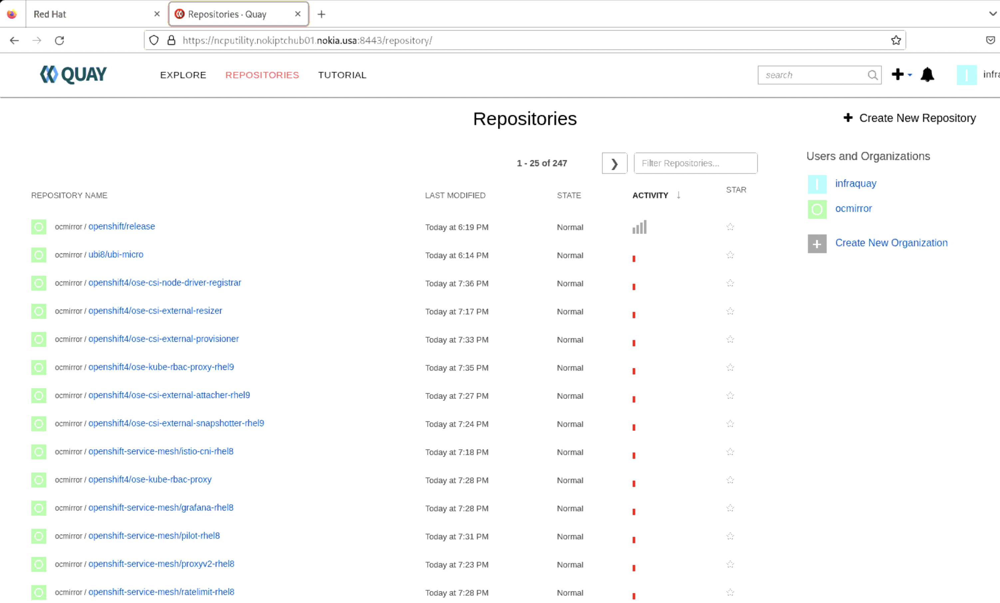
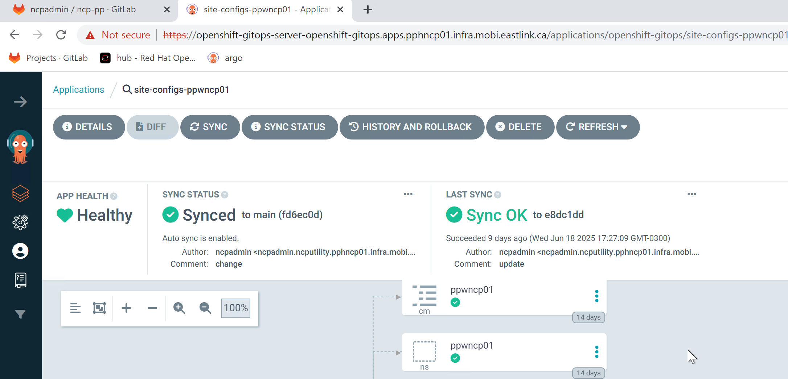

# Infra-manager node redeployment after hub and cwl clusters are deployed.


## Issue description: 

* someone accidentally formatted and reinstalled the OS on the infra-manager host at the Eastlink PP site. This impacted the hub cluster’s lifecycle management capabilities. The infra-Quay registry was lost, along with all hub cluster installation files and manifests previously stored on the infra-manager. Most critically, we also lost the SSH private key that was stored on this host

## Impact Analysis: 

### what are all the impact from operational point of view? 

* Hub Cluster LCM is non-functional due to infra-quay is lost.
* Infra Quay registry is completely lost and must be redeployed. 
* SSH private key used for access to hub and CWL cluster nodes is lost. So, we can’t troubleshoot anything at the host level on both clusters.
* No SSH access to hub or CWL nodes, blocking all remote administration and recovery tasks.
* Hub installation files and other critical configurations are permanently lost.


## Restore plan (Highlevel)

* [Access Reinstalled Infra-Manager Node](#access-reinstalled-infra-manager-node)
* [Installing the necessary packages for the Hub Cluster deployment](#installing-the-necessary-packages-for-the-hub-cluster-deployment)
* [Installing the mirror-registry(infra-quay) on the infrastructure manager node](#installing-the-mirror-registry-on-the-infrastructure-manager-node)
* [Add the infra-quay registry to the trusted registries](#add-the-infra-quay-registry-to-the-trusted-registries)
* [Configuring an organization in Quay](#configuring-an-organization-in-quay)
* [Copy OpenShift related binaries](#copy-openshift-related-binaries)
* [Mirroring images to infra-quay mirror-registry](#mirroring-images-to-infra-quay-mirror-registry)
* [Generate the ssh key for authenticating with core OS.](#generate-the-ssh-key-for-authenticating-with-core-os)
* [Configure Quay SSL to Match Hub Cluster TLS](#configure-quay-ssl-to-match-hub-cluster-tls)
* [Validate Operator Catalog, ITMS, and DTMS](#validate-operator-catalog-itms-and-dtms)
* [Restore SSH Key for Hub Cluster](#restore-ssh-key-for-hub-cluster)
* [Restore SSH Key for CWL Cluster](#restore-ssh-key-for-cwl-cluster)


## Implementation 

#### Access Reinstalled Infra-Manager Node

1) Login to Customer VPN, followed by ssh to infra-manager node using username `ncpuser` with given password. 

```
    ┌──────────────────────────────────────────────────────────────────────┐
    │                 • MobaXterm Personal Edition v25.1 •                 │
    │               (SSH client, X server and network tools)               │
    │                                                                      │
    │ ⮞ SSH session to ncpuser@10.236.6.230                                │
    │   • Direct SSH      :  ✓                                             │
    │   • SSH compression :  ✓                                             │
    │   • SSH-browser     :  ✓                                             │
    │   • X11-forwarding  :  ✓  (remote display is forwarded through SSH)  │
    │                                                                      │
    │ ⮞ For more info, ctrl+click on help or visit our website.            │
    └──────────────────────────────────────────────────────────────────────┘

Activate the web console with: systemctl enable --now cockpit.socket

Register this system with Red Hat Insights: insights-client --register
Create an account or view all your systems at https://red.ht/insights-dashboard
Last login: Fri Jun 27 15:36:03 2025 from 10.192.52.140
[ncpuser@ncputility ~]$
[ncpuser@ncputility ~]$ sudo su -
[sudo] password for ncpuser:
[root@ncputility ~]# cat /etc/redhat-release
Red Hat Enterprise Linux release 9.4 (Plow)
[root@ncputility ~]#


```

#### Installing the necessary packages for the Hub Cluster deployment


1) Login to the node via SSH, using the user created with Administrator privileges. Root user is not needed.
    For higher security, key based authentication can be used for SSH and the password authentication may
    be disabled.

2) Verify the hostname of the node using `hostname -f` command

3) Copy the `rhel_rhcos.tar.gz` to the node. Uncompress it using the command tar `rhel_rhcos.tar.gz.-zxvf`

4) Create a directory to mount the ISO file

```
sudo cp rhel-9.4-x86_64-dvd.iso /mnt
sudo mkdir -p /mnt/rhel9.4
echo '/mnt/rhel-9.4-x86_64-dvd.iso /mnt/rhel9.4/ iso9660 loop 0 0' | sudo
tee -a /etc/fstab
sudo mount -a
```

5) Create a local repo from the ISO which is mounted:
```
cat << 'EOF' | sudo tee -a /etc/yum.repos.d/rhel9.4dvd.repo
[BaseOS]
name=BaseOS Packages Red Hat Enterprise Linux 9
metadata_expire=-1
gpgcheck=1
enabled=1
baseurl=file:///mnt/rhel9.4/BaseOS/
gpgkey=file:///etc/pki/rpm-gpg/RPM-GPG-KEY-redhat-release
[AppStream]
name=AppStream Packages Red Hat Enterprise Linux 9
metadata_expire=-1
gpgcheck=1
enabled=1
baseurl=file:///mnt/rhel9.4/AppStream/
gpgkey=file:///etc/pki/rpm-gpg/RPM-GPG-KEY-redhat-release
EOF
```
6) Install the necessary packages:

```
[root@ncputility ~]# sudo dnf clean all
Updating Subscription Management repositories.
Unable to read consumer identity

This system is not registered with an entitlement server. You can use "rhc" or "subscription-manager" to register.

13 files removed
[root@ncputility ~]# sudo dnf repolist enabled
Updating Subscription Management repositories.
Unable to read consumer identity

This system is not registered with an entitlement server. You can use "rhc" or "subscription-manager" to register.

repo id                                                                     repo name
AppStream                                                                   AppStream Packages Red Hat Enterprise Linux 9
BaseOS                                                                      BaseOS Packages Red Hat Enterprise Linux 9
[root@ncputility ~]# sudo dnf install wget httpd mkpasswd nmstate podman tcpdump rsync tmux bind-utils chrony net-tools unzip bash-completion
Updating Subscription Management repositories.
Unable to read consumer identity

This system is not registered with an entitlement server. You can use "rhc" or "subscription-manager" to register.

BaseOS Packages Red Hat Enterprise Linux 9                                                                                                                  136 MB/s | 2.1 MB     00:00    
AppStream Packages Red Hat Enterprise Linux 9                                                                                                               208 MB/s | 7.0 MB     00:00    
Package wget-1.21.1-7.el9.x86_64 is already installed.
Package podman-2:4.9.4-0.1.el9.x86_64 is already installed.
Package tcpdump-14:4.99.0-9.el9.x86_64 is already installed.
Package rsync-3.2.3-19.el9.x86_64 is already installed.
Package bind-utils-32:9.16.23-15.el9.x86_64 is already installed.
Package chrony-4.5-1.el9.x86_64 is already installed.
Package net-tools-2.0-0.62.20160912git.el9.x86_64 is already installed.
Package unzip-6.0-56.el9.x86_64 is already installed.
Package bash-completion-1:2.11-5.el9.noarch is already installed.
Dependencies resolved.
============================================================================================================================================================================================
 Package                                            Architecture                           Version                                          Repository                                 Size
============================================================================================================================================================================================
Installing:
 httpd                                              x86_64                                 2.4.57-8.el9                                     
 ** output **

Installed:
  apr-1.7.0-12.el9_3.x86_64         apr-util-1.6.1-23.el9.x86_64            apr-util-bdb-1.6.1-23.el9.x86_64        apr-util-openssl-1.6.1-23.el9.x86_64    httpd-2.4.57-8.el9.x86_64       
  httpd-core-2.4.57-8.el9.x86_64    httpd-filesystem-2.4.57-8.el9.noarch    httpd-tools-2.4.57-8.el9.x86_64         mkpasswd-5.5.9-4.el9.x86_64             mod_http2-2.0.26-1.el9.x86_64   
  mod_lua-2.4.57-8.el9.x86_64       nmstate-2.2.25-1.el9.x86_64             redhat-logos-httpd-90.4-2.el9.noarch    tmux-3.2a-5.el9.x86_64                  whois-nls-5.5.9-4.el9.noarch    

Complete!
[root@ncputility ~]# 
```

7) Start and enable HTTP server:

```
[root@ncputility ~]# sudo systemctl start httpd
[root@ncputility ~]# sudo systemctl enable httpd
Created symlink /etc/systemd/system/multi-user.target.wants/httpd.service → /usr/lib/systemd/system/httpd.service.
[root@ncputility ~]# 
```

8) Allow ports 80 for the webserver (later it will be used by the Hub Cluster for fetching CoreOS) and 8443 which will be the mirror-registry’s port.

```
[root@ncputility ~]# sudo firewall-cmd --zone=public --add-port=80/tcp --permanent
success
[root@ncputility ~]# sudo firewall-cmd --zone=public --add-port=8443/tcp --permanent
success
[root@ncputility ~]# sudo firewall-cmd –reload
usage: 'firewall-cmd --help' for usage information or see firewall-cmd(1) man page
firewall-cmd: error: unrecognized arguments: –reload
[root@ncputility ~]# sudo firewall-cmd --reload
success
[root@ncputility ~]# sudo firewall-cmd --list-all
public (active)
  target: default
  icmp-block-inversion: no
  interfaces: 140
  sources: 
  services: cockpit dhcpv6-client ssh vnc-server
  ports: 5902/tcp 53/tcp 53/udp 80/tcp 8443/tcp
  protocols: 
  forward: yes
  masquerade: no
  forward-ports: 
  source-ports: 
  icmp-blocks: 
  rich rules: 
[root@ncputility ~]# 
```

9) Set NTP servers, Udate the correct ntp ip on the configuration file `/etc/chrony.conf`

```
[root@ncputility ~]# sudo vi /etc/chrony.conf^C
[root@ncputility ~]# chronyc sources
MS Name/IP address         Stratum Poll Reach LastRx Last sample               
===============================================================================
^* 135.112.203.53                2   7   377    43   -221ns[  +11us] +/-   22ms
[root@ncputility ~]# timedatectl 
               Local time: Wed 2025-03-26 17:19:06 EDT
           Universal time: Wed 2025-03-26 21:19:06 UTC
                 RTC time: Wed 2025-03-26 21:19:06
                Time zone: America/New_York (EDT, -0400)
System clock synchronized: yes
              NTP service: active
          RTC in local TZ: no
[root@ncputility ~]# 
```

10) Modify the chrony configuration according to the available NTP servers:

```
cat /etc/chrony.conf | grep -v '#'
server 10.171.8.4 iburst
server 10.171.8.5 iburst
sourcedir /run/chrony-dhcp
driftfile /var/lib/chrony/drift
makestep 1.0 3
rtcsync
keyfile /etc/chrony.keys
ntsdumpdir /var/lib/chrony
leapsectz right/UTC
logdir /var/log/chrony
```

11) Enable and restart chronyd

```
sudo systemctl enable chronyd
sudo systemctl restart chronyd
```

12) Verify NTP sources:

```
[root@ncputility ~]# sudo vi /etc/chrony.conf^C
[root@ncputility ~]# chronyc sources
MS Name/IP address         Stratum Poll Reach LastRx Last sample               
===============================================================================
^* 135.112.203.53                2   7   377    43   -221ns[  +11us] +/-   22ms
[root@ncputility ~]#

```

#### Installing the mirror-registry on the infrastructure manager node

1) Uncompress the mirror-registry, which can be found in the previously uncompressed ncp_tools.tar.gz in compressed format. This will be a local registry from where the Hub Cluster can fetch its images.

```
[root@ncputility ncp]# tar -xvf ncp_tools.tar.gz
butane-amd64
butane-amd64.sha256
butane-windows-amd64.exe
butane-windows-amd64.exe.sha256
helm-linux-amd64
helm-linux-amd64.sha256
helm-windows-amd64.exe
helm-windows-amd64.exe.sha256
kustomize_v5.4.3_linux_amd64.tar.gz
kustomize_v5.4.3_linux_amd64.tar.gz.sha256
mirror-registry.tar.gz
mirror-registry.tar.gz.sha256
oc-mirror.tar.gz
oc-mirror.tar.gz.sha256
openshift-client-linux.tar.gz
openshift-client-linux.tar.gz.sha256
openshift-client-windows.zip
openshift-client-windows.zip.sha256
openshift-install-linux.tar.gz
openshift-install-linux.tar.gz.sha256
opm-linux.tar.gz
opm-linux.tar.gz.sha256
opm-windows.tar.gz
opm-windows.tar.gz.sha256
s3cmd-2.4.0.tar.gz
s3cmd-2.4.0.tar.gz.sha256
[root@ncputility ncp]#
```

2) Create a folder for the quay root:

```
[root@ncputility ~]#  mkdir -p /opt/quayroot
[root@ncputility ~]# 
```
> The owner shall be the Linux user who is installing it. For example:
sudo chown <user:user> /opt/quayroot/

    a. extract the mirror-registry file.

    ```
    [root@ncputility ncp]# tar -xvf mirror-registry.tar.gz
    image-archive.tar
    execution-environment.tar
    mirror-registry
    [root@ncputility ncp]# 

    ```

2.1) Quay installation

```
[root@ncputility ncp]# ./mirror-registry install --initUser infraquay --initPassword Nokia12234 --quayRoot /opt/quayroot

   __   __
  /  \ /  \     ______   _    _     __   __   __
 / /\ / /\ \   /  __  \ | |  | |   /  \  \ \ / /
/ /  / /  \ \  | |  | | | |  | |  / /\ \  \   /
\ \  \ \  / /  | |__| | | |__| | / ____ \  | |
 \ \/ \ \/ /   \_  ___/  \____/ /_/    \_\ |_|
  \__/ \__/      \ \__
                  \___\ by Red Hat
 Build, Store, and Distribute your Containers
	
INFO[2025-03-26 17:25:38] Install has begun                            
INFO[2025-03-26 17:25:38] Found execution environment at /root/ncp/execution-environment.tar 
INFO[2025-03-26 17:25:38] Loading execution environment from execution-environment.tar 
INFO[2025-03-26 17:25:49] Detected an installation to localhost        
INFO[2025-03-26 17:25:49] Did not find SSH key in default location. Attempting to set up SSH keys. 
INFO[2025-03-26 17:25:49] Generating SSH Key                           
INFO[2025-03-26 17:25:50] Generated SSH Key at /root/.ssh/quay_installer 
INFO[2025-03-26 17:25:50] Adding key to ~/.ssh/authorized_keys         
INFO[2025-03-26 17:25:50] Successfully set up SSH keys                 
INFO[2025-03-26 17:25:50] Attempting to set SELinux rules on /root/.ssh/quay_installer 
INFO[2025-03-26 17:25:50] Found image archive at /root/ncp/image-archive.tar 
INFO[2025-03-26 17:25:50] Detected an installation to localhost        
INFO[2025-03-26 17:25:50] Unpacking image archive from /root/ncp/image-archive.tar 
INFO[2025-03-26 17:25:52] Loading pause image archive from pause.tar   
INFO[2025-03-26 17:25:58] Loading redis image archive from redis.tar   
INFO[2025-03-26 17:26:05] Loading postgres image archive from postgres.tar 
INFO[2025-03-26 17:26:17] Loading Quay image archive from quay.tar     
INFO[2025-03-26 17:26:45] Attempting to set SELinux rules on image archive 
INFO[2025-03-26 17:26:45] Running install playbook. This may take some time. To see playbook output run the installer with -v (verbose) flag. 
INFO[2025-03-26 17:26:45] Detected an installation to localhost        

PLAY [Install Mirror Appliance] ************************************************************************************************************************************************************

TASK [Gathering Facts] *********************************************************************************************************************************************************************
ok: [root@ncputility.nokiptchub01.nokia.usa]

TASK [mirror_appliance : Expand variables] *************************************************************************************************************************************************
included: /runner/project/roles/mirror_appliance/tasks/expand-vars.yaml for root@ncputility.nokiptchub01.nokia.usa

TASK [mirror_appliance : Expand pg_storage] ************************************************************************************************************************************************
changed: [root@ncputility.nokiptchub01.nokia.usa]

TASK [mirror_appliance : Expand quay_root] *************************************************************************************************************************************************
changed: [root@ncputility.nokiptchub01.nokia.usa]

TASK [mirror_appliance : Expand quay_storage] **********************************************************************************************************************************************
changed: [root@ncputility.nokiptchub01.nokia.usa]

TASK [mirror_appliance : Set expanded variables] *******************************************************************************************************************************************
ok: [root@ncputility.nokiptchub01.nokia.usa]

TASK [mirror_appliance : Install Dependencies] *********************************************************************************************************************************************
included: /runner/project/roles/mirror_appliance/tasks/install-deps.yaml for root@ncputility.nokiptchub01.nokia.usa

TASK [mirror_appliance : Create user service directory] ************************************************************************************************************************************
ok: [root@ncputility.nokiptchub01.nokia.usa]

TASK [mirror_appliance : Set SELinux Rules] ************************************************************************************************************************************************
included: /runner/project/roles/mirror_appliance/tasks/set-selinux-rules.yaml for root@ncputility.nokiptchub01.nokia.usa

TASK [mirror_appliance : Set container_manage_cgroup flag on and keep it persistent across reboots] ****************************************************************************************
skipping: [root@ncputility.nokiptchub01.nokia.usa]

TASK [mirror_appliance : Install Quay Pod Service] *****************************************************************************************************************************************
included: /runner/project/roles/mirror_appliance/tasks/install-pod-service.yaml for root@ncputility.nokiptchub01.nokia.usa

TASK [mirror_appliance : Copy Quay Pod systemd service file] *******************************************************************************************************************************
changed: [root@ncputility.nokiptchub01.nokia.usa]

TASK [mirror_appliance : Check if pod pause image is loaded] *******************************************************************************************************************************
changed: [root@ncputility.nokiptchub01.nokia.usa]

TASK [mirror_appliance : Pull Infra image] *************************************************************************************************************************************************
skipping: [root@ncputility.nokiptchub01.nokia.usa]

TASK [mirror_appliance : Start Quay Pod service] *******************************************************************************************************************************************
changed: [root@ncputility.nokiptchub01.nokia.usa]

TASK [mirror_appliance : Autodetect Image Archive] *****************************************************************************************************************************************
included: /runner/project/roles/mirror_appliance/tasks/autodetect-image-archive.yaml for root@ncputility.nokiptchub01.nokia.usa

TASK [mirror_appliance : Checking for Image Archive] ***************************************************************************************************************************************
ok: [root@ncputility.nokiptchub01.nokia.usa -> localhost]

TASK [mirror_appliance : Create install directory for image-archive.tar dest] **************************************************************************************************************
ok: [root@ncputility.nokiptchub01.nokia.usa]

TASK [mirror_appliance : Copy Images if /runner/image-archive.tar exists] ******************************************************************************************************************
skipping: [root@ncputility.nokiptchub01.nokia.usa]

TASK [mirror_appliance : Unpack Images if /runner/image-archive.tar exists] ****************************************************************************************************************
skipping: [root@ncputility.nokiptchub01.nokia.usa]

TASK [mirror_appliance : Loading Redis if redis.tar exists] ********************************************************************************************************************************
skipping: [root@ncputility.nokiptchub01.nokia.usa]

TASK [mirror_appliance : Loading Quay if quay.tar exists] **********************************************************************************************************************************
skipping: [root@ncputility.nokiptchub01.nokia.usa]

TASK [mirror_appliance : Loading Postgres if postgres.tar exists] **************************************************************************************************************************
skipping: [root@ncputility.nokiptchub01.nokia.usa]

TASK [mirror_appliance : Install Postgres Service] *****************************************************************************************************************************************
included: /runner/project/roles/mirror_appliance/tasks/install-postgres-service.yaml for root@ncputility.nokiptchub01.nokia.usa

TASK [mirror_appliance : Create necessary directory for Postgres persistent data] **********************************************************************************************************
skipping: [root@ncputility.nokiptchub01.nokia.usa]

TASK [mirror_appliance : Set permissions on local storage directory] ***********************************************************************************************************************
skipping: [root@ncputility.nokiptchub01.nokia.usa]

TASK [mirror_appliance : Copy Postgres systemd service file] *******************************************************************************************************************************
changed: [root@ncputility.nokiptchub01.nokia.usa]

TASK [mirror_appliance : Check if Postgres image is loaded] ********************************************************************************************************************************
changed: [root@ncputility.nokiptchub01.nokia.usa]

TASK [mirror_appliance : Pull Postgres image] **********************************************************************************************************************************************
skipping: [root@ncputility.nokiptchub01.nokia.usa]

TASK [mirror_appliance : Create Postgres Storage named volume] *****************************************************************************************************************************
changed: [root@ncputility.nokiptchub01.nokia.usa]

TASK [mirror_appliance : Start Postgres service] *******************************************************************************************************************************************
changed: [root@ncputility.nokiptchub01.nokia.usa]

TASK [mirror_appliance : Wait for pg_trgm to be installed] *********************************************************************************************************************************
FAILED - RETRYING: [root@ncputility.nokiptchub01.nokia.usa]: Wait for pg_trgm to be installed (20 retries left).
changed: [root@ncputility.nokiptchub01.nokia.usa]

TASK [mirror_appliance : Install Redis Service] ********************************************************************************************************************************************
included: /runner/project/roles/mirror_appliance/tasks/install-redis-service.yaml for root@ncputility.nokiptchub01.nokia.usa

TASK [mirror_appliance : Copy Redis systemd service file] **********************************************************************************************************************************
changed: [root@ncputility.nokiptchub01.nokia.usa]

TASK [mirror_appliance : Check if Redis image is loaded] ***********************************************************************************************************************************
changed: [root@ncputility.nokiptchub01.nokia.usa]

TASK [mirror_appliance : Pull Redis image] *************************************************************************************************************************************************
skipping: [root@ncputility.nokiptchub01.nokia.usa]

TASK [mirror_appliance : Start Redis service] **********************************************************************************************************************************************
changed: [root@ncputility.nokiptchub01.nokia.usa]

TASK [mirror_appliance : Install Quay Service] *********************************************************************************************************************************************
included: /runner/project/roles/mirror_appliance/tasks/install-quay-service.yaml for root@ncputility.nokiptchub01.nokia.usa

TASK [mirror_appliance : Create necessary directory for Quay local storage] ****************************************************************************************************************
skipping: [root@ncputility.nokiptchub01.nokia.usa]

TASK [mirror_appliance : Set permissions on local storage directory] ***********************************************************************************************************************
skipping: [root@ncputility.nokiptchub01.nokia.usa]

TASK [mirror_appliance : Create necessary directory for Quay config bundle] ****************************************************************************************************************
changed: [root@ncputility.nokiptchub01.nokia.usa]

TASK [mirror_appliance : Copy Quay config.yaml file] ***************************************************************************************************************************************
changed: [root@ncputility.nokiptchub01.nokia.usa]

TASK [mirror_appliance : Check if SSL Cert exists] *****************************************************************************************************************************************
ok: [root@ncputility.nokiptchub01.nokia.usa -> localhost]

TASK [mirror_appliance : Check if SSL Key exists] ******************************************************************************************************************************************
ok: [root@ncputility.nokiptchub01.nokia.usa -> localhost]

TASK [mirror_appliance : Create necessary directory for Quay rootCA files] *****************************************************************************************************************
changed: [root@ncputility.nokiptchub01.nokia.usa]

TASK [mirror_appliance : Create OpenSSL Config] ********************************************************************************************************************************************
changed: [root@ncputility.nokiptchub01.nokia.usa]

TASK [mirror_appliance : Create root CA key] ***********************************************************************************************************************************************
changed: [root@ncputility.nokiptchub01.nokia.usa]

TASK [mirror_appliance : Create root CA pem] ***********************************************************************************************************************************************
changed: [root@ncputility.nokiptchub01.nokia.usa]

TASK [mirror_appliance : Create ssl key] ***************************************************************************************************************************************************
changed: [root@ncputility.nokiptchub01.nokia.usa]

TASK [mirror_appliance : Create CSR] *******************************************************************************************************************************************************
changed: [root@ncputility.nokiptchub01.nokia.usa]

TASK [mirror_appliance : Create self-signed cert] ******************************************************************************************************************************************
changed: [root@ncputility.nokiptchub01.nokia.usa]

TASK [mirror_appliance : Create chain cert] ************************************************************************************************************************************************
changed: [root@ncputility.nokiptchub01.nokia.usa]

TASK [mirror_appliance : Replace ssl cert with chain cert] *********************************************************************************************************************************
changed: [root@ncputility.nokiptchub01.nokia.usa]

TASK [mirror_appliance : Copy SSL certificate] *********************************************************************************************************************************************
skipping: [root@ncputility.nokiptchub01.nokia.usa]

TASK [mirror_appliance : Copy SSL key] *****************************************************************************************************************************************************
skipping: [root@ncputility.nokiptchub01.nokia.usa]

TASK [mirror_appliance : Set permissions for key] ******************************************************************************************************************************************
changed: [root@ncputility.nokiptchub01.nokia.usa]

TASK [mirror_appliance : Set permissions for cert] *****************************************************************************************************************************************
ok: [root@ncputility.nokiptchub01.nokia.usa]

TASK [mirror_appliance : Copy Quay systemd service file] ***********************************************************************************************************************************
changed: [root@ncputility.nokiptchub01.nokia.usa]

TASK [mirror_appliance : Check if Quay image is loaded] ************************************************************************************************************************************
changed: [root@ncputility.nokiptchub01.nokia.usa]

TASK [mirror_appliance : Pull Quay image] **************************************************************************************************************************************************
skipping: [root@ncputility.nokiptchub01.nokia.usa]

TASK [mirror_appliance : Create Quay Storage named volume] *********************************************************************************************************************************
changed: [root@ncputility.nokiptchub01.nokia.usa]

TASK [mirror_appliance : Start Quay service] ***********************************************************************************************************************************************
changed: [root@ncputility.nokiptchub01.nokia.usa]

TASK [mirror_appliance : Wait for Quay] ****************************************************************************************************************************************************
included: /runner/project/roles/mirror_appliance/tasks/wait-for-quay.yaml for root@ncputility.nokiptchub01.nokia.usa

TASK [mirror_appliance : Waiting up to 3 minutes for Quay to become alive at https://ncputility.nokiptchub01.nokia.usa:8443/health/instance] ***********************************************
FAILED - RETRYING: [root@ncputility.nokiptchub01.nokia.usa]: Waiting up to 3 minutes for Quay to become alive at https://ncputility.nokiptchub01.nokia.usa:8443/health/instance (10 retries left).
ok: [root@ncputility.nokiptchub01.nokia.usa]

TASK [mirror_appliance : Create init user] *************************************************************************************************************************************************
included: /runner/project/roles/mirror_appliance/tasks/create-init-user.yaml for root@ncputility.nokiptchub01.nokia.usa

TASK [mirror_appliance : Creating init user at endpoint https://ncputility.nokiptchub01.nokia.usa:8443/api/v1/user/initialize] *************************************************************
ok: [root@ncputility.nokiptchub01.nokia.usa]

TASK [mirror_appliance : Enable lingering for systemd user processes] **********************************************************************************************************************
skipping: [root@ncputility.nokiptchub01.nokia.usa]

PLAY RECAP *********************************************************************************************************************************************************************************
root@ncputility.nokiptchub01.nokia.usa : ok=50   changed=30   unreachable=0    failed=0    skipped=17   rescued=0    ignored=0   

INFO[2025-03-26 17:28:27] Quay installed successfully, config data is stored in /opt/quayroot 
INFO[2025-03-26 17:28:27] Quay is available at https://ncputility.nokiptchub01.nokia.usa:8443 with credentials (infraquay, Nokia12234) 
[root@ncputility ncp]# 
```


#### Add the infra-quay registry to the trusted registries

Prerequisites
Perform the following actions:

1)	Make a dir first to copy the cert.
```
[root@ncputility ncp]# sudo mkdir -p /etc/containers/certs.d/ncputility.nokiptchub01.nokia.usa:8443/
[root@ncputility ncp]# 

```
2)	Copy the certificate here Add to the systems trusted list 

```
[root@ncputility ncp]# sudo cp /opt/quayroot/quay-rootCA/rootCA.pem  /etc/containers/certs.d/ncputility.nokiptchub01.nokia.usa:8443/
[root@ncputility ncp]# sudo cp /opt/quayroot/quay-rootCA/rootCA.pem /etc/pki/ca-trust/source/anchors/
[root@ncputility ncp]# sudo update-ca-trust extract
[root@ncputility ncp]# 

```

3)	Create the pullsecret to ~/.docker/config.json
```
[root@ncputility ncp]# mkdir -p ~/.docker
[root@ncputility ncp]# 
```
4) Create the base64 encoded username:password pair of the mirror-registry:

```
[root@ncputility ncp]# authpull=`echo -n 'infraquay:Nokia12234' | base64 -w0`
[root@ncputility ncp]# echo '{"auths": {"ncputility.nokiptchub01.nokia.usa:8443": {"auth": "'"$authpull"'", "email": "raj@ncputility.ncputility.nokiptchub01.nokia.usa"}}}' | tee ~/.docker/config.json
{"auths": {"ncputility.nokiptchub01.nokia.usa:8443": {"auth": "aW5mcmFxdWF5Ok5va2lhMTIyMzQ=", "email": "raj@ncputility.ncputility.nokiptchub01.nokia.usa"}}}
[root@ncputility ncp]# cat ~/.docker/config.json
{"auths": {"ncputility.nokiptchub01.nokia.usa:8443": {"auth": "aW5mcmFxdWF5Ok5va2lhMTIyMzQ=", "email": "raj@ncputility.ncputility.nokiptchub01.nokia.usa"}}}
[root@ncputility ncp]# cat ~/.docker/config.json |jq .
{
  "auths": {
    "ncputility.nokiptchub01.nokia.usa:8443": {
      "auth": "aW5mcmFxdWF5Ok5va2lhMTIyMzQ=",
      "email": "raj@ncputility.ncputility.nokiptchub01.nokia.usa"
    }
  }
}
[root@ncputility ncp]# 
```

5)	Validate the pull secret file here
```
[root@ncputility ncp]# podman login https://ncputility.nokiptchub01.nokia.usa:8443  --authfile .docker/config.json -u infraquay -p Nokia12234
Login Succeeded!
[root@ncputility ncp]# 
```

#### Configuring an organization in Quay

1)	Create an organization in Quay:


2)	Click create New organization


3)	In the example above the ocmirror organization was created. 


#### Copy OpenShift related binaries

1)	From the uncompressed ncp_tools.tar.gz copy (or move) the necessary binaries:

```
[root@ncputility ~]# cd ncp/
[root@ncputility ncp]# sudo cp butane-amd64 /usr/local/bin/butane
[root@ncputility ncp]# sudo chmod +x /usr/local/bin/butane
[root@ncputility ncp]# sudo cp helm-linux-amd64 /usr/local/bin/helm
[root@ncputility ncp]# sudo chmod +x /usr/local/bin/helm
[root@ncputility ncp]# tar -zxvf openshift-client-linux.tar.gz
README.md
oc
kubectl
[root@ncputility ncp]# sudo cp kubectl /usr/local/bin/
[root@ncputility ncp]# sudo cp oc /usr/local/bin/
[root@ncputility ncp]# tar -zxvf openshift-install-linux.tar.gz
README.md
openshift-install
[root@ncputility ncp]# sudo cp openshift-install /usr/local/bin/
[root@ncputility ncp]# tar -xvf oc-mirror.tar.gz
oc-mirror
[root@ncputility ncp]# sudo cp oc-mirror /usr/local/bin/
[root@ncputility ncp]# sudo chmod +x /usr/local/bin/oc-mirror
[root@ncputility ncp]# cd /root/ncp
[root@ncputility ncp]# 
```

#### Mirroring images to infra-quay mirror-registry


1) Copy the `ncp-platform.partaa.tar ncp-platform.partab.tar and ncp-platform.partac.tar` files to the infrastructure node.

2) Combine them to one: cat ncp-platform.parta* > ncp-platform-parta.tar
To avoid any connectivity issues to the infrastructure node and to avoid the mirroring process
disturbance, tmux can be used and suggested.

```
oc-mirror --from=./ncp-platform-parta.tar docker://ncputility.nokiptchub01.nokia.usa:8443/ocmirror
```

3) Copy `ncp_operators.partaa.tar, ncp_operators.partab.tar, ncp_operators.partac.tar,
ncp_operators.partad.tar, ncp_operators.partae.tar, ncp_operators.partaf.tar,
ncp_operators.partag.tar, ncp_operators.partah.tar, ncp_operators.partai.tar and
ncp_operators.partaj.tar` files to the Infrastructure node.

4) Combine them together: cat ncp_operators.part* > ncp_operators.tar

```
[root@ncputility ncp]# cat ncp-operators.part* > ncp_operators.tar

```
```
oc-mirror --from=./ncp_operators.tar docker://ncputility.nokiptchub01.nokia.usa:8443/ocmirror
uploading: ncputility.nokiptchub01.nokia.usa:8443/ocmirror/openshift4/ose-csi-external-resizer sha256:ba4c748f34a20478f7334a3e29888150985cd77bf5667cb28df709f8349e14fb 55.28MiB
uploading: ncputility.nokiptchub01.nokia.usa:8443/ocmirror/openshift4/ose-csi-external-resizer sha256:8bad510b7a13af38e38c6a4b66c8beaac49b44c2f1bac22068b1001bae266f3e 81.92MiB
uploading: ncputility.nokiptchub01.nokia.usa:8443/ocmirror/openshift4/ose-csi-external-resizer sha256:d074e0420aa5a047ac468c239178ef5f660b03920ad2f7f7e6a1d71530069db5 10.1MiB
uploading: ncputility.nokiptchub01.nokia.usa:8443/ocmirror/openshift4/ose-csi-external-resizer sha256:f26b1ec0865cd5bcc30994a1d00d16f6f1bad44dd538ee1df0e8840753595738 21.78KiB
uploading: ncputility.nokiptchub01.nokia.usa:8443/ocmirror/openshift4/ose-csi-external-resizer sha256:70a5bdb4264951ee2dfdc73b51c3c8ab99a611d9ac3acaf4a81988a075b5b845 21.69MiB
uploading: ncputility.nokiptchub01.nokia.usa:8443/ocmirror/openshift4/ose-csi-external-resizer sha256:abb828c6dd68e53a22f7a11904b72f9d5a7802fb5e7c380b3a22b18a02e9a463 73.31MiB
uploading: ncputility.nokiptchub01.nokia.usa:8443/ocmirror/openshift4/ose-csi-external-resizer sha256:f44954f3b43a0b5ee76801b112b069aecdb6ce7b387ed3fb72bec893f848c89a 54.58MiB
uploading: ncputility.nokiptchub01.nokia.usa:8443/ocmirror/openshift4/ose-csi-external-resizer sha256:7be6430836eaa16b36440931da447277c710585b321a59f555d455e6b9f9689e 10.28MiB
uploading: ncputility.nokiptchub01.nokia.usa:8443/ocmirror/openshift4/ose-csi-external-resizer sha256:e892ff5d6fa3cef8357fcaa97f0f534e4f454439edadf9cbb820482420817585 21.91MiB
uploading: ncputility.nokiptchub01.nokia.usa:8443/ocmirror/openshift4/ose-csi-external-resizer sha256:4caf23c20c871ed5c847c163905c27ee724b9e10975f1711715589a52942b3d5 53.47MiB
uploading: ncputility.nokiptchub01.nokia.usa:8443/ocmirror/openshift4/ose-csi-external-resizer sha256:ca4e3da08236e2c5f895043898246830e8a394a483c5ba66aa25635ea19d4c69 21.78KiB
uploading: ncputility.nokiptchub01.nokia.usa:8443/ocmirror/openshift4/ose-csi-external-resizer sha256:357d8d6388d50c5e60475784a9956fcff8a1e66f48ae978c0e691fd587b76248 10.25MiB
uploading: ncputility.nokiptchub01.nokia.usa:8443/ocmirror/openshift4/ose-csi-external-resizer sha256:bfdc7c9d33c28bd179f2b99aea50e8e86a372a209dfe272757d32965644f8c59 21.76KiB
uploading: ncputility.nokiptchub01.nokia.usa:8443/ocmirror/openshift4/ose-csi-external-resizer sha256:89176521898ace7eab9ccf870f6e4e5e3a21c3688df09c9346a3cf6f909f1188 23.84MiB
uploading: ncputility.nokiptchub01.nokia.usa:8443/ocmirror/openshift4/ose-csi-external-resizer sha256:00f24979220b92c40dbe75e7f85475c5d14efe31c4b0f2c8c2ea50bf359986ec 10.97MiB
uploading: ncputility.nokiptchub01.nokia.usa:8443/ocmirror/openshift4/ose-csi-external-resizer sha256:96e84521ae3a855d5ef74239d41bdc2cd5c2d0db0fd71006823f9cab7b5ae5d6 21.76KiB
uploading: ncputility.nokiptchub01.nokia.usa:8443/ocmirror/openshift4/ose-csi-external-resizer sha256:c7965aa7086045a59bdb113a1fb8a19d7ccf7af4133e59af8ecefd39cda8e0b1 75.31MiB
uploading: ncputility.nokiptchub01.nokia.usa:8443/ocmirror/openshift4/ose-csi-external-resizer sha256:5b92631cae6df8d9aef617e5a07532336e5c2a09d7c5418592ea6188a7e10a0c 72.73MiB
uploading: ncputility.nokiptchub01.nokia.usa:8443/ocmirror/openshift4/ose-csi-external-resizer sha256:5cac740fb8a68c72180f72cbe2227abcdb92f2acc1ee68141b720e2e16e3daed 23.64MiB
sha256:a1395b66e122f878c6abdb229134d5150832e9f95b6278e823095bb66da7203d ncputility.nokiptchub01.nokia.usa:8443/ocmirror/openshift4/ose-csi-external-resizer
sha256:a007417b5129999c3aa2391802b9d1131d67bd735acb0e4e83f2232da56b51a2 ncputility.nokiptchub01.nokia.usa:8443/ocmirror/openshift4/ose-csi-external-resizer
sha256:69640e0eade25e28d6f08c98bed2a0a9e7120b4b6e5a3510ca3741681c79c096 ncputility.nokiptchub01.nokia.usa:8443/ocmirror/openshift4/ose-csi-external-resizer
sha256:91b6872c930e6d846fb94eb314df9fa4e0f35a7a234462329ea1e0911ed98e00 ncputility.nokiptchub01.nokia.usa:8443/ocmirror/openshift4/ose-csi-external-resizer
sha256:152e719fa5c0a8326fb845884a761c7976521201ac912932992df020bda77fae ncputility.nokiptchub01.nokia.usa:8443/ocmirror/openshift4/ose-csi-external-resizer:b068f7cc
info: Mirroring completed in 5.52s (125MB/s)

uploading: ncputility.nokiptchub01.nokia.usa:8443/ocmirror/openshift4/ose-csi-external-resizer sha256:ba4c748f34a20478f7334a3e29888150985cd77bf5667cb28df709f8349e14fb 55.28MiB
uploading: ncputility.nokiptchub01.nokia.usa:8443/ocmirror/openshift4/ose-csi-external-resizer sha256:8bad510b7a13af38e38c6a4b66c8beaac49b44c2f1bac22068b1001bae266f3e 81.92MiB
uploading: ncputility.nokiptchub01.nokia.usa:8443/ocmirror/openshift4/ose-csi-external-resizer sha256:d074e0420aa5a047ac468c239178ef5f660b03920ad2f7f7e6a1d71530069db5 10.1MiB
uploading: ncputility.nokiptchub01.nokia.usa:8443/ocmirror/openshift4/ose-csi-external-resizer sha256:f26b1ec0865cd5bcc30994a1d00d16f6f1bad44dd538ee1df0e8840753595738 21.78KiB
uploading: ncputility.nokiptchub01.nokia.usa:8443/ocmirror/openshift4/ose-csi-external-resizer sha256:70a5bdb4264951ee2dfdc73b51c3c8ab99a611d9ac3acaf4a81988a075b5b845 21.69MiB
uploading: ncputility.nokiptchub01.nokia.usa:8443/ocmirror/openshift4/ose-csi-external-resizer sha256:abb828c6dd68e53a22f7a11904b72f9d5a7802fb5e7c380b3a22b18a02e9a463 73.31MiB
uploading: ncputility.nokiptchub01.nokia.usa:8443/ocmirror/openshift4/ose-csi-external-resizer sha256:f44954f3b43a0b5ee76801b112b069aecdb6ce7b387ed3fb72bec893f848c89a 54.58MiB
uploading: ncputility.nokiptchub01.nokia.usa:8443/ocmirror/openshift4/ose-csi-external-resizer sha256:7be6430836eaa16b36440931da447277c710585b321a59f555d455e6b9f9689e 10.28MiB
uploading: ncputility.nokiptchub01.nokia.usa:8443/ocmirror/openshift4/ose-csi-external-resizer sha256:e892ff5d6fa3cef8357fcaa97f0f534e4f454439edadf9cbb820482420817585 21.91MiB
uploading: ncputility.nokiptchub01.nokia.usa:8443/ocmirror/openshift4/ose-csi-external-resizer sha256:4caf23c20c871ed5c847c163905c27ee724b9e10975f1711715589a52942b3d5 53.47MiB
uploading: ncputility.nokiptchub01.nokia.usa:8443/ocmirror/openshift4/ose-csi-external-resizer sha256:ca4e3da08236e2c5f895043898246830e8a394a483c5ba66aa25635ea19d4c69 21.78KiB
uploading: ncputility.nokiptchub01.nokia.usa:8443/ocmirror/openshift4/ose-csi-external-resizer sha256:357d8d6388d50c5e60475784a9956fcff8a1e66f48ae978c0e691fd587b76248 10.25MiB
uploading: ncputility.nokiptchub01.nokia.usa:8443/ocmirror/openshift4/ose-csi-external-resizer sha256:bfdc7c9d33c28bd179f2b99aea50e8e86a372a209dfe272757d32965644f8c59 21.76KiB
uploading: ncputility.nokiptchub01.nokia.usa:8443/ocmirror/openshift4/ose-csi-external-resizer sha256:89176521898ace7eab9ccf870f6e4e5e3a21c3688df09c9346a3cf6f909f1188 23.84MiB
uploading: ncputility.nokiptchub01.nokia.usa:8443/ocmirror/openshift4/ose-csi-external-resizer sha256:00f24979220b92c40dbe75e7f85475c5d14efe31c4b0f2c8c2ea50bf359986ec 10.97MiB
uploading: ncputility.nokiptchub01.nokia.usa:8443/ocmirror/openshift4/ose-csi-external-resizer sha256:96e84521ae3a855d5ef74239d41bdc2cd5c2d0db0fd71006823f9cab7b5ae5d6 21.76KiB
uploading: ncputility.nokiptchub01.nokia.usa:8443/ocmirror/openshift4/ose-csi-external-resizer sha256:c7965aa7086045a59bdb113a1fb8a19d7ccf7af4133e59af8ecefd39cda8e0b1 75.31MiB
uploading: ncputility.nokiptchub01.nokia.usa:8443/ocmirror/openshift4/ose-csi-external-resizer sha256:5b92631cae6df8d9aef617e5a07532336e5c2a09d7c5418592ea6188a7e10a0c 72.73MiB
uploading: ncputility.nokiptchub01.nokia.usa:8443/ocmirror/openshift4/ose-csi-external-resizer sha256:5cac740fb8a68c72180f72cbe2227abcdb92f2acc1ee68141b720e2e16e3daed 23.64MiB
sha256:a1395b66e122f878c6abdb229134d5150832e9f95b6278e823095bb66da7203d ncputility.nokiptchub01.nokia.usa:8443/ocmirror/openshift4/ose-csi-external-resizer
sha256:a007417b5129999c3aa2391802b9d1131d67bd735acb0e4e83f2232da56b51a2 ncputility.nokiptchub01.nokia.usa:8443/ocmirror/openshift4/ose-csi-external-resizer
sha256:69640e0eade25e28d6f08c98bed2a0a9e7120b4b6e5a3510ca3741681c79c096 ncputility.nokiptchub01.nokia.usa:8443/ocmirror/openshift4/ose-csi-external-resizer
sha256:91b6872c930e6d846fb94eb314df9fa4e0f35a7a234462329ea1e0911ed98e00 ncputility.nokiptchub01.nokia.usa:8443/ocmirror/openshift4/ose-csi-external-resizer
sha256:152e719fa5c0a8326fb845884a761c7976521201ac912932992df020bda77fae ncputility.nokiptchub01.nokia.usa:8443/ocmirror/openshift4/ose-csi-external-resizer:b068f7cc
info: Mirroring completed in 5.52s (125MB/s)

catalogs/registry.redhat.io/redhat/redhat-operator-index/v4.16/layout/blobs/sha256/d74e8b702f03952802c351c423f5a15bd670d0558f3f25e04d27bfc1964d68f6
catalogs/registry.redhat.io/redhat/redhat-operator-index/v4.16/layout/blobs/sha256/d97215b78c445a91c5e9676d137c6c9fa1cbef72ce82425316432b221360f9a1
catalogs/registry.redhat.io/redhat/redhat-operator-index/v4.16/layout/blobs/sha256/ed1748ba861420cf9f23989a033c63968dcb227442f5d70ff5088fc2f163b44b
catalogs/registry.redhat.io/redhat/redhat-operator-index/v4.16/layout/blobs/sha256/f20db0aa394f8fd833f0f3d35bd505ecbddcc38d501afaea85ef28ac5c446ee9
catalogs/registry.redhat.io/redhat/redhat-operator-index/v4.16/layout/blobs/sha256/f371e370ccf3b0b9ed6e19bf73c29f180e3e288bf25cea4df13d52c27f24ebff
catalogs/registry.redhat.io/redhat/redhat-operator-index/v4.16/layout/blobs/sha256/f6eee3a6ec21314c3c091044142276b65fb7ae526e21cb2288af902735496b96
catalogs/registry.redhat.io/redhat/redhat-operator-index/v4.16/layout/blobs/sha256/f85f9539a5bfe9b773c454c22e77875de533ce99aacf5f24efd6d159c06b0405
catalogs/registry.redhat.io/redhat/redhat-operator-index/v4.16/layout/index.json
catalogs/registry.redhat.io/redhat/redhat-operator-index/v4.16/layout/oci-layout
Rendering catalog image "ncputility.nokiptchub01.nokia.usa:8443/ocmirror/redhat/certified-operator-index:v4.16" with file-based catalog 
Rendering catalog image "ncputility.nokiptchub01.nokia.usa:8443/ocmirror/redhat/redhat-operator-index:v4.16" with file-based catalog 
Writing image mapping to oc-mirror-workspace/results-1743029387/mapping.txt
Writing CatalogSource manifests to oc-mirror-workspace/results-1743029387
Writing ICSP manifests to oc-mirror-workspace/results-1743029387
[root@ncputility ncp]# 
```

5) When you reload your quay registry, you will be able to see the images uploaded. 




### Generate the ssh key for authenticating with core OS. 

1) Generate a keypair for ssh access of the HUB cluster nodes, using ssh-keygen. Preferred algorithm is `ed25519`. Use the command, It will keep pub in .ssh folder.


```
[root@ncputility ncp]# ssh-keygen -t ed25519
Generating public/private ed25519 key pair.
Enter file in which to save the key (/root/.ssh/id_ed25519): 
Enter passphrase (empty for no passphrase): 
Enter same passphrase again: 
Your identification has been saved in /root/.ssh/id_ed25519
Your public key has been saved in /root/.ssh/id_ed25519.pub
The key fingerprint is:
SHA256:cPryPsjzimE7ks5xceRKXYFr5QlpGk00t5q01qrYxJU root@ncputility.nokiptchub01.nokia.usa
The key's randomart image is:
+--[ED25519 256]--+
|     ++oo        |
|    . *o.o       |
|     ++=+.       |
|    .=o@o        |
|    o.E S        |
|   o * o         |
|  ..B.o..        |
| .oB.=+o.        |
| .+.=..=+.       |
+----[SHA256]-----+
[root@ncputility ncp]# 

```

### Configure Quay SSL to Match Hub Cluster TLS

### Validate Operator Catalog, ITMS, and DTMS

### Restore SSH Key for Hub Cluster

1) Login to hub cluster with kubeadmin or cluster-admin role.

```
[root@ncputility ~ hub_rc]$ source  hubrc
WARNING: Using insecure TLS client config. Setting this option is not supported!

Login successful.

You have access to 105 projects, the list has been suppressed. You can list all projects with 'oc projects'

Using project "default".
[root@ncputility ~ hub_rc]$

```

2) list the mc for ssh on this hold and take a backup of it. 

```
[root@ncputility ~ hub_rc]$ oc get mc 99-master-ssh  99-worker-ssh
NAME            GENERATEDBYCONTROLLER   IGNITIONVERSION   AGE
99-master-ssh                           3.2.0             29d
99-worker-ssh                           3.2.0             29d
[root@ncputility ~ hub_rc]$ oc get mc 99-master-ssh  99-worker-ssh -o yaml > 99-master-worker-ssh.yaml
[root@ncputility ~ hub_rc]$ 
[root@ncputility ~ hub_rc]$ oc get mc 99-master-ssh  99-worker-ssh -o yaml > 99-master-worker-ssh-back.yaml
[root@ncputility ~ hub_rc]$

```

3) update the `sshAuthorizedKeys` key with your latest key and then apply it. 

```
[root@ncputility ~ hub_rc]$ vi 99-master-worker-ssh-back.yaml
```
>         - name: core
          sshAuthorizedKeys:
          - ssh-ed25519 AAAAC3NzaC1lZDI1NTE5AAAAIGW2BXbCPiDgL3m4y8y3UYdehEmdUsrQBNLOR27waVBr
            root@ncputility.pphncp01.infra.mobi.eastlink.ca

this part need to updated. 

4) apply the change 

```
[root@ncputility ~ hub_rc]$ oc apply -f 99-master-worker-ssh-back.yaml
Warning: resource machineconfigs/99-master-ssh is missing the kubectl.kubernetes.io/last-applied-configuration annotation which is required by oc apply. oc apply should only be used on resources created declaratively by either oc create --save-config or oc apply. The missing annotation will be patched automatically.
machineconfig.machineconfiguration.openshift.io/99-master-ssh configured
Warning: resource machineconfigs/99-worker-ssh is missing the kubectl.kubernetes.io/last-applied-configuration annotation which is required by oc apply. oc apply should only be used on resources created declaratively by either oc create --save-config or oc apply. The missing annotation will be patched automatically.
machineconfig.machineconfiguration.openshift.io/99-worker-ssh configured
[root@ncputility ~ hub_rc]$

```

5) Machine Config Operator should start applying the changes shortly. Observe which MachineConfigPools are being updated with oc get mcp and check more details on which node is being updated by following this solution.

```
[root@ncputility ~ hub_rc]$ oc get mcp
NAME     CONFIG                                             UPDATED   UPDATING   DEGRADED   MACHINECOUNT   READYMACHINECOUNT   UPDATEDMACHINECOUNT   DEGRADEDMACHINECOUNT   AGE
master   rendered-master-adf9d3edadac5fe32aa27a42deeb773e   True      False      False      3              3                   3                     0                      29d
worker   rendered-worker-9ad974bc81cec3f37ff34bd866f0e906   True      False      False      0              0                   0                     0                      29d
[root@ncputility ~ hub_rc]$

```


6) For more insights on how the change is being applied in a single node, then check the machine config daemon logs:

```
NODE='master-0.pphncp01.infra.mobi.eastlink.ca'
oc -n openshift-machine-config-operator logs -c machine-config-daemon $(oc -n openshift-machine-config-operator get pod -l k8s-app=machine-config-daemon --field-selector spec.nodeName=${NODE} -o name) -f 
```

Where ${NODE} must be replaced with the name of the node. Omit -f if logs are not required to be followed.
If the update was successfully applied, then logs similar to below lines are expected:


```
I0111 19:59:07.360110    7993 update.go:258] SSH Keys reconcilable
...
I0111 19:59:07.371253    7993 update.go:569] Writing SSHKeys at "/home/core/.ssh"
...
I0111 19:59:07.372208    7993 update.go:613] machine-config-daemon initiating reboot: Node will reboot into config worker-96b48815fa067f651fa50541ea6a9b5d
```

### Restore SSH Key for CWL Cluster


1) login to infra-manager node and followed by navigate to git files location.

```
[root@ncputility ~ hub_rc]$ pwd
/root/ncp-pp/ppwncp01/site-config/ppwncp01
[root@ncputility ~ hub_rc]$ vi ppwncp01.yaml

```

2) update the site-config.yaml with recent ssh pub key directly. 

> vi to this file `ppwncp01.yaml` and update `sshPublicKey`

```
---
apiVersion: ran.openshift.io/v1
kind: SiteConfig
metadata:
  name: "ppwncp01"
  namespace: "ppwncp01"
spec:
  # The base domain used by our SNOs
  baseDomain: "infra.mobi.eastlink.ca"
  # The secret name of the secret containing the pull secret for our disconnected registry
  pullSecretRef:
    name: "ppwncp01-disconnected-registry-pull-secret"
  # The OCP release we will be deploying otherwise specified (this can be configured per cluster as well)
  clusterImageSetNameRef: "ncp-24-7-mp1-release"
  # The ssh public key that will be injected into our SNOs authorized_keys
  sshPublicKey: "ssh-ed25519 AAAAC3NzaC1lZDI1NTE5AAAAIGW2BXbCPiDgL3m4y8y3UYdehEmdUsrQBNLOR27waVBr"
  clusters:
    - clusterName: "ppwncp01"
      # The sdn plugin that will be used

```

3) Commit this change on the git server too 

```
[root@ncputility ~ hub_rc]$ git commit -m "update"
Author identity unknown

*** Please tell me who you are.

Run

  git config --global user.email "you@example.com"
  git config --global user.name "Your Name"

to set your account's default identity.
Omit --global to set the identity only in this repository.

fatal: unable to auto-detect email address (got 'root@ncputility.(none)')
[root@ncputility ~ hub_rc]$ git push
Username for 'https://gitlab.apps.pphncp01.infra.mobi.eastlink.ca': ncpadmin
Password for 'https://ncpadmin@gitlab.apps.pphncp01.infra.mobi.eastlink.ca':
Everything up-to-date
[root@ncputility ~ hub_rc]$

```

4)  Open up the Argocd web console and select sync for site-config application tiles. once sync completed, monitor the progress via mcp. 

> [ARGO-CD URL](#https://openshift-gitops-server-openshift-gitops.apps.pphncp01.infra.mobi.eastlink.ca/applications/openshift-gitops/site-configs-ppwncp01?view=tree)




5)  Machine Config Operator should start applying the changes shortly. Observe which MachineConfigPools are being updated with oc get mcp and check more details on which node is being updated by following this solution.


```
[root@ncputility ~ hub_rc]$ oc get mcp
NAME     CONFIG                                             UPDATED   UPDATING   DEGRADED   MACHINECOUNT   READYMACHINECOUNT   UPDATEDMACHINECOUNT   DEGRADEDMACHINECOUNT   AGE
master   rendered-master-adf9d3edadac5fe32aa27a42deeb773e   True      False      False      3              3                   3                     0                      29d
worker   rendered-worker-9ad974bc81cec3f37ff34bd866f0e906   True      False      False      0              0                   0                     0                      29d
[root@ncputility ~ hub_rc]$

```


6) For more insights on how the change is being applied in a single node, then check the machine config daemon logs:

```
NODE='master-0.pphncp01.infra.mobi.eastlink.ca'
oc -n openshift-machine-config-operator logs -c machine-config-daemon $(oc -n openshift-machine-config-operator get pod -l k8s-app=machine-config-daemon --field-selector spec.nodeName=${NODE} -o name) -f 
```

Where ${NODE} must be replaced with the name of the node. Omit -f if logs are not required to be followed.
If the update was successfully applied, then logs similar to below lines are expected:


```
I0111 19:59:07.360110    7993 update.go:258] SSH Keys reconcilable
...
I0111 19:59:07.371253    7993 update.go:569] Writing SSHKeys at "/home/core/.ssh"
...
I0111 19:59:07.372208    7993 update.go:613] machine-config-daemon initiating reboot: Node will reboot into config worker-96b48815fa067f651fa50541ea6a9b5d
```


