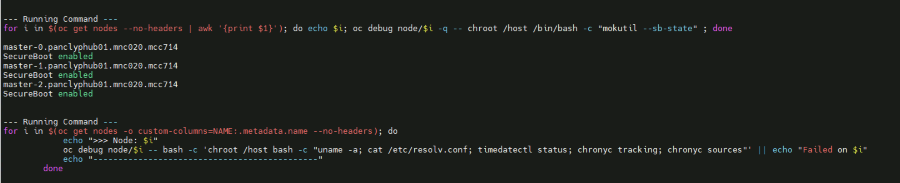

# OpenShift & Quay healthcheck - Runbook

This runbook describes how to run the **OpenShift & Quay healthcheck script** in three modes:

- **Hub cluster healthcheck** (`--hub`)
- **Spoke cluster healthcheck** (`--spoke`)
- **Quay infrastructure health** (`--infra-quay`)

The script prints each command before executing it and streams outputs/errs to the console.

---

## Prerequisites

- **Python 3.6+** (check with `python3 --version`)
- **`oc` CLI** installed and logged in to the target OpenShift cluster for `--hub` or `--spoke` modes
  - Verify login: `oc whoami`
- **`podman`, `curl`, `ss`, `nc`** available on the host for `--infra-quay` mode
- The Python script file saved locally (example name: `ocp_health_check.py`) containing the latest version shared in this project:
  - Supports flags: `--hub`, `--spoke`, `--infra-quay`
  - **`--hub` and `--spoke` are mutually exclusive** (cannot be used together)


> If your Quay registry is **not** bound to `https://localhost:8443`, update the Quay endpoints inside the script to match your host/port. (NCP 24.7.MPX and 25.4 MPX platform can be ignored this step.)

---


## Download the script


#### Version-02 [Latest]

[Click to download version-2](./ocp_health_check-v2.py)

#### Version-01

[Click to download version-1](./healthcheck.py)

## Quick Start

From the directory where `ocp_health_check.py` is saved:

```bash
# Show usage (no flags)
python3 ocp_health_check.py

# Run hub healthcheck
python3 ocp_health_check.py --hub

# Run spoke healthcheck
python3 ocp_health_check.py --spoke

# Run Quay infra checks
python3 ocp_health_check.py --infra-quay

```

If no flags are provided, the script prints usage and exits with a non‑zero code.

---

## What each mode does

### `--hub` (Hub Cluster healthcheck)

Runs cluster‑wide healthcheck useful on a hub/management cluster. Examples include:

- Cluster version & node inventory
- Bare Metal Hosts, Machines, MCP, ClusterOperators, Components
- Workload inventory (pods/deployments/statefulsets/daemonsets)
- Readiness endpoints and etcd status
- Network operator configuration (serviceNetwork/clusterNetwork)
- OperatorHub/catalog sources & marketplace components
- Image registry & Multus presence
- Node labels and hugepages capacity
- NMState operators and policies
- Ceph (Rook) health (`ceph -s`, OSD tree)

**Example invocation:**

```bash
python3 ocp_health_check.py --hub
```

> Note: `--hub` automatically includes a small base set of commands (`oc whoami --show-server`, `oc get clusterversion`, `oc get nodes -o wide`).


### `--spoke` (Spoke/Workload Cluster healthcheck)

Focuses on data‑plane/workload validations. Examples include:

- Cluster version & node inventory
- Bare Metal Hosts, Machines, MCP, ClusterOperators, Components
- Workload inventory (pods/deployments/statefulsets/daemonsets)
- Readiness endpoints and etcd status
- Network operator configuration (serviceNetwork/clusterNetwork)
- OperatorHub/catalog sources & marketplace components
- Image registry & Multus presence
- Node labels and hugepages capacity
- NMState / SR‑IOV operators and policies
- MetalLB status (controller/speaker, FRR configuration, BFD peers)
- OpenShift Logging / NumaResources pods visibility
- Ceph (Rook) health (`ceph -s`, OSD tree)

**Example invocation:**

```bash
python3 ocp_health_check.py --spoke
```

> Tip: These commands may produce **large outputs**. Consider redirecting to a file:
> ```bash
> python3 ocp_health_check.py --spoke | tee spoke_diag_$(date +%F_%H%M).log
> ```


### `--infra-quay` (Quay Infrastructure Health)

Validates a local Red Hat Quay deployment listening on `https://localhost:8443`:

- Health endpoints: `/health/instance`, `/health/ready`, `/health/live`
- API discovery: `/api/v1/discovery`
- Container logs tail: `quay-app`, `quay-postgres`, `quay-redis`
- Port binding check (8443)
- App → DB/Redis connectivity via `nc` from inside `quay-app`

**Example invocation:**

```bash
python3 ocp_health_check.py --infra-quay
```

You can **combine** with a cluster mode:

```bash
python3 ocp_health_check.py --hub --infra-quay
python3 ocp_health_check.py --spoke --infra-quay
```

---

## Usage & Help

Running the script **without arguments** prints a help/usage block with examples and exits.

```
Usage: python ocp_health_check.py [OPTIONS]

Options:
  --hub         Run healthcheck for hub cluster            (mutually exclusive with --spoke)
  --spoke       Run healthcheck for spoke cluster          (mutually exclusive with --hub)
  --infra-quay  Run healthcheck for Quay infrastructure    (can be combined with --hub or --spoke)

Examples:
  python ocp_health_check.py --hub
  python ocp_health_check.py --spoke
  python ocp_health_check.py --infra-quay
  python ocp_health_check.py --hub --infra-quay
  python ocp_health_check.py --spoke --infra-quay
```


---

## Capturing Output

For long runs or later analysis, redirect output to a timestamped file:

```bash
python3 ocp_health_check.py --hub --infra-quay | tee hub_$(date +%F_%H%M).log
```

To save **only errors**:
```bash
python3 ocp_health_check.py --spoke 1> /tmp/spoke.out 2> /tmp/spoke.err
```

> This script output should be shared as part of exit criteria  package. also, infra-quay, hub, spoke cluster should be having separate files. 

---

## Common Troubleshooting


### Script get hung for couple of tasks

Following task required to be executed inside the nodes OS level. so it will take some extra time. 



### Quay health endpoints fail (non‑200 or timeouts)
- Ensure Quay is running and listening:
  ```bash
  podman ps
  ss -lntp | grep 8443
  ```
- Check logs:
  ```bash
  podman logs quay-app | tail -n 100
  podman logs quay-postgres | tail -n 100
  podman logs quay-redis | tail -n 100
  ```
- Validate app → DB/Redis connectivity inside container:
  ```bash
  podman exec -it quay-app bash -c "nc -zv quay-postgres 5432"
  podman exec -it quay-app bash -c "nc -zv quay-redis 6379"
  ```

### `oc` commands fail
- Verify kubeconfig/permissions:
  ```bash
  oc whoami
  oc get clusterversion
  ```
- Confirm network reachability and that your token hasn’t expired.

### MetalLB FRR exec fails
- Ensure `metallb-system` namespace exists and at least one `speaker` pod is Running:
  ```bash
  oc get pods -n metallb-system -o wide
  ```

### Ceph checks fail
- Ensure Rook operator pod exists and is Running in `openshift-storage`:
  ```bash
  oc get pods -n openshift-storage -l app=rook-ceph-operator
  ```

---


**End of Runbook**

